# Архитектура системы EvilEye

Данный документ описывает архитектуру системы EvilEye на разных уровнях абстракции. Каждый уровень фокусируется на определенных аспектах системы, что позволяет понять как общую структуру, так и детали реализации.

## Оглавление

- [Уровень 1: CLI и точки входа](#уровень-1-cli-и-точки-входа)
- [Уровень 2: Контроллер и основные сущности](#уровень-2-контроллер-и-основные-сущности)
- [Уровень 3: Pipeline архитектура](#уровень-3-pipeline-архитектура)
- [Уровень 4: Видеозахват и запись](#уровень-4-видеозахват-и-запись)
- [Уровень 5: Обработка объектов](#уровень-5-обработка-объектов)
- [Уровень 6: Обработка событий](#уровень-6-обработка-событий)
- [Уровень 7: Работа с базой данных](#уровень-7-работа-с-базой-данных)

---

## Уровень 1: CLI и точки входа

На верхнем уровне система предоставляет несколько точек входа для различных сценариев использования.

### Схема точек входа

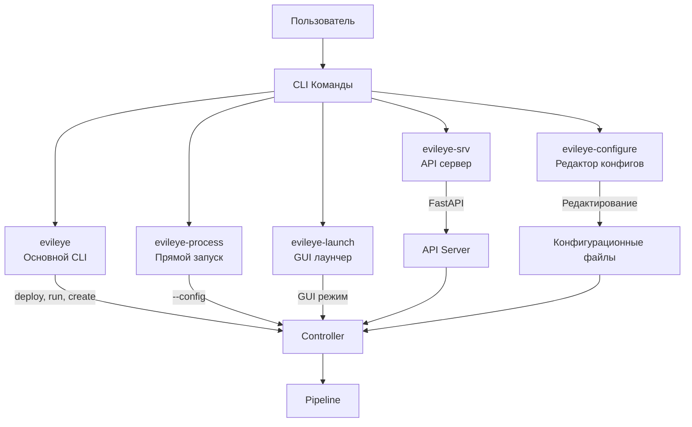
```mermaid
graph TB
    User[Пользователь] --> CLI[CLI Команды]
    
    CLI --> Evileye[evileye<br/>Основной CLI]
    CLI --> EvileyeProcess[evileye-process<br/>Прямой запуск]
    CLI --> EvileyeLaunch[evileye-launch<br/>GUI лаунчер]
    CLI --> EvileyeConfigure[evileye-configure<br/>Редактор конфигов]
    CLI --> EvileyeSrv[evileye-srv<br/>API сервер]
    
    Evileye --> |deploy, run, create| Controller[Controller]
    EvileyeProcess --> |--config| Controller
    EvileyeLaunch --> |GUI режим| Controller
    EvileyeConfigure --> |Редактирование| ConfigFiles[Конфигурационные файлы]
    EvileyeSrv --> |FastAPI| APIServer[API Server]
    
    APIServer --> Controller
    
    ConfigFiles --> Controller
    
    Controller --> Pipeline[Pipeline]
```

### Описание диаграммы: Схема точек входа

**Что показывает диаграмма:**
Диаграмма отображает все возможные точки входа в систему EvilEye и пути взаимодействия между пользователем, CLI командами, конфигурационными файлами и основными компонентами системы. Она демонстрирует различные способы запуска и управления системой.

**Элементы диаграммы:**
- **User (Пользователь)**: Начальная точка взаимодействия - пользователь системы
- **CLI (CLI Команды)**: Абстрактный узел, представляющий все доступные команды командной строки
- **evileye**: Основной CLI интерфейс с полным набором команд (deploy, run, create, validate, server, info)
- **evileye-process**: Прямой запуск процесса обработки с поддержкой флагов конфигурации
- **evileye-launch**: GUI лаунчер с визуальным управлением конфигурациями и процессами
- **evileye-configure**: Визуальный редактор конфигурационных файлов
- **evileye-srv**: FastAPI веб-сервер для удаленного управления через REST API
- **ConfigFiles (Конфигурационные файлы)**: JSON файлы с настройками системы
- **APIServer (API Server)**: Веб-сервер, обрабатывающий HTTP запросы
- **Controller**: Центральный оркестратор системы, координирующий все компоненты
- **Pipeline**: Модуль обработки видео потоков

**Связи и потоки:**
- **Стрелки без меток** (`-->`): Прямое взаимодействие или переход управления
- **Стрелки с метками** (`--> |метка|`): Специфическое взаимодействие с указанием типа операции:
  - `|deploy, run, create|`: Основные команды CLI для управления системой
  - `|--config|`: Передача конфигурационного файла
  - `|GUI режим|`: Запуск с графическим интерфейсом
  - `|Редактирование|`: Операции редактирования конфигурации
  - `|FastAPI|`: Использование FastAPI фреймворка

**Как это работает:**
Пользователь выбирает один из способов взаимодействия с системой через CLI команды. В зависимости от выбранной команды, система либо напрямую создает Controller (evileye, evileye-process, evileye-launch), либо сначала обрабатывает конфигурацию (evileye-configure создает/редактирует ConfigFiles, которые затем используются Controller). API сервер (evileye-srv) создает отдельный веб-сервер, который также взаимодействует с Controller для обработки HTTP запросов. Все пути в конечном итоге ведут к Controller, который инициализирует Pipeline для обработки видео.

**Примеры использования:**
- **Для начинающих**: Использование `evileye-launch` для визуального управления через GUI
- **Для автоматизации**: Использование `evileye-process --no-gui` для headless запуска в скриптах
- **Для разработчиков**: Использование `evileye run` с различными конфигурациями для тестирования
- **Для интеграции**: Использование `evileye-srv` для создания REST API сервиса
- **Для настройки**: Использование `evileye-configure` для визуального редактирования конфигураций

### Описание компонентов

#### CLI команды

**`evileye`** - Основной CLI интерфейс с полным набором команд:
- `deploy` / `deploy-samples` - Развертывание конфигураций
- `run <config>` - Запуск системы с конфигурацией
- `create <name>` - Создание новой конфигурации
- `list-configs` - Список доступных конфигураций
- `validate <config>` - Валидация конфигурации
- `server` - Запуск API сервера
- `info` - Информация о системе

**`evileye-process`** - Прямой запуск процесса обработки:
- Поддержка флагов `--config`, `--gui`, `--no-gui`, `--autoclose`
- Используется для автоматизации и скриптов

**`evileye-launch`** - GUI лаунчер с управлением конфигурациями:
- Браузер конфигураций
- Управление процессами (старт/стоп)
- Мониторинг статуса
- Просмотр логов

**`evileye-configure`** - Визуальный редактор конфигураций:
- Графический интерфейс для редактирования
- Валидация в реальном времени
- Шаблоны конфигураций

**`evileye-srv`** - FastAPI веб-сервер:
- REST API для удаленного управления
- Стриминг видео
- Управление pipeline через API
- Интерактивная документация на `/docs`

### Поток инициализации

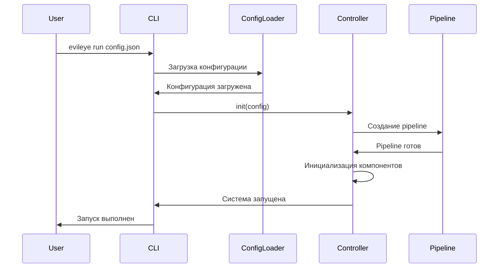
```mermaid
sequenceDiagram
    participant User
    participant CLI
    participant ConfigLoader
    participant Controller
    participant Pipeline
    
    User->>CLI: evileye run config.json
    CLI->>ConfigLoader: Загрузка конфигурации
    ConfigLoader->>CLI: Конфигурация загружена
    CLI->>Controller: init(config)
    Controller->>Pipeline: Создание pipeline
    Pipeline->>Controller: Pipeline готов
    Controller->>Controller: Инициализация компонентов
    Controller->>CLI: Система запущена
    CLI->>User: Запуск выполнен
```

### Описание диаграммы: Поток инициализации

**Что показывает диаграмма:**
Диаграмма последовательности демонстрирует пошаговый процесс инициализации системы EvilEye от момента ввода команды пользователем до полного запуска всех компонентов. Она показывает временную последовательность взаимодействий между компонентами системы.

**Элементы диаграммы:**
- **User**: Пользователь, инициирующий запуск системы
- **CLI**: Командная строка, обрабатывающая команду пользователя
- **ConfigLoader**: Компонент загрузки и валидации конфигурационных файлов
- **Controller**: Центральный оркестратор системы
- **Pipeline**: Модуль обработки видео потоков

**Связи и потоки:**
- **Стрелки** (`->>`): Синхронные вызовы методов или передача данных между компонентами
- **Последовательность сверху вниз**: Отображает временную последовательность операций
- **Самообращение** (`Controller->>Controller`): Внутренние операции компонента без внешних вызовов

**Как это работает:**
1. Пользователь вводит команду `evileye run config.json` в CLI
2. CLI передает путь к конфигурационному файлу в ConfigLoader для загрузки и валидации
3. ConfigLoader возвращает загруженную и проверенную конфигурацию обратно в CLI
4. CLI вызывает метод `init(config)` у Controller, передавая конфигурацию
5. Controller создает экземпляр Pipeline на основе конфигурации
6. Pipeline инициализируется и сигнализирует Controller о готовности
7. Controller выполняет внутреннюю инициализацию всех своих компонентов (ObjectsHandler, EventsDetectors, DatabaseController, Visualizer)
8. Controller уведомляет CLI об успешном запуске системы
9. CLI выводит сообщение пользователю о завершении запуска

**Примеры использования:**
- **Понимание процесса запуска**: Диаграмма помогает понять, какие компоненты инициализируются и в каком порядке
- **Отладка проблем запуска**: При ошибках инициализации можно отследить, на каком этапе произошла проблема
- **Разработка новых точек входа**: Понимание последовательности позволяет правильно интегрировать новые способы запуска системы
- **Оптимизация времени запуска**: Видно, какие операции выполняются последовательно и могут быть оптимизированы

---

## Уровень 2: Контроллер и основные сущности

Контроллер является центральным оркестратором системы, координирующим работу всех основных компонентов.

### Схема архитектуры контроллера

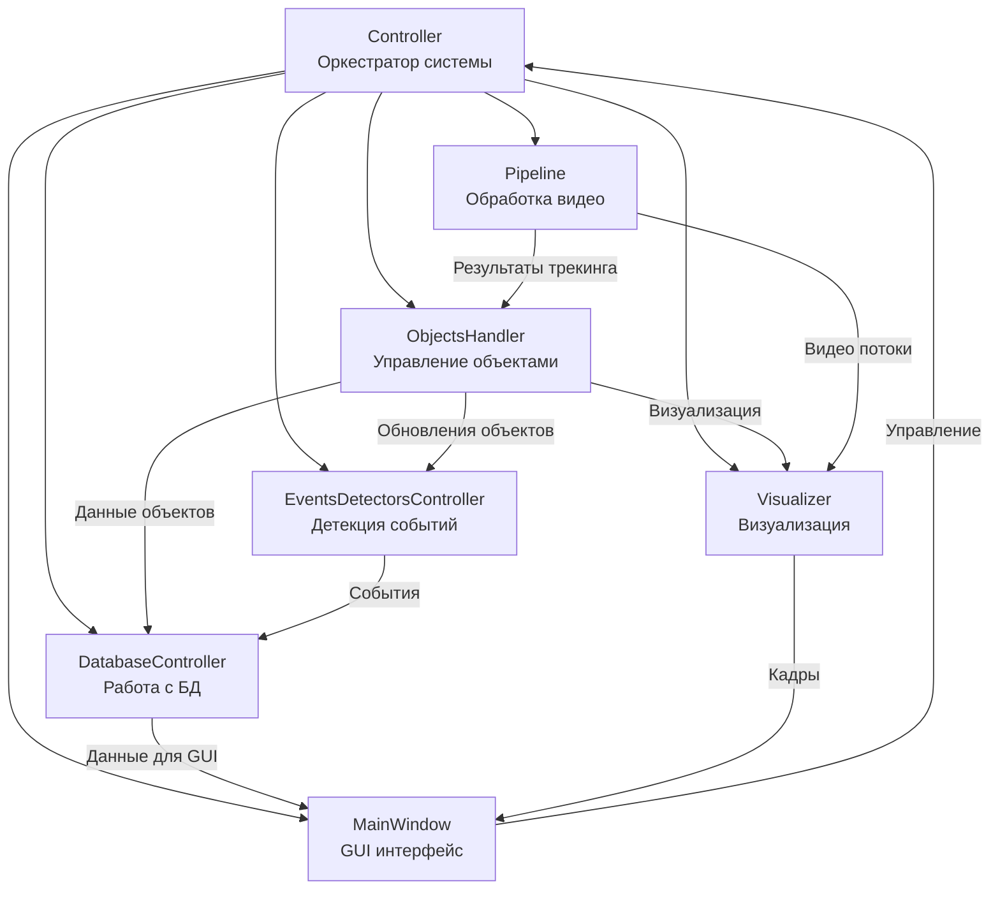
```mermaid
graph TB
    Controller[Controller<br/>Оркестратор системы] --> Pipeline[Pipeline<br/>Обработка видео]
    Controller --> ObjectsHandler[ObjectsHandler<br/>Управление объектами]
    Controller --> EventsDetectors[EventsDetectorsController<br/>Детекция событий]
    Controller --> DatabaseController[DatabaseController<br/>Работа с БД]
    Controller --> Visualizer[Visualizer<br/>Визуализация]
    Controller --> MainWindow[MainWindow<br/>GUI интерфейс]
    
    Pipeline --> |Результаты трекинга| ObjectsHandler
    ObjectsHandler --> |Обновления объектов| EventsDetectors
    ObjectsHandler --> |Данные объектов| DatabaseController
    EventsDetectors --> |События| DatabaseController
    ObjectsHandler --> |Визуализация| Visualizer
    DatabaseController --> |Данные для GUI| MainWindow
    Visualizer --> |Кадры| MainWindow
    
    Pipeline --> |Видео потоки| Visualizer
    
    MainWindow --> |Управление| Controller
```

### Описание диаграммы: Схема архитектуры контроллера

**Что показывает диаграмма:**
Диаграмма отображает центральную роль Controller как оркестратора системы и показывает все основные компоненты, которыми он управляет, а также потоки данных между ними. Она демонстрирует иерархическую структуру системы, где Controller находится на вершине и координирует работу всех подчиненных компонентов.

**Элементы диаграммы:**
- **Controller**: Центральный оркестратор системы, управляющий жизненным циклом всех компонентов
- **Pipeline**: Модуль обработки видео потоков через последовательность процессоров
- **ObjectsHandler**: Компонент управления жизненным циклом детектированных и отслеживаемых объектов
- **EventsDetectorsController**: Координатор различных детекторов событий (FOV, Zone, Attribute, System, Camera)
- **DatabaseController**: Компонент управления сохранением данных в базу данных или JSON файлы
- **Visualizer**: Компонент визуализации результатов обработки (отрисовка объектов, треков, зон)
- **MainWindow**: Главное окно GUI приложения с управлением конфигурациями и отображением данных

**Связи и потоки:**
- **Стрелки от Controller** (`Controller --> Component`): Управляющие связи - Controller создает, инициализирует и управляет компонентами
- **Стрелки с метками** (`--> |метка|`): Потоки данных с указанием типа передаваемой информации:
  - `|Результаты трекинга|`: Данные о треках объектов от Pipeline к ObjectsHandler
  - `|Обновления объектов|`: Уведомления об изменениях состояний объектов для детекторов событий
  - `|Данные объектов|`: Информация об объектах для сохранения в БД
  - `|События|`: Обнаруженные события для сохранения в БД
  - `|Визуализация|`: Данные для отрисовки объектов на кадрах
  - `|Данные для GUI|`: Информация из БД для отображения в интерфейсе
  - `|Кадры|`: Обработанные видеокадры для отображения
  - `|Видео потоки|`: Исходные видеопотоки для визуализации
  - `|Управление|`: Команды от пользователя через GUI к Controller

**Как это работает:**
Controller находится в центре архитектуры и управляет всеми компонентами, но значительную часть обязанностей по инициализации и жизненному циклу он делегирует специализированным сервисам. Через слой сервисов (PipelineService, DatabaseService, EventsService, VisualizationService, ObjectsHandlerService) Controller конфигурирует и запускает Pipeline, ObjectsHandler, EventsDetectorsController, DatabaseController, Visualizer и MainWindow. В главном цикле обработки Controller вызывает Pipeline для обработки видео, получает результаты трекинга и передает их в ObjectsHandler. ObjectsHandler управляет состояниями объектов и уведомляет EventsDetectorsController об изменениях, что позволяет детекторам событий обнаруживать различные типы событий. Все данные (объекты и события) сохраняются через DatabaseService и связанные с ним адаптеры базы данных. Visualizer получает данные для отрисовки как от Pipeline (видеопотоки), так и от ObjectsHandler (информация об объектах), и передает обработанные кадры в MainWindow для отображения пользователю. MainWindow также может отправлять команды управления обратно в Controller.

**Примеры использования:**
- **Понимание архитектуры системы**: Диаграмма помогает понять, как компоненты связаны между собой и какие данные передаются
- **Отладка потоков данных**: При проблемах с данными можно отследить путь от источника до получателя
- **Разработка новых компонентов**: Понимание связей помогает правильно интегрировать новые компоненты в систему
- **Оптимизация производительности**: Видно, какие компоненты взаимодействуют напрямую и где могут быть узкие места

### Слой сервисов контроллера

Для уменьшения связности и нагрузки на Controller в системе используется слой сервисов, инкапсулирующий работу с отдельными подсистемами.

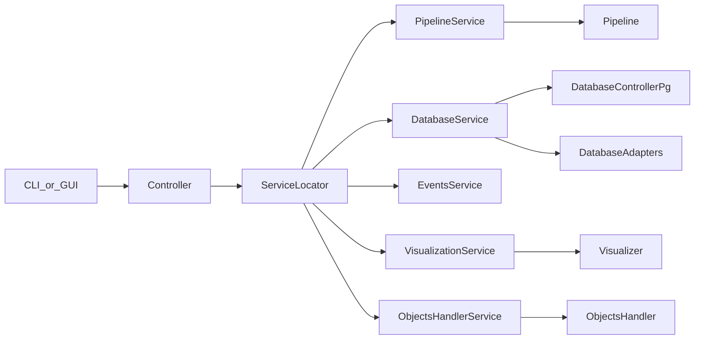
```mermaid
flowchart LR
    cli[CLI_or_GUI] --> controller[Controller]
    controller --> serviceLocator[ServiceLocator]
    serviceLocator --> pipelineService[PipelineService]
    serviceLocator --> dbService[DatabaseService]
    serviceLocator --> eventsService[EventsService]
    serviceLocator --> vizService[VisualizationService]
    serviceLocator --> ohService[ObjectsHandlerService]
    pipelineService --> pipeline[Pipeline]
    dbService --> dbController[DatabaseControllerPg]
    dbService --> dbAdapters[DatabaseAdapters]
    ohService --> objectsHandler[ObjectsHandler]
    vizService --> visualizer[Visualizer]
```

**Что показывает диаграмма:**
Диаграмма отражает текущую архитектуру слоя контроллера: Controller больше не создает и не настраивает все компоненты напрямую, а использует ServiceLocator для доступа к специализированным сервисам. Каждый сервис отвечает за один поддомен (pipeline, БД, события, визуализация, обработчик объектов) и предоставляет высокоуровневый API для Controller.

**Основные сервисы:**
- **PipelineService**: создание, инициализация и запуск/остановка Pipeline (включая загрузку моделей детектора и настройку процессоров).
- **DatabaseService**: инициализация `DatabaseControllerPg`, настройка параметров подключения и централизованный запуск/остановка всех `DatabaseAdapter*`.
- **EventsService**: подготовка детекторов событий, подписка на обновления объектов и управление событиями.
- **VisualizationService**: инициализация `Visualizer`, передача ему метаданных источников и управление режимами отображения.
- **ObjectsHandlerService**: создание и инициализация `ObjectsHandler`, передача ему параметров камер, `ClassManager` и связей с остальными компонентами.
- **ServiceLocator**: точка доступа к сервисам, позволяющая Controller не зависеть напрямую от конкретных реализаций.

Такой слой сервисов уменьшает размер и ответственность Controller, упрощает тестирование и делает архитектуру более модульной.

### Описание компонентов

#### Controller

**Роль**: Центральный оркестратор системы, координирующий компоненты через слой сервисов.

**Основные функции**:
- Инициализация и конфигурация всех компонентов через специализированные сервисы
- Управление главным циклом обработки (`run()`)
- Координация между Pipeline, ObjectsHandler, EventsDetectors
- Управление GUI и визуализацией
- Обработка перезапусков и плановых перезапусков

**Ключевые методы**:
- `init(config)` - Инициализация с конфигурацией
- `start()` - Запуск системы
- `run()` - Главный цикл обработки
- `stop()` - Остановка системы

#### Pipeline

**Роль**: Обработка видео потоков через последовательность процессоров.

**Типы pipeline**:
- `PipelineSurveillance` - Полнофункциональная pipeline с детекцией и трекингом
- `PipelineCapture` - Упрощенная pipeline для захвата видео

**Процесс обработки**:
1. Sources - Захват видео
2. Preprocessors - Предобработка кадров
3. Detectors - Детекция объектов
4. Trackers - Трекинг объектов
5. MC Trackers - Межкамерный трекинг
6. Attributes - Детекция атрибутов

#### ObjectsHandler

**Роль**: Управление жизненным циклом объектов (детектированных и отслеживаемых).

**Состояния объектов**:
- `new_objs` - Новые объекты
- `active_objs` - Активные объекты
- `lost_objs` - Потерянные объекты

**Функции**:
- Прием результатов трекинга из Pipeline
- Управление историей объектов
- Интеграция с LabelingManager для сохранения меток
- Интеграция с AttributeManager для управления атрибутами
- Подписка EventsDetectors на обновления

#### EventsDetectorsController

**Роль**: Координация различных детекторов событий.

**Типы детекторов**:
- `CamEventsDetector` - События камер (старт/стоп)
- `FieldOfViewEventsDetector` - События появления объектов в поле зрения
- `ZoneEventsDetector` - События входа/выхода из зон
- `AttributeEventsDetector` - События изменения атрибутов
- `SystemEventsDetector` - Системные события (старт/стоп системы)

#### DatabaseController

**Роль**: Управление сохранением данных в базу данных или JSON файлы.

**Режимы работы**:
- PostgreSQL - Полнофункциональная БД
- JSON - Файловое хранилище (без БД)

**Адаптеры**:
- `DatabaseAdapterObjects` - Сохранение объектов
- `DatabaseAdapterCamEvents` - События камер
- `DatabaseAdapterFovEvents` - FOV события
- `DatabaseAdapterZoneEvents` - События зон
- `DatabaseAdapterAttributeEvents` - События атрибутов
- `DatabaseAdapterSystemEvents` - Системные события

#### Visualizer и MainWindow

**Роль**: Визуализация результатов и пользовательский интерфейс.

**Visualizer**:
- Отрисовка объектов на кадрах
- Отображение треков
- Визуализация зон и ROI

**MainWindow**:
- Главное окно приложения
- Управление конфигурациями
- Журнал событий
- Настройки системы

### Поток данных в главном цикле

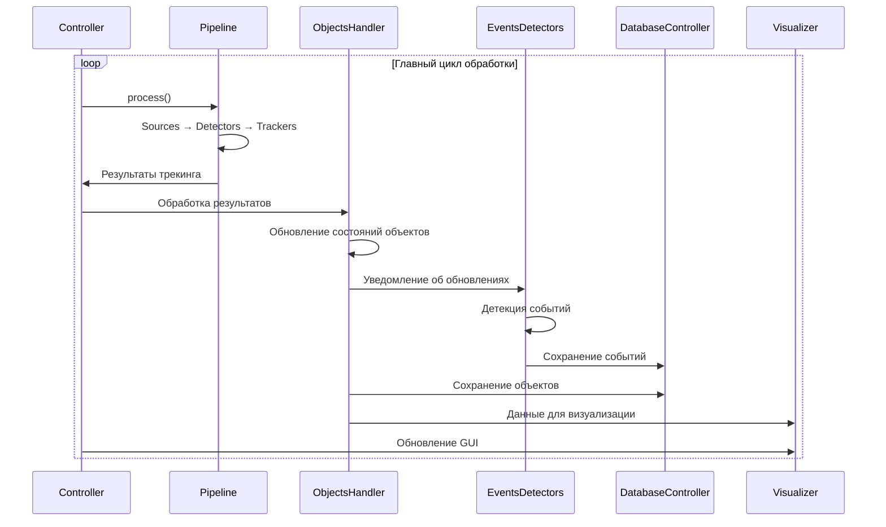
```mermaid
sequenceDiagram
    participant Controller
    participant Pipeline
    participant ObjectsHandler
    participant EventsDetectors
    participant DatabaseController
    participant Visualizer
    
    loop Главный цикл обработки
        Controller->>Pipeline: process()
        Pipeline->>Pipeline: Sources → Detectors → Trackers
        Pipeline->>Controller: Результаты трекинга
        
        Controller->>ObjectsHandler: Обработка результатов
        ObjectsHandler->>ObjectsHandler: Обновление состояний объектов
        
        ObjectsHandler->>EventsDetectors: Уведомление об обновлениях
        EventsDetectors->>EventsDetectors: Детекция событий
        EventsDetectors->>DatabaseController: Сохранение событий
        
        ObjectsHandler->>DatabaseController: Сохранение объектов
        ObjectsHandler->>Visualizer: Данные для визуализации
        
        Controller->>Visualizer: Обновление GUI
    end
```

### Описание диаграммы: Поток данных в главном цикле

**Что показывает диаграмма:**
Диаграмма последовательности демонстрирует детальный поток обработки данных в главном цикле системы EvilEye. Она показывает, как данные проходят через различные компоненты от момента обработки видео до сохранения результатов и обновления интерфейса. Весь процесс выполняется в бесконечном цикле до остановки системы.

**Элементы диаграммы:**
- **Controller**: Центральный оркестратор, управляющий циклом обработки
- **Pipeline**: Модуль обработки видео через последовательность процессоров
- **ObjectsHandler**: Компонент управления жизненным циклом объектов
- **EventsDetectors**: Контроллер детекторов событий (FOV, Zone, Attribute, System, Camera)
- **DatabaseController**: Компонент сохранения данных в БД или JSON
- **Visualizer**: Компонент визуализации результатов

**Связи и потоки:**
- **loop Главный цикл обработки**: Весь процесс выполняется в бесконечном цикле
- **Стрелки** (`->>`): Синхронные вызовы методов или передача данных
- **Самообращение** (`Component->>Component`): Внутренние операции компонента без внешних вызовов
- **Последовательность сверху вниз**: Отображает временную последовательность операций в рамках одной итерации цикла

**Как это работает:**
1. **Обработка видео**: Controller вызывает `Pipeline.process()`, который последовательно обрабатывает кадры через Sources → Preprocessors → Detectors → Trackers → MC Trackers → Attributes
2. **Получение результатов**: Pipeline возвращает результаты трекинга (информацию об отслеживаемых объектах) в Controller
3. **Обработка объектов**: Controller передает результаты в ObjectsHandler, который обновляет состояния объектов (new → active → lost)
4. **Детекция событий**: ObjectsHandler уведомляет EventsDetectors об обновлениях объектов, что позволяет детекторам проверить условия событий (появление в FOV, вход/выход из зон, изменение атрибутов)
5. **Сохранение событий**: EventsDetectors сохраняет обнаруженные события через DatabaseController
6. **Сохранение объектов**: ObjectsHandler также сохраняет данные об объектах через DatabaseController
7. **Визуализация**: ObjectsHandler передает данные для визуализации в Visualizer (bbox, треки, атрибуты)
8. **Обновление GUI**: Controller инициирует обновление интерфейса через Visualizer, который отрисовывает кадры с объектами и передает их в MainWindow

**Примеры использования:**
- **Понимание производительности**: Диаграмма помогает понять последовательность операций и выявить узкие места
- **Отладка обработки**: При проблемах с данными можно отследить, на каком этапе происходит ошибка
- **Оптимизация цикла**: Видно, какие операции выполняются последовательно и могут быть распараллелены
- **Разработка новых детекторов**: Понимание потока позволяет правильно интегрировать новые типы детекторов событий
- **Мониторинг системы**: Диаграмма помогает понять, какие компоненты активны в каждый момент времени

---

## Уровень 3: Pipeline архитектура

Pipeline архитектура обеспечивает модульную и расширяемую обработку видео потоков.

### Иерархия классов Pipeline

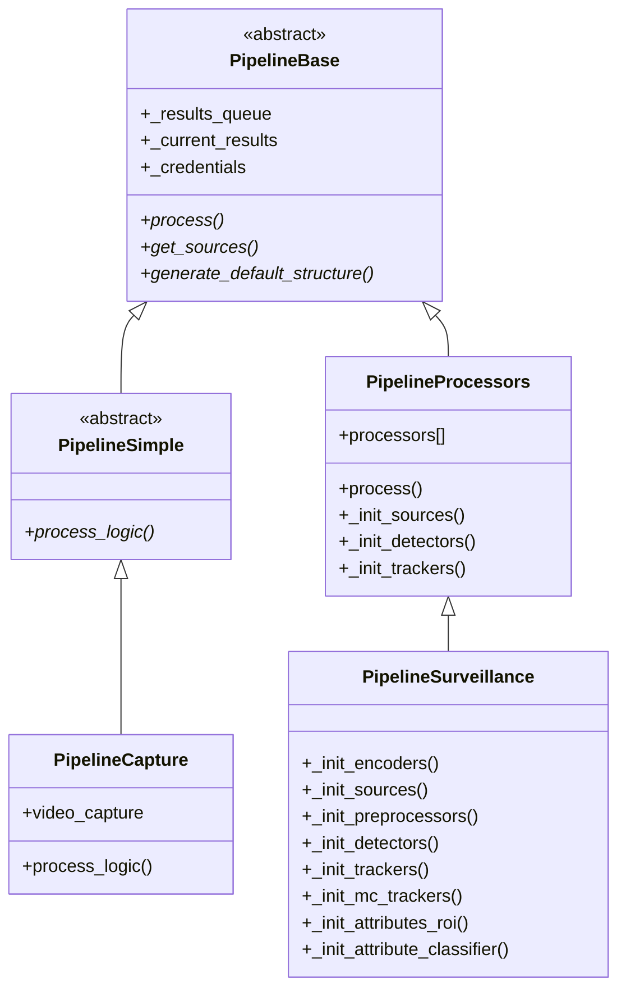
```mermaid
classDiagram
    class PipelineBase {
        <<abstract>>
        +_results_queue
        +_current_results
        +_credentials
        +process()*
        +get_sources()*
        +generate_default_structure()*
    }
    
    class PipelineSimple {
        <<abstract>>
        +process_logic()*
    }
    
    class PipelineProcessors {
        +processors[]
        +process()
        +_init_sources()
        +_init_detectors()
        +_init_trackers()
    }
    
    class PipelineCapture {
        +video_capture
        +process_logic()
    }
    
    class PipelineSurveillance {
        +_init_encoders()
        +_init_sources()
        +_init_preprocessors()
        +_init_detectors()
        +_init_trackers()
        +_init_mc_trackers()
        +_init_attributes_roi()
        +_init_attribute_classifier()
    }
    
    PipelineBase <|-- PipelineSimple
    PipelineBase <|-- PipelineProcessors
    PipelineSimple <|-- PipelineCapture
    PipelineProcessors <|-- PipelineSurveillance
```

### Описание диаграммы: Иерархия классов Pipeline

**Что показывает диаграмма:**
Диаграмма классов демонстрирует иерархию наследования всех типов pipeline в системе EvilEye. Она показывает, как общая функциональность разделена между базовыми классами и как специализированные реализации наследуют и расширяют базовую функциональность.

**Элементы диаграммы:**
- **PipelineBase**: Абстрактный базовый класс для всех реализаций pipeline, содержащий общую функциональность (управление результатами, учетные данные)
- **PipelineSimple**: Абстрактный класс для простых pipeline без процессоров, требующий реализации только метода `process_logic()`
- **PipelineProcessors**: Класс для процессор-базированных pipeline с последовательностью процессоров
- **PipelineCapture**: Конкретная реализация простой pipeline для захвата видео файла
- **PipelineSurveillance**: Конкретная реализация полнофункциональной surveillance pipeline со всеми компонентами

**Связи и потоки:**
- **`<|--`**: Наследование (is-a relationship) - дочерний класс наследует от родительского
- **`<<abstract>>`**: Стереотип абстрактного класса - класс не может быть инстанциирован напрямую
- **`+`**: Публичные методы и атрибуты
- **`*`**: Абстрактные методы, которые должны быть реализованы в дочерних классах

**Как это работает:**
Иерархия построена по принципу разделения ответственности. `PipelineBase` содержит общую функциональность, не зависящую от типа pipeline (управление очередью результатов, учетные данные). От него наследуются два направления: `PipelineSimple` для простых pipeline и `PipelineProcessors` для сложных процессор-базированных pipeline. `PipelineSimple` требует только реализации логики обработки через `process_logic()`, что делает его идеальным для простых задач типа захвата видео. `PipelineProcessors` добавляет функциональность управления последовательностью процессоров и методы инициализации для каждого типа процессора. `PipelineCapture` наследуется от `PipelineSimple` и реализует простой захват видео. `PipelineSurveillance` наследуется от `PipelineProcessors` и добавляет специфичные методы инициализации для всех типов процессоров surveillance системы.

**Примеры использования:**
- **Понимание архитектуры**: Диаграмма помогает понять, как организована иерархия классов и какие методы доступны на каждом уровне
- **Создание новых pipeline**: При разработке новой pipeline видно, от какого класса лучше наследоваться в зависимости от сложности задачи
- **Рефакторинг**: Понимание иерархии помогает правильно переносить общую функциональность в базовые классы
- **Отладка**: При проблемах с pipeline можно понять, на каком уровне иерархии находится проблема

### PipelineSurveillance: Последовательность процессоров


```mermaid
graph LR
    Start[Начало] --> Encoders[Encoders<br/>Инициализация энкодеров]
    Encoders --> Sources[Sources<br/>Видео источники]
    Sources --> Preprocessors[Preprocessors<br/>Предобработка]
    Preprocessors --> Detectors[Detectors<br/>Детекция объектов]
    Detectors --> Trackers[Trackers<br/>Трекинг объектов]
    Trackers --> MCTrackers[MC Trackers<br/>Межкамерный трекинг]
    MCTrackers --> AttributesROI[Attributes ROI<br/>Извлечение ROI]
    AttributesROI --> AttributeClassifier[Attribute Classifier<br/>Классификация атрибутов]
    AttributeClassifier --> End[Результаты]
    
    style Sources fill:#e1f5ff
    style Detectors fill:#fff4e1
    style Trackers fill:#e8f5e8
    style MCTrackers fill:#f3e5f5
```

### Описание диаграммы: PipelineSurveillance - Последовательность процессоров

**Что показывает диаграмма:**
Диаграмма отображает строгую последовательность инициализации и обработки процессоров в PipelineSurveillance. Она демонстрирует порядок, в котором компоненты должны быть инициализированы и обработаны для корректной работы системы видеонаблюдения. Направление слева направо показывает последовательность выполнения.

**Элементы диаграммы:**
- **Start (Начало)**: Точка входа в процесс инициализации
- **Encoders**: Инициализация энкодеров для извлечения признаков объектов (используются трекерами для re-identification)
- **Sources**: Создание и инициализация видео источников (IP камеры, файлы, USB устройства)
- **Preprocessors**: Инициализация предобработчиков кадров (улучшение качества, нормализация)
- **Detectors**: Инициализация детекторов объектов (YOLO, RT-DETR, RF-DETR модели)
- **Trackers**: Инициализация трекеров объектов (BoTSORT алгоритм)
- **MC Trackers**: Инициализация межкамерных трекеров для реидентификации объектов между камерами
- **Attributes ROI**: Инициализация извлечения областей интереса (ROI) из детектированных объектов для анализа атрибутов
- **Attribute Classifier**: Инициализация классификатора атрибутов объектов (каска, рюкзак и т.д.)
- **End (Результаты)**: Финальные результаты обработки, передаваемые в ObjectsHandler

**Связи и потоки:**
- **Стрелки** (`-->`): Последовательность выполнения - каждый этап должен завершиться перед началом следующего
- **Направление LR (Left-Right)**: Показывает временную последовательность слева направо
- **Цветовая кодировка**: Различные цвета узлов помогают визуально группировать компоненты:
  - Sources (голубой): Входные данные
  - Detectors (желтый): Детекция
  - Trackers (зеленый): Трекинг
  - MC Trackers (фиолетовый): Межкамерный трекинг

**Как это работает:**
Последовательность строго определена и должна соблюдаться. Сначала инициализируются Encoders (если требуется), так как они могут использоваться трекерами. Затем создаются Sources для захвата видео. После этого инициализируются Preprocessors для подготовки кадров к детекции. Detectors обрабатывают подготовленные кадры и находят объекты. Trackers присваивают идентификаторы объектам и отслеживают их между кадрами. MC Trackers связывают объекты между разными камерами. Attributes ROI извлекает области интереса из треков для анализа атрибутов. Attribute Classifier классифицирует атрибуты объектов. Результаты передаются в ObjectsHandler для дальнейшей обработки.

**Примеры использования:**
- **Понимание порядка инициализации**: Диаграмма помогает понять, почему компоненты должны инициализироваться в определенном порядке
- **Отладка проблем инициализации**: При ошибках можно определить, на каком этапе произошла проблема
- **Разработка новых процессоров**: Понимание последовательности помогает правильно интегрировать новые типы процессоров
- **Оптимизация производительности**: Видно, какие этапы выполняются последовательно и могут быть оптимизированы
- **Настройка конфигурации**: Помогает понять, какие компоненты зависят от других и должны быть настроены в правильном порядке

### Описание компонентов Pipeline

#### PipelineBase

**Базовый класс** для всех реализаций pipeline.

**Общая функциональность**:
- Управление очередью результатов (`_results_queue`)
- Хранение текущих результатов (`_current_results`)
- Управление учетными данными (`_credentials`)
- Методы доступа к результатам (`get_results_list()`, `peek_latest_result()`)

**Абстрактные методы**:
- `get_sources()` - Возвращает список видео источников
- `generate_default_structure(num_sources)` - Генерирует структуру конфигурации

#### PipelineSimple

**Простая реализация** pipeline без процессоров.

**Особенности**:
- Абстрактный метод `process_logic()` для реализации логики
- Возвращает пустой список источников
- Используется для простых задач (например, захват видео)

#### PipelineProcessors

**Процессор-базированная** pipeline с последовательностью процессоров.

**Особенности**:
- Список процессоров (`processors[]`)
- Последовательная обработка через `process()`
- Методы инициализации для каждого типа процессора
- Управление результатами каждого этапа

#### PipelineCapture

**Простая pipeline** для захвата видео файла.

**Особенности**:
- Использует `VideoCapture` напрямую
- Упрощенная конфигурация (параметры из секции `sources`)
- Метод `get()` для чтения кадров
- Возвращает `CaptureImage` объекты

**Последовательность обработки**:
```python
VideoCapture.get() → CaptureImage → Результат
```

#### PipelineSurveillance

**Полнофункциональная** surveillance pipeline.

**Последовательность инициализации**:
1. **Encoders** - Инициализация энкодеров для трекинга (если требуется)
2. **Sources** - Создание видео источников (IP камеры, файлы, устройства)
3. **Preprocessors** - Инициализация предобработчиков кадров
4. **Detectors** - Инициализация детекторов объектов (YOLO, RT-DETR, RF-DETR)
5. **Trackers** - Инициализация трекеров (BoTSORT)
6. **MC Trackers** - Инициализация межкамерных трекеров
7. **Attributes ROI** - Инициализация извлечения ROI для атрибутов
8. **Attribute Classifier** - Инициализация классификатора атрибутов

**Процесс обработки**:
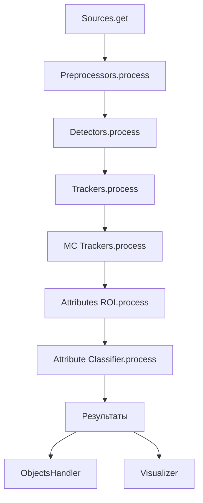
```mermaid
flowchart TD
    A[Sources.get] --> B[Preprocessors.process]
    B --> C[Detectors.process]
    C --> D[Trackers.process]
    D --> E[MC Trackers.process]
    E --> F[Attributes ROI.process]
    F --> G[Attribute Classifier.process]
    G --> H[Результаты]
    
    H --> I[ObjectsHandler]
    H --> J[Visualizer]
```

### Описание диаграммы: Процесс обработки

**Что показывает диаграмма:**
Диаграмма потока демонстрирует последовательность вызовов методов процессоров при обработке каждого кадра видео в PipelineSurveillance. Она показывает, как данные проходят через каждый этап обработки от захвата кадра до получения финальных результатов с треками объектов и их атрибутами.

**Элементы диаграммы:**
- **Sources.get**: Метод получения кадров из видео источников
- **Preprocessors.process**: Метод предобработки кадров (нормализация, улучшение качества)
- **Detectors.process**: Метод детекции объектов на кадре (нахождение bbox и классов)
- **Trackers.process**: Метод трекинга объектов (присвоение track_id, отслеживание между кадрами)
- **MC Trackers.process**: Метод межкамерного трекинга (связывание объектов между камерами)
- **Attributes ROI.process**: Метод извлечения областей интереса из треков для анализа атрибутов
- **Attribute Classifier.process**: Метод классификации атрибутов объектов (каска, рюкзак и т.д.)
- **Результаты**: Финальные данные обработки (треки объектов с атрибутами)
- **ObjectsHandler**: Компонент управления объектами, получающий результаты
- **Visualizer**: Компонент визуализации, получающий результаты для отрисовки

**Связи и потоки:**
- **Стрелки** (`-->`): Последовательный вызов методов процессоров
- **Направление TD (Top-Down)**: Показывает поток данных сверху вниз
- **Разветвление результатов**: Результаты передаются одновременно в ObjectsHandler и Visualizer

**Как это работает:**
При каждом вызове `Pipeline.process()` выполняется следующая последовательность: Sources получает новые кадры из всех настроенных источников. Preprocessors обрабатывают кадры (нормализация, улучшение контраста и т.д.). Detectors анализируют обработанные кадры и находят объекты с их классами и координатами. Trackers присваивают идентификаторы объектам и отслеживают их между кадрами, обновляя позиции и состояния. MC Trackers связывают объекты между разными камерами, создавая единые треки для объектов, появляющихся в поле зрения нескольких камер. Attributes ROI извлекает области интереса из треков объектов для дальнейшего анализа атрибутов. Attribute Classifier классифицирует атрибуты объектов на основе извлеченных ROI. Финальные результаты содержат полную информацию о треках объектов с их атрибутами и передаются одновременно в ObjectsHandler для управления жизненным циклом и в Visualizer для отрисовки.

**Примеры использования:**
- **Понимание потока данных**: Диаграмма помогает понять, как данные трансформируются на каждом этапе
- **Отладка обработки**: При проблемах с результатами можно определить, на каком этапе происходит ошибка
- **Оптимизация производительности**: Видно последовательность операций, которые могут быть оптимизированы или распараллелены
- **Разработка новых процессоров**: Понимание потока помогает правильно интегрировать новые типы процессоров в последовательность
- **Настройка конфигурации**: Помогает понять зависимости между процессорами и порядок их настройки

### Регистрация и обнаружение Pipeline классов

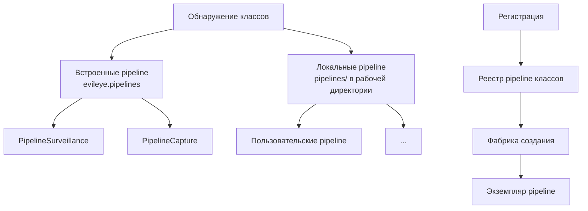
```mermaid
graph TB
    Discovery[Обнаружение классов] --> Builtin[Встроенные pipeline<br/>evileye.pipelines]
    Discovery --> Local[Локальные pipeline<br/>pipelines/ в рабочей директории]
    
    Builtin --> PipelineSurveillance[PipelineSurveillance]
    Builtin --> PipelineCapture[PipelineCapture]
    
    Local --> CustomPipeline1[Пользовательские pipeline]
    Local --> CustomPipeline2[...]
    
    Registration[Регистрация] --> Registry[Реестр pipeline классов]
    Registry --> Factory[Фабрика создания]
    Factory --> Instance[Экземпляр pipeline]
```

### Описание диаграммы: Регистрация и обнаружение Pipeline классов

**Что показывает диаграмма:**
Диаграмма демонстрирует механизм динамического обнаружения и регистрации классов pipeline в системе EvilEye. Она показывает, как система находит доступные классы pipeline из различных источников и как они регистрируются для последующего использования через фабрику создания экземпляров.

**Элементы диаграммы:**
- **Discovery (Обнаружение классов)**: Процесс сканирования и поиска классов pipeline
- **Builtin (Встроенные pipeline)**: Источник встроенных классов из пакета `evileye.pipelines`
- **Local (Локальные pipeline)**: Источник пользовательских классов из локальной папки `pipelines/` в рабочей директории
- **PipelineSurveillance**: Встроенный класс полнофункциональной surveillance pipeline
- **PipelineCapture**: Встроенный класс простой pipeline для захвата видео
- **CustomPipeline1, CustomPipeline2**: Примеры пользовательских pipeline классов
- **Registration (Регистрация)**: Процесс регистрации найденных классов
- **Registry (Реестр pipeline классов)**: Хранилище зарегистрированных классов с их метаданными
- **Factory (Фабрика создания)**: Компонент, создающий экземпляры pipeline на основе имени класса
- **Instance (Экземпляр pipeline)**: Конкретный экземпляр pipeline, созданный фабрикой

**Связи и потоки:**
- **Стрелки** (`-->`): Поток процесса от обнаружения до создания экземпляра
- **Направление TB (Top-Bottom)**: Показывает последовательность этапов сверху вниз
- **Разветвление источников**: Discovery проверяет два источника классов параллельно

**Как это работает:**
При запуске системы или при запросе списка доступных pipeline, механизм Discovery сканирует два источника: встроенный пакет `evileye.pipelines` и локальную папку `pipelines/` в рабочей директории. Из встроенного пакета обнаруживаются стандартные классы (PipelineSurveillance, PipelineCapture). Из локальной папки могут быть обнаружены пользовательские классы, созданные разработчиками. Все найденные классы регистрируются в Registry с их метаданными (имя класса, описание, параметры конфигурации). Когда требуется создать экземпляр pipeline (например, при загрузке конфигурации с указанием `pipeline_class`), Factory использует Registry для поиска класса по имени и создания экземпляра через рефлексию. Это позволяет системе динамически расширяться новыми типами pipeline без изменения основного кода.

**Примеры использования:**
- **Понимание расширяемости**: Диаграмма показывает, как система поддерживает добавление пользовательских pipeline
- **Разработка новых pipeline**: Помогает понять, где размещать новые классы и как они будут обнаружены
- **Отладка проблем загрузки**: При ошибках создания pipeline можно отследить, на каком этапе (обнаружение, регистрация, создание) произошла проблема
- **Динамическая конфигурация**: Позволяет создавать различные типы pipeline в зависимости от конфигурации без перекомпиляции
- **Тестирование**: Можно создавать тестовые pipeline в локальной папке для проверки функциональности

---

## Уровень 4: Видеозахват и запись

Система поддерживает различные бэкенды для захвата и записи видео.

### Архитектура видеозахвата

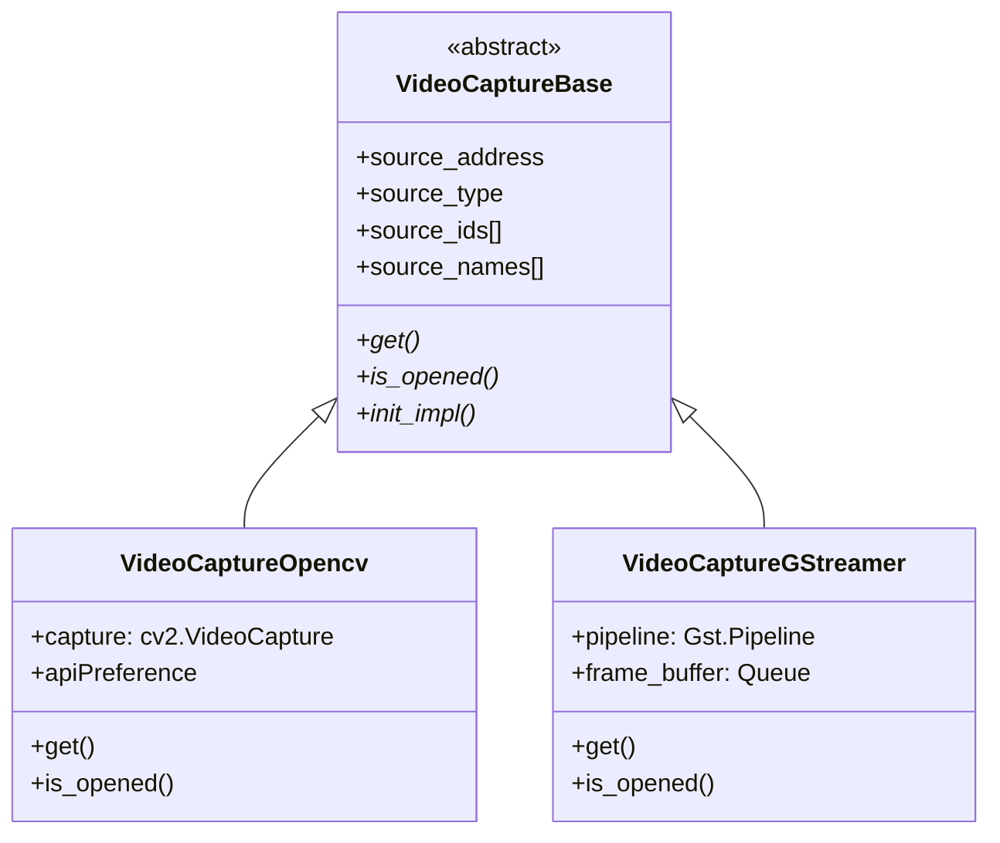
```mermaid
classDiagram
    class VideoCaptureBase {
        <<abstract>>
        +source_address
        +source_type
        +source_ids[]
        +source_names[]
        +get()*
        +is_opened()*
        +init_impl()*
    }
    
    class VideoCaptureOpencv {
        +capture: cv2.VideoCapture
        +apiPreference
        +get()
        +is_opened()
    }
    
    class VideoCaptureGStreamer {
        +pipeline: Gst.Pipeline
        +frame_buffer: Queue
        +get()
        +is_opened()
    }
    
    VideoCaptureBase <|-- VideoCaptureOpencv
    VideoCaptureBase <|-- VideoCaptureGStreamer
```

### Описание диаграммы: Архитектура видеозахвата

**Что показывает диаграмма:**
Диаграмма классов демонстрирует иерархию классов для захвата видео из различных источников. Она показывает абстрактный базовый класс с общим интерфейсом и две конкретные реализации, использующие разные технологии (OpenCV и GStreamer) для работы с видео источниками.

**Элементы диаграммы:**
- **VideoCaptureBase**: Абстрактный базовый класс, определяющий общий интерфейс для всех реализаций видеозахвата
- **VideoCaptureOpencv**: Реализация на основе OpenCV, использующая `cv2.VideoCapture` для работы с различными источниками
- **VideoCaptureGStreamer**: Реализация на основе GStreamer, использующая `Gst.Pipeline` для более гибкой работы с видео потоками

**Связи и потоки:**
- **`<|--`**: Наследование - дочерние классы реализуют абстрактные методы базового класса
- **`<<abstract>>`**: Стереотип абстрактного класса - VideoCaptureBase не может быть инстанциирован напрямую
- **`+`**: Публичные методы и атрибуты
- **`*`**: Абстрактные методы, которые должны быть реализованы в дочерних классах

**Как это работает:**
VideoCaptureBase определяет общий интерфейс с абстрактными методами `get()`, `is_opened()`, `init_impl()`, которые должны быть реализованы в дочерних классах. VideoCaptureOpencv использует стандартный OpenCV API (`cv2.VideoCapture`) для работы с источниками, поддерживая различные API предпочтения (CAP_FFMPEG, CAP_GSTREAMER). VideoCaptureGStreamer использует нативный GStreamer pipeline для более гибкой работы с видео потоками, обеспечивая лучшую производительность и поддержку аппаратного ускорения. Оба класса реализуют одинаковый интерфейс, что позволяет системе использовать их взаимозаменяемо в зависимости от конфигурации.

**Примеры использования:**
- **Понимание абстракции**: Диаграмма показывает, как общий интерфейс скрывает различия в реализации
- **Выбор реализации**: Помогает понять, когда использовать OpenCV, а когда GStreamer
- **Разработка новых реализаций**: При необходимости можно добавить новые классы, наследуясь от VideoCaptureBase
- **Тестирование**: Можно создавать mock-реализации для тестирования без реальных видео источников

### Схема выбора бэкенда захвата

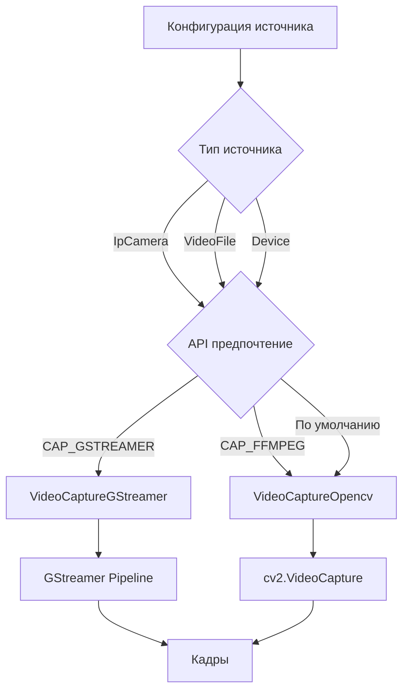
```mermaid
graph TB
    Config[Конфигурация источника] --> CheckType{Тип источника}
    
    CheckType -->|IpCamera| CheckAPI{API предпочтение}
    CheckType -->|VideoFile| CheckAPI
    CheckType -->|Device| CheckAPI
    
    CheckAPI -->|CAP_GSTREAMER| GStreamer[VideoCaptureGStreamer]
    CheckAPI -->|CAP_FFMPEG| OpenCV[VideoCaptureOpencv]
    CheckAPI -->|По умолчанию| OpenCV
    
    GStreamer --> GStreamerPipeline[GStreamer Pipeline]
    OpenCV --> OpenCVCapture[cv2.VideoCapture]
    
    GStreamerPipeline --> Frames[Кадры]
    OpenCVCapture --> Frames
```

### Описание диаграммы: Схема выбора бэкенда захвата

**Что показывает диаграмма:**
Диаграмма потока решений демонстрирует логику выбора конкретной реализации видеозахвата на основе конфигурации источника. Она показывает последовательность проверок условий и выбор между различными бэкендами в зависимости от типа источника и предпочтений API.

**Элементы диаграммы:**
- **Config (Конфигурация источника)**: Входные данные конфигурации с параметрами источника
- **CheckType (Тип источника)**: Узел принятия решения о типе источника (IpCamera, VideoFile, Device)
- **CheckAPI (API предпочтение)**: Узел принятия решения о предпочтении API (CAP_GSTREAMER, CAP_FFMPEG, по умолчанию)
- **GStreamer (VideoCaptureGStreamer)**: Реализация на основе GStreamer
- **OpenCV (VideoCaptureOpencv)**: Реализация на основе OpenCV
- **GStreamerPipeline**: GStreamer pipeline для обработки видео
- **OpenCVCapture**: Объект cv2.VideoCapture для обработки видео
- **Frames (Кадры)**: Финальный результат - кадры видео в формате BGR

**Связи и потоки:**
- **Ромбовидные узлы** (`{}`): Узлы принятия решений (decision nodes)
- **Стрелки с метками** (`--> |метка|`): Условия перехода к следующему узлу
- **Направление TB (Top-Bottom)**: Показывает последовательность принятия решений сверху вниз

**Как это работает:**
Система начинает с анализа конфигурации источника. Сначала определяется тип источника (IpCamera для RTSP потоков, VideoFile для видео файлов, Device для USB камер). Затем проверяется предпочтение API из конфигурации. Если указано `CAP_GSTREAMER`, создается VideoCaptureGStreamer с соответствующим GStreamer pipeline. Если указано `CAP_FFMPEG` или значение по умолчанию, создается VideoCaptureOpencv с использованием cv2.VideoCapture. GStreamer pipeline строится в зависимости от типа источника (rtspsrc для IP камер, filesrc для файлов, v4l2src для устройств). OpenCV использует стандартный API для работы с источниками. Оба пути в конечном итоге приводят к получению кадров в формате BGR, готовых для дальнейшей обработки.

**Примеры использования:**
- **Понимание логики выбора**: Диаграмма помогает понять, как система выбирает бэкенд на основе конфигурации
- **Настройка конфигурации**: Помогает правильно настроить параметры для использования нужного бэкенда
- **Отладка проблем захвата**: При проблемах можно определить, какой бэкенд используется и почему
- **Оптимизация производительности**: Позволяет выбрать оптимальный бэкенд для конкретного типа источника
- **Расширение функциональности**: Показывает точки, где можно добавить новые типы источников или бэкендов

### Типы источников и их обработка

#### IP Camera (RTSP)

**OpenCV**:
```
rtsp://url → cv2.VideoCapture(CAP_FFMPEG) → Кадры
```

**GStreamer**:
```
rtspsrc location=rtsp://url → rtph264depay → h264parse → 
avdec_h264 → videoconvert → appsink → Кадры
```

#### Video File

**OpenCV**:
```
/path/to/video.mp4 → cv2.VideoCapture(CAP_FFMPEG) → Кадры
```

**GStreamer**:
```
filesrc location=/path/to/video.mp4 → decodebin → 
videoconvert → appsink → Кадры
```

#### USB Camera (Device)

**OpenCV**:
```
device_index → cv2.VideoCapture(device_index) → Кадры
```

**GStreamer**:
```
v4l2src device=/dev/video0 → videoconvert → appsink → Кадры
```

### Архитектура записи видео

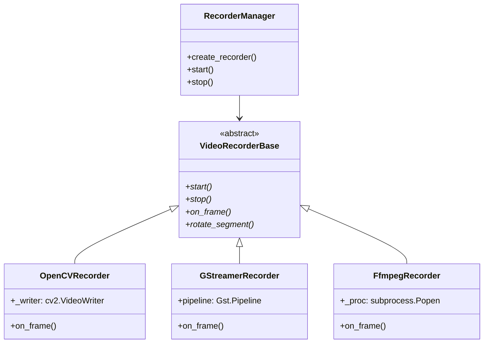
```mermaid
classDiagram
    class VideoRecorderBase {
        <<abstract>>
        +start()*
        +stop()*
        +on_frame()*
        +rotate_segment()*
    }
    
    class RecorderManager {
        +create_recorder()
        +start()
        +stop()
    }
    
    class OpenCVRecorder {
        +_writer: cv2.VideoWriter
        +on_frame()
    }
    
    class GStreamerRecorder {
        +pipeline: Gst.Pipeline
        +on_frame()
    }
    
    class FfmpegRecorder {
        +_proc: subprocess.Popen
        +on_frame()
    }
    
    VideoRecorderBase <|-- OpenCVRecorder
    VideoRecorderBase <|-- GStreamerRecorder
    VideoRecorderBase <|-- FfmpegRecorder
    RecorderManager --> VideoRecorderBase
```

### Описание диаграммы: Архитектура записи видео

**Что показывает диаграмма:**
Диаграмма классов демонстрирует иерархию классов для записи видео в файлы. Она показывает абстрактный базовый класс с общим интерфейсом записи и три конкретные реализации, использующие разные технологии (OpenCV, GStreamer, FFmpeg) для записи видео, а также менеджер, который управляет выбором и жизненным циклом рекордеров.

**Элементы диаграммы:**
- **VideoRecorderBase**: Абстрактный базовый класс, определяющий общий интерфейс для всех реализаций записи видео
- **RecorderManager**: Менеджер, управляющий выбором и жизненным циклом рекордеров
- **OpenCVRecorder**: Реализация на основе OpenCV, использующая `cv2.VideoWriter` для записи
- **GStreamerRecorder**: Реализация на основе GStreamer, использующая `Gst.Pipeline` для записи
- **FfmpegRecorder**: Реализация на основе FFmpeg через subprocess для копирования потоков без перекодирования

**Связи и потоки:**
- **`<|--`**: Наследование - дочерние классы реализуют абстрактные методы базового класса
- **`-->`**: Композиция - RecorderManager использует VideoRecorderBase для создания экземпляров
- **`<<abstract>>`**: Стереотип абстрактного класса - VideoRecorderBase не может быть инстанциирован напрямую
- **`+`**: Публичные методы и атрибуты
- **`*`**: Абстрактные методы, которые должны быть реализованы в дочерних классах

**Как это работает:**
VideoRecorderBase определяет общий интерфейс с абстрактными методами `start()`, `stop()`, `on_frame()`, `rotate_segment()`, которые должны быть реализованы в дочерних классах. RecorderManager анализирует бэкенд захвата и тип источника, чтобы выбрать подходящий рекордер. OpenCVRecorder использует стандартный OpenCV API для записи кадров в файлы, поддерживая различные кодеки. GStreamerRecorder интегрируется в GStreamer pipeline захвата через элемент `tee`, что позволяет записывать видео без дополнительного копирования кадров. FfmpegRecorder используется специально для видео файлов с GStreamer и копирует потоки напрямую без перекодирования, что обеспечивает максимальную производительность. Все рекордеры поддерживают сегментацию по времени для управления размером файлов.

**Примеры использования:**
- **Понимание абстракции записи**: Диаграмма показывает, как общий интерфейс скрывает различия в реализации
- **Выбор реализации**: Помогает понять логику выбора рекордера в зависимости от бэкенда захвата
- **Разработка новых рекордеров**: При необходимости можно добавить новые классы, наследуясь от VideoRecorderBase
- **Оптимизация записи**: Показывает различные подходы к записи и их преимущества

### Выбор рекордера

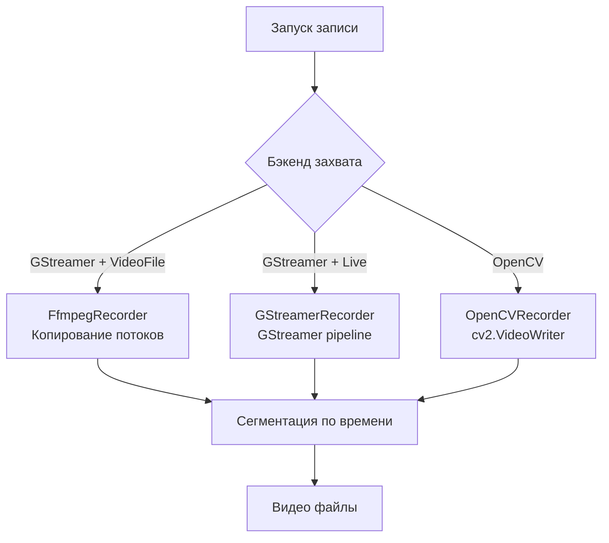
```mermaid
graph TB
    Start[Запуск записи] --> CheckBackend{Бэкенд захвата}
    
    CheckBackend -->|GStreamer + VideoFile| FFmpeg[FfmpegRecorder<br/>Копирование потоков]
    CheckBackend -->|GStreamer + Live| GStreamer[GStreamerRecorder<br/>GStreamer pipeline]
    CheckBackend -->|OpenCV| OpenCV[OpenCVRecorder<br/>cv2.VideoWriter]
    
    FFmpeg --> Segment[Сегментация по времени]
    GStreamer --> Segment
    OpenCV --> Segment
    
    Segment --> Files[Видео файлы]
```

### Описание диаграммы: Выбор рекордера

**Что показывает диаграмма:**
Диаграмма потока решений демонстрирует логику выбора конкретной реализации рекордера на основе бэкенда видеозахвата и типа источника. Она показывает, как система выбирает оптимальный способ записи видео в зависимости от используемого бэкенда захвата.

**Элементы диаграммы:**
- **Start (Запуск записи)**: Точка входа при инициализации записи
- **CheckBackend (Бэкенд захвата)**: Узел принятия решения о бэкенде захвата и типе источника
- **FFmpeg (FfmpegRecorder)**: Рекордер для видео файлов с GStreamer, использующий копирование потоков
- **GStreamer (GStreamerRecorder)**: Рекордер для live источников с GStreamer, интегрированный в pipeline
- **OpenCV (OpenCVRecorder)**: Рекордер для всех случаев с OpenCV бэкендом
- **Segment (Сегментация по времени)**: Процесс разбиения записи на сегменты
- **Files (Видео файлы)**: Финальный результат - записанные видео файлы

**Связи и потоки:**
- **Ромбовидный узел** (`{}`): Узел принятия решения
- **Стрелки с метками** (`--> |метка|`): Условия перехода к конкретному рекордеру:
  - `|GStreamer + VideoFile|`: GStreamer бэкенд с видео файлом как источником
  - `|GStreamer + Live|`: GStreamer бэкенд с live источником (IP камера, USB)
  - `|OpenCV|`: OpenCV бэкенд для любого типа источника
- **Направление TB (Top-Bottom)**: Показывает последовательность принятия решений сверху вниз

**Как это работает:**
При запуске записи система анализирует бэкенд видеозахвата и тип источника. Если используется GStreamer с видео файлом, выбирается FfmpegRecorder, который копирует потоки напрямую без перекодирования через FFmpeg subprocess, что обеспечивает максимальную производительность и качество. Если используется GStreamer с live источником (IP камера или USB устройство), выбирается GStreamerRecorder, который интегрируется в существующий GStreamer pipeline через элемент `tee`, что позволяет записывать видео без дополнительного копирования кадров в память. Для всех случаев с OpenCV бэкендом используется OpenCVRecorder, который записывает кадры через `cv2.VideoWriter`. Все рекордеры поддерживают сегментацию по времени, автоматически разбивая запись на файлы заданной длительности, что упрощает управление и обработку записанного видео.

**Примеры использования:**
- **Понимание логики выбора**: Диаграмма помогает понять, почему система выбирает конкретный рекордер
- **Оптимизация записи**: Позволяет выбрать оптимальный рекордер для конкретного сценария использования
- **Отладка проблем записи**: При проблемах можно определить, какой рекордер используется и почему
- **Настройка производительности**: Помогает понять, как выбор бэкенда захвата влияет на выбор рекордера
- **Разработка новых рекордеров**: Показывает точки принятия решений, где можно добавить новые варианты

### Особенности записи

**Сегментация**:
- Запись разбивается на сегменты по времени (`segment_length_sec`)
- Автоматическая ротация файлов
- Структура директорий: `YYYY-MM-DD/camera_name/`

**GStreamer Recorder**:
- Интеграция в pipeline захвата
- Использование `tee` элемента для разделения потоков
- Поддержка аппаратного кодирования

**FFmpeg Recorder**:
- Используется для видео файлов с GStreamer
- Копирование потоков без перекодирования
- Сегментация через `-f segment`

**OpenCV Recorder**:
- Простая реализация через `cv2.VideoWriter`
- Поддержка различных кодеков (MPEG4, H264, XVID)
- Ручная сегментация

---

## Уровень 5: Обработка объектов

Система обработки объектов управляет детектированными и отслеживаемыми объектами на протяжении их жизненного цикла.

### Поток обработки объектов

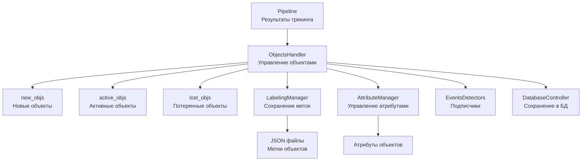
```mermaid
graph TB
    Pipeline[Pipeline<br/>Результаты трекинга] --> ObjectsHandler[ObjectsHandler<br/>Управление объектами]
    
    ObjectsHandler --> NewObjs[new_objs<br/>Новые объекты]
    ObjectsHandler --> ActiveObjs[active_objs<br/>Активные объекты]
    ObjectsHandler --> LostObjs[lost_objs<br/>Потерянные объекты]
    
    ObjectsHandler --> LabelingManager[LabelingManager<br/>Сохранение меток]
    ObjectsHandler --> AttributeManager[AttributeManager<br/>Управление атрибутами]
    
    LabelingManager --> JSONFiles[JSON файлы<br/>Метки объектов]
    AttributeManager --> ObjectAttributes[Атрибуты объектов]
    
    ObjectsHandler --> EventsDetectors[EventsDetectors<br/>Подписчики]
    ObjectsHandler --> DatabaseController[DatabaseController<br/>Сохранение в БД]
```

### Описание диаграммы: Поток обработки объектов

**Что показывает диаграмма:**
Диаграмма демонстрирует поток данных от Pipeline до финального сохранения объектов и их меток. Она показывает, как ObjectsHandler управляет жизненным циклом объектов, распределяя их по различным состояниям и взаимодействуя с менеджерами для сохранения меток и управления атрибутами.

**Элементы диаграммы:**
- **Pipeline**: Источник результатов трекинга с информацией об отслеживаемых объектах
- **ObjectsHandler**: Центральный компонент управления объектами и их состояниями
- **new_objs**: Список новых объектов, только что детектированных
- **active_objs**: Список активных объектов, которые отслеживаются в текущий момент
- **lost_objs**: Список потерянных объектов, которые временно не отслеживаются
- **LabelingManager**: Менеджер сохранения меток объектов в JSON файлы
- **AttributeManager**: Менеджер управления атрибутами объектов (каска, рюкзак и т.д.)
- **JSONFiles**: JSON файлы с метками объектов для экспорта и анализа
- **ObjectAttributes**: Управляемые атрибуты объектов
- **EventsDetectors**: Детекторы событий, подписанные на обновления объектов
- **DatabaseController**: Контроллер базы данных для сохранения объектов

**Связи и потоки:**
- **Стрелки** (`-->`): Поток данных и управления между компонентами
- **Направление TB (Top-Bottom)**: Показывает иерархию и поток данных сверху вниз
- **Разветвление от ObjectsHandler**: ObjectsHandler распределяет данные в несколько направлений параллельно

**Как это работает:**
Pipeline передает результаты трекинга в ObjectsHandler через очередь. ObjectsHandler обрабатывает результаты в отдельном потоке и распределяет объекты по трем спискам в зависимости от их состояния: новые объекты попадают в `new_objs`, активные объекты обновляются в `active_objs`, потерянные объекты перемещаются в `lost_objs`. Параллельно ObjectsHandler взаимодействует с LabelingManager для сохранения меток объектов в JSON файлы (bbox, классы, треки). AttributeManager получает информацию об атрибутах объектов и управляет их состояниями (none/exists/lost). ObjectsHandler также уведомляет подписанные EventsDetectors об обновлениях объектов, что позволяет детекторам событий проверять условия событий. Все данные об объектах сохраняются через DatabaseController в базу данных или JSON файлы.

**Примеры использования:**
- **Понимание жизненного цикла объектов**: Диаграмма помогает понять, как объекты проходят через различные состояния
- **Отладка обработки объектов**: При проблемах можно отследить путь данных от Pipeline до сохранения
- **Настройка меток**: Помогает понять, как настраивается сохранение меток через LabelingManager
- **Работа с атрибутами**: Показывает, как интегрируется управление атрибутами объектов
- **Интеграция событий**: Демонстрирует связь между объектами и детекторами событий

### Жизненный цикл объекта

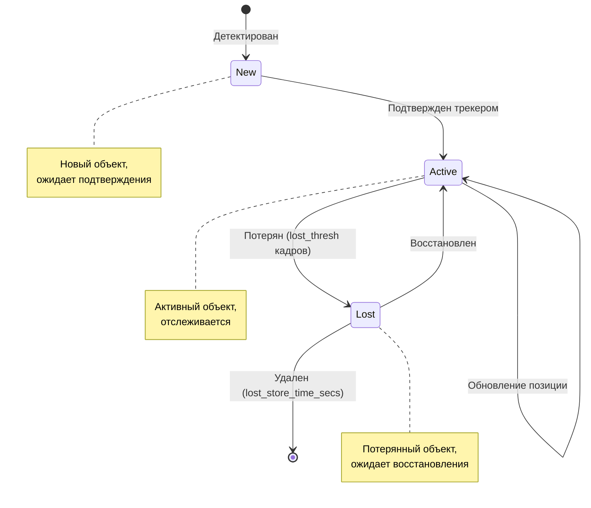
```mermaid
stateDiagram-v2
    [*] --> New: Детектирован
    New --> Active: Подтвержден трекером
    Active --> Active: Обновление позиции
    Active --> Lost: Потерян (lost_thresh кадров)
    Lost --> Active: Восстановлен
    Lost --> [*]: Удален (lost_store_time_secs)
    
    note right of New
        Новый объект,
        ожидает подтверждения
    end note
    
    note right of Active
        Активный объект,
        отслеживается
    end note
    
    note right of Lost
        Потерянный объект,
        ожидает восстановления
    end note
```

### Описание диаграммы: Жизненный цикл объекта

**Что показывает диаграмма:**
Диаграмма состояний демонстрирует полный жизненный цикл объекта от момента его детекции до удаления из системы. Она показывает все возможные состояния объекта и условия переходов между ними, включая параметры, влияющие на переходы.

**Элементы диаграммы:**
- **[*]**: Начальное/конечное состояние (объект не существует в системе)
- **New**: Состояние нового объекта, только что детектированного, но еще не подтвержденного трекером
- **Active**: Состояние активного объекта, который отслеживается трекером
- **Lost**: Состояние потерянного объекта, который временно не отслеживается, но еще не удален

**Связи и потоки:**
- **Стрелки с метками** (`--> : метка`): Переходы между состояниями с указанием условий:
  - `Детектирован`: Объект обнаружен детектором
  - `Подтвержден трекером`: Трекер присвоил track_id объекту
  - `Обновление позиции`: Объект продолжает отслеживаться
  - `Потерян (lost_thresh кадров)`: Объект не отслеживается в течение заданного количества кадров
  - `Восстановлен`: Объект снова начал отслеживаться
  - `Удален (lost_store_time_secs)`: Объект удален после истечения времени хранения
- **Примечания** (`note right of`): Дополнительные пояснения к состояниям

**Как это работает:**
Объект начинает свой жизненный цикл в состоянии New, когда детектор впервые обнаруживает его на кадре. Если трекер подтверждает объект и присваивает ему track_id, объект переходит в состояние Active. В состоянии Active объект отслеживается между кадрами, его позиция обновляется, и он может оставаться в этом состоянии неограниченно долго, пока продолжает отслеживаться. Если объект не отслеживается в течение `lost_thresh` кадров (по умолчанию 5), он переходит в состояние Lost. В состоянии Lost объект сохраняется в памяти в течение `lost_store_time_secs` (по умолчанию 10 секунд) на случай восстановления. Если объект снова начинает отслеживаться, он возвращается в состояние Active. Если время хранения истекло, объект удаляется из системы и переходит в конечное состояние.

**Примеры использования:**
- **Понимание состояний объектов**: Диаграмма помогает понять, в каких состояниях может находиться объект
- **Настройка параметров**: Показывает, какие параметры (`lost_thresh`, `lost_store_time_secs`) влияют на переходы
- **Отладка трекинга**: При проблемах с трекингом можно определить, в каком состоянии находится объект
- **Оптимизация памяти**: Помогает понять, когда объекты удаляются и как управлять памятью
- **Разработка логики событий**: Показывает, в каких состояниях объекты могут генерировать события

### ObjectsHandler: Внутренняя структура

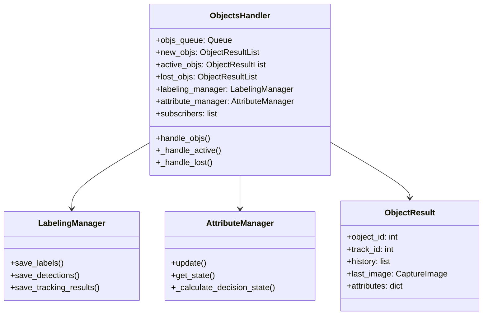
```mermaid
classDiagram
    class ObjectsHandler {
        +objs_queue: Queue
        +new_objs: ObjectResultList
        +active_objs: ObjectResultList
        +lost_objs: ObjectResultList
        +labeling_manager: LabelingManager
        +attribute_manager: AttributeManager
        +subscribers: list
        +handle_objs()
        +_handle_active()
        +_handle_lost()
    }
    
    class LabelingManager {
        +save_labels()
        +save_detections()
        +save_tracking_results()
    }
    
    class AttributeManager {
        +update()
        +get_state()
        +_calculate_decision_state()
    }
    
    class ObjectResult {
        +object_id: int
        +track_id: int
        +history: list
        +last_image: CaptureImage
        +attributes: dict
    }
    
    ObjectsHandler --> LabelingManager
    ObjectsHandler --> AttributeManager
    ObjectsHandler --> ObjectResult
```

### Описание диаграммы: ObjectsHandler - Внутренняя структура

**Что показывает диаграмма:**
Диаграмма классов демонстрирует внутреннюю структуру ObjectsHandler и его взаимодействие с менеджерами и структурами данных. Она показывает, как ObjectsHandler организует хранение объектов в различных состояниях и делегирует специализированные задачи менеджерам.

**Элементы диаграммы:**
- **ObjectsHandler**: Главный класс управления объектами с очередью для приема данных и списками для хранения объектов
- **LabelingManager**: Менеджер сохранения меток объектов в JSON файлы
- **AttributeManager**: Менеджер управления состояниями атрибутов объектов
- **ObjectResult**: Структура данных, представляющая один объект с его историей и атрибутами

**Связи и потоки:**
- **`-->`**: Композиция или использование - ObjectsHandler использует LabelingManager и AttributeManager, а также работает с коллекциями ObjectResult
- **Атрибуты классов**: Показывают внутреннюю структуру данных каждого класса
- **Методы классов**: Показывают основные операции, выполняемые каждым классом

**Как это работает:**
ObjectsHandler содержит очередь `objs_queue` для потокобезопасного приема результатов трекинга от Pipeline. Три списка (`new_objs`, `active_objs`, `lost_objs`) хранят объекты в различных состояниях. Метод `handle_objs()` работает в отдельном потоке и обрабатывает результаты из очереди, вызывая `_handle_active()` для активных объектов и `_handle_lost()` для потерянных. ObjectsHandler делегирует сохранение меток в LabelingManager через методы `save_labels()`, `save_detections()`, `save_tracking_results()`. Управление атрибутами делегируется в AttributeManager, который отслеживает состояния атрибутов через метод `update()` и вычисляет финальные состояния через `_calculate_decision_state()`. Список `subscribers` содержит детекторы событий, которые уведомляются об обновлениях объектов. Каждый объект представлен структурой ObjectResult с уникальным `object_id`, `track_id` от трекера, историей позиций, последним кадром и словарем атрибутов.

**Примеры использования:**
- **Понимание структуры данных**: Диаграмма помогает понять, как организовано хранение объектов
- **Разработка новых менеджеров**: Показывает паттерн делегирования задач специализированным менеджерам
- **Отладка обработки объектов**: При проблемах можно определить, какой компонент отвечает за конкретную функциональность
- **Оптимизация памяти**: Помогает понять структуру данных и возможности оптимизации
- **Интеграция новых функций**: Показывает точки расширения для добавления новой функциональности

### Обработка результатов трекинга

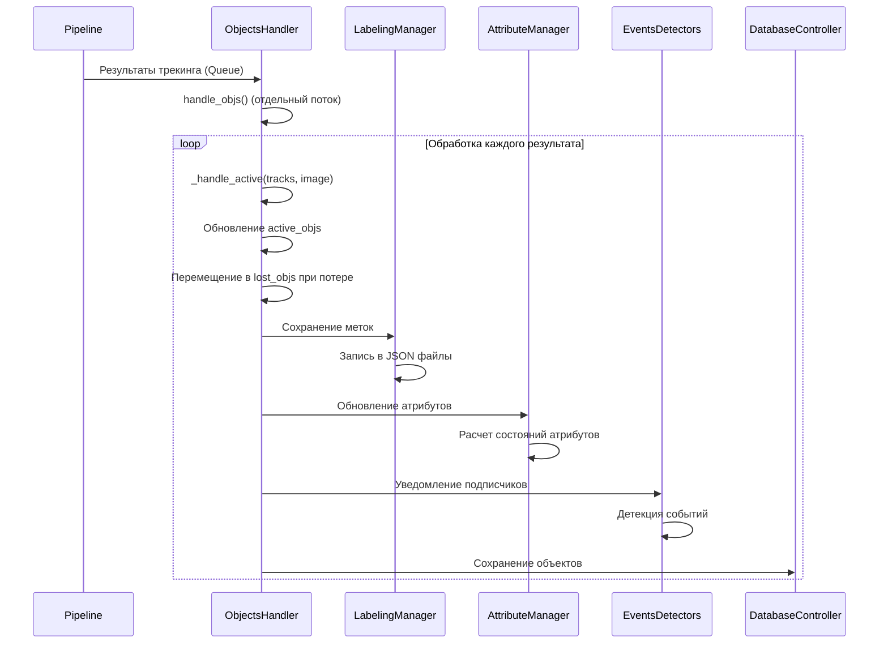
```mermaid
sequenceDiagram
    participant Pipeline
    participant ObjectsHandler
    participant LabelingManager
    participant AttributeManager
    participant EventsDetectors
    participant DatabaseController
    
    Pipeline->>ObjectsHandler: Результаты трекинга (Queue)
    ObjectsHandler->>ObjectsHandler: handle_objs() (отдельный поток)
    
    loop Обработка каждого результата
        ObjectsHandler->>ObjectsHandler: _handle_active(tracks, image)
        ObjectsHandler->>ObjectsHandler: Обновление active_objs
        ObjectsHandler->>ObjectsHandler: Перемещение в lost_objs при потере
        
        ObjectsHandler->>LabelingManager: Сохранение меток
        LabelingManager->>LabelingManager: Запись в JSON файлы
        
        ObjectsHandler->>AttributeManager: Обновление атрибутов
        AttributeManager->>AttributeManager: Расчет состояний атрибутов
        
        ObjectsHandler->>EventsDetectors: Уведомление подписчиков
        EventsDetectors->>EventsDetectors: Детекция событий
        
        ObjectsHandler->>DatabaseController: Сохранение объектов
    end
```

### Описание диаграммы: Обработка результатов трекинга

**Что показывает диаграмма:**
Диаграмма последовательности демонстрирует детальный процесс обработки результатов трекинга от момента получения данных от Pipeline до сохранения в базу данных. Она показывает асинхронную обработку в отдельном потоке и параллельные операции с различными компонентами системы.

**Элементы диаграммы:**
- **Pipeline**: Источник результатов трекинга с информацией об отслеживаемых объектах
- **ObjectsHandler**: Компонент управления объектами, обрабатывающий результаты в отдельном потоке
- **LabelingManager**: Менеджер сохранения меток объектов
- **AttributeManager**: Менеджер управления атрибутами объектов
- **EventsDetectors**: Контроллер детекторов событий
- **DatabaseController**: Контроллер базы данных для сохранения объектов

**Связи и потоки:**
- **Стрелки** (`->>`): Синхронные вызовы методов или передача данных
- **loop Обработка каждого результата**: Цикл обработки всех результатов из очереди
- **Самообращение** (`ObjectsHandler->>ObjectsHandler`): Внутренние операции компонента
- **Последовательность сверху вниз**: Отображает временную последовательность операций

**Как это работает:**
Pipeline помещает результаты трекинга в очередь `objs_queue` ObjectsHandler. ObjectsHandler обрабатывает результаты в отдельном потоке через метод `handle_objs()`, что позволяет не блокировать основной поток обработки. Для каждого результата из очереди выполняется следующая последовательность: ObjectsHandler вызывает `_handle_active()` для обработки активных треков, обновляя список `active_objs` и перемещая потерянные объекты в `lost_objs`. Параллельно ObjectsHandler передает данные в LabelingManager для сохранения меток в JSON файлы. AttributeManager получает обновления атрибутов и пересчитывает их состояния на основе порогов доверия и времени. ObjectsHandler уведомляет всех подписанных EventsDetectors об обновлениях объектов, что позволяет детекторам проверить условия событий. Наконец, ObjectsHandler сохраняет данные об объектах через DatabaseController в базу данных или JSON файлы. Весь процесс выполняется асинхронно в отдельном потоке, что обеспечивает производительность системы.

**Примеры использования:**
- **Понимание асинхронной обработки**: Диаграмма показывает, как обработка объектов выполняется в отдельном потоке
- **Отладка потоков данных**: При проблемах можно отследить путь данных от Pipeline до сохранения
- **Оптимизация производительности**: Видно параллельные операции, которые могут быть оптимизированы
- **Разработка новых менеджеров**: Показывает паттерн взаимодействия с менеджерами
- **Мониторинг системы**: Помогает понять, какие компоненты активны при обработке объектов

### LabelingManager: Сохранение меток

**Структура сохранения**:
```
EvilEyeData/
├── Detections/
│   └── YYYY-MM-DD/
│       ├── Metadata/
│       │   ├── objects_found.json
│       │   └── objects_lost.json
│       └── Images/
│           └── source_id/
│               ├── frame_XXXXX.jpg
│               └── ...
```

**Формат JSON**:
- `objects_found.json` - Новые объекты
- `objects_lost.json` - Потерянные объекты
- Метаданные: object_id, track_id, bbox, class_id, confidence, timestamp

### AttributeManager: Управление атрибутами

**Состояния атрибутов**:
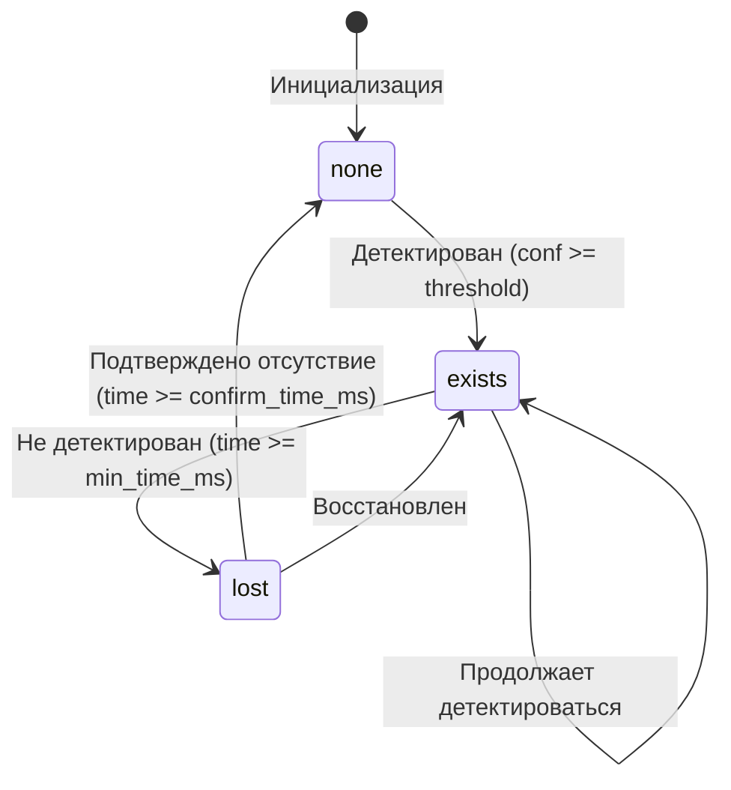
```mermaid
stateDiagram-v2
    [*] --> none: Инициализация
    none --> exists: Детектирован (conf >= threshold)
    exists --> lost: Не детектирован (time >= min_time_ms)
    lost --> none: Подтверждено отсутствие (time >= confirm_time_ms)
    lost --> exists: Восстановлен
    exists --> exists: Продолжает детектироваться
```

### Описание диаграммы: Состояния атрибутов

**Что показывает диаграмма:**
Диаграмма состояний демонстрирует жизненный цикл атрибута объекта (например, каска или рюкзак) от момента инициализации до финального подтверждения состояния. Она показывает, как система управляет состояниями атрибутов на основе порогов доверия и времени детекции.

**Элементы диаграммы:**
- **[*]**: Начальное состояние (атрибут не инициализирован)
- **none**: Состояние отсутствия атрибута или неподтвержденного атрибута
- **exists**: Состояние подтвержденного наличия атрибута
- **lost**: Состояние временной потери атрибута, ожидающее подтверждения отсутствия

**Связи и потоки:**
- **Стрелки с метками** (`--> : метка`): Переходы между состояниями с указанием условий:
  - `Инициализация`: Атрибут создается при первом обнаружении объекта
  - `Детектирован (conf >= threshold)`: Атрибут обнаружен с доверием выше порога
  - `Не детектирован (time >= min_time_ms)`: Атрибут не обнаруживается в течение минимального времени
  - `Подтверждено отсутствие (time >= confirm_time_ms)`: Отсутствие атрибута подтверждено после истечения времени подтверждения
  - `Восстановлен`: Атрибут снова обнаружен после потери
  - `Продолжает детектироваться`: Атрибут продолжает обнаруживаться в состоянии exists

**Как это работает:**
Атрибут инициализируется в состоянии none при первом обнаружении объекта. Когда классификатор атрибутов обнаруживает атрибут с доверием выше `confidence_threshold`, атрибут переходит в состояние exists. В состоянии exists атрибут считается подтвержденным и активным. Если атрибут перестает обнаруживаться в течение `min_time_ms` миллисекунд, он переходит в состояние lost. В состоянии lost система ожидает подтверждения отсутствия в течение `confirm_time_ms` миллисекунд. Если атрибут снова обнаруживается, он возвращается в состояние exists. Если время подтверждения истекло без обнаружения атрибута, он переходит обратно в состояние none. Если атрибут продолжает обнаруживаться в состоянии exists, он остается в этом состоянии. Система использует EMA-сглаживание доверия для уменьшения колебаний и стабилизации состояний.

**Примеры использования:**
- **Понимание логики атрибутов**: Диаграмма помогает понять, как система принимает решения о наличии атрибутов
- **Настройка порогов**: Показывает, какие параметры влияют на переходы между состояниями
- **Отладка детекции атрибутов**: При проблемах можно определить, в каком состоянии находится атрибут и почему
- **Оптимизация производительности**: Помогает понять баланс между чувствительностью и стабильностью детекции
- **Разработка новых атрибутов**: Показывает паттерн управления состояниями для новых типов атрибутов

**Параметры**:
- `confidence_thresholds` - Пороги доверия для каждого атрибута
- `time_thresholds.min_time_ms` - Время до перехода в "lost"
- `time_thresholds.confirm_time_ms` - Время подтверждения состояния
- `ema_alpha` - Коэффициент EMA-сглаживания доверия

---

## Уровень 6: Обработка событий

Система детекции событий отслеживает различные типы событий на основе изменений объектов и состояния системы.

### Архитектура детекторов событий

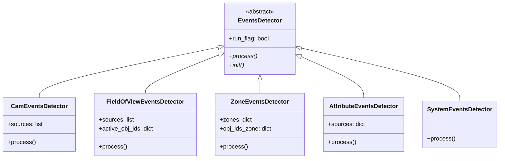
```mermaid
classDiagram
    class EventsDetector {
        <<abstract>>
        +run_flag: bool
        +process()*
        +init()*
    }
    
    class CamEventsDetector {
        +sources: list
        +process()
    }
    
    class FieldOfViewEventsDetector {
        +sources: list
        +active_obj_ids: dict
        +process()
    }
    
    class ZoneEventsDetector {
        +zones: dict
        +obj_ids_zone: dict
        +process()
    }
    
    class AttributeEventsDetector {
        +sources: dict
        +process()
    }
    
    class SystemEventsDetector {
        +process()
    }
    
    EventsDetector <|-- CamEventsDetector
    EventsDetector <|-- FieldOfViewEventsDetector
    EventsDetector <|-- ZoneEventsDetector
    EventsDetector <|-- AttributeEventsDetector
    EventsDetector <|-- SystemEventsDetector
```

### Описание диаграммы: Архитектура детекторов событий

**Что показывает диаграмма:**
Диаграмма классов демонстрирует иерархию всех типов детекторов событий в системе EvilEye. Она показывает абстрактный базовый класс с общим интерфейсом и пять конкретных реализаций, каждая из которых отвечает за детекцию определенного типа событий.

**Элементы диаграммы:**
- **EventsDetector**: Абстрактный базовый класс, определяющий общий интерфейс для всех детекторов событий
- **CamEventsDetector**: Детектор событий камер (старт, стоп, ошибки)
- **FieldOfViewEventsDetector**: Детектор событий появления объектов в поле зрения
- **ZoneEventsDetector**: Детектор событий входа/выхода объектов из зон
- **AttributeEventsDetector**: Детектор событий изменения атрибутов объектов
- **SystemEventsDetector**: Детектор системных событий (старт/стоп системы, ошибки)

**Связи и потоки:**
- **`<|--`**: Наследование - все конкретные детекторы наследуются от EventsDetector
- **`<<abstract>>`**: Стереотип абстрактного класса - EventsDetector не может быть инстанциирован напрямую
- **`+`**: Публичные методы и атрибуты
- **`*`**: Абстрактные методы, которые должны быть реализованы в дочерних классах

**Как это работает:**
EventsDetector определяет общий интерфейс с абстрактными методами `process()` и `init()`, а также флагом `run_flag` для управления жизненным циклом. Каждый конкретный детектор реализует свою логику детекции событий в методе `process()`. CamEventsDetector отслеживает состояние источников видео и генерирует события при изменениях. FieldOfViewEventsDetector отслеживает появление новых объектов в поле зрения через словарь `active_obj_ids`. ZoneEventsDetector отслеживает позиции объектов относительно заданных зон и генерирует события входа/выхода. AttributeEventsDetector отслеживает изменения состояний атрибутов через AttributeManager. SystemEventsDetector отслеживает состояние системы и генерирует системные события. Все детекторы работают в отдельных потоках и вызывают метод `process()` при получении уведомлений от подписанных компонентов.

**Примеры использования:**
- **Понимание типов событий**: Диаграмма помогает понять, какие типы событий поддерживаются системой
- **Разработка новых детекторов**: Показывает паттерн создания новых типов детекторов событий
- **Настройка детекции**: Помогает понять, какие параметры настраиваются для каждого типа детектора
- **Отладка событий**: При проблемах можно определить, какой детектор отвечает за конкретный тип событий
- **Оптимизация производительности**: Показывает структуру детекторов и возможности оптимизации

### Схема обработки событий

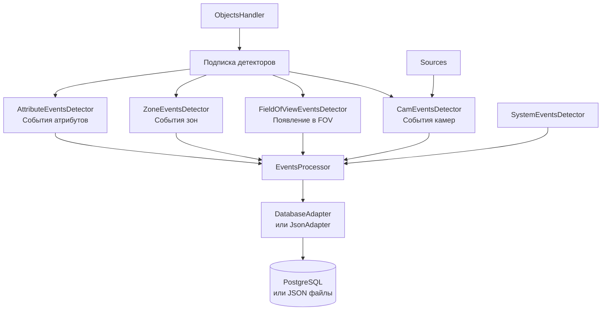
```mermaid
graph TB
    ObjectsHandler[ObjectsHandler] --> Subscribe[Подписка детекторов]
    
    Subscribe --> CamDetector[CamEventsDetector<br/>События камер]
    Subscribe --> FOVDetector[FieldOfViewEventsDetector<br/>Появление в FOV]
    Subscribe --> ZoneDetector[ZoneEventsDetector<br/>События зон]
    Subscribe --> AttrDetector[AttributeEventsDetector<br/>События атрибутов]
    
    Sources[Sources] --> CamDetector
    
    CamDetector --> EventsProcessor[EventsProcessor]
    FOVDetector --> EventsProcessor
    ZoneDetector --> EventsProcessor
    AttrDetector --> EventsProcessor
    SystemDetector[SystemEventsDetector] --> EventsProcessor
    
    EventsProcessor --> DatabaseAdapter[DatabaseAdapter<br/>или JsonAdapter]
    DatabaseAdapter --> Storage[(PostgreSQL<br/>или JSON файлы)]
```

### Описание диаграммы: Схема обработки событий

**Что показывает диаграмма:**
Диаграмма демонстрирует полный поток обработки событий от момента подписки детекторов на обновления объектов до сохранения событий в базу данных или JSON файлы. Она показывает, как различные типы детекторов получают данные и как события обрабатываются и сохраняются.

**Элементы диаграммы:**
- **ObjectsHandler**: Источник данных об объектах для детекторов событий
- **Subscribe (Подписка детекторов)**: Процесс подписки детекторов на обновления объектов
- **CamDetector (CamEventsDetector)**: Детектор событий камер
- **FOVDetector (FieldOfViewEventsDetector)**: Детектор событий появления в поле зрения
- **ZoneDetector (ZoneEventsDetector)**: Детектор событий зон
- **AttrDetector (AttributeEventsDetector)**: Детектор событий атрибутов
- **Sources**: Видео источники для детектора событий камер
- **SystemDetector (SystemEventsDetector)**: Детектор системных событий
- **EventsProcessor**: Процессор событий, обрабатывающий и маршрутизирующий события
- **DatabaseAdapter / JsonAdapter**: Адаптеры для сохранения событий в БД или JSON
- **Storage**: Финальное хранилище (PostgreSQL или JSON файлы)

**Связи и потоки:**
- **Стрелки** (`-->`): Поток данных и управления между компонентами
- **Направление TB (Top-Bottom)**: Показывает поток обработки сверху вниз
- **Разветвление от Subscribe**: Несколько детекторов подписываются параллельно
- **Слияние в EventsProcessor**: Все детекторы передают события в единый процессор
- **Ромбовидный узел Storage**: Хранилище данных

**Как это работает:**
ObjectsHandler подписывает детекторы событий на обновления объектов через механизм подписки. Четыре детектора (CamEventsDetector, FieldOfViewEventsDetector, ZoneEventsDetector, AttributeEventsDetector) подписываются на ObjectsHandler и получают уведомления об изменениях объектов. CamEventsDetector также подписывается на Sources для отслеживания состояния камер. SystemEventsDetector работает независимо и отслеживает состояние системы. При обнаружении события каждый детектор передает его в EventsProcessor, который определяет доступность базы данных и выбирает соответствующий адаптер (DatabaseAdapter для PostgreSQL или JsonAdapter для JSON файлов). Адаптер сохраняет событие в финальное хранилище с соответствующей структурой данных.

**Примеры использования:**
- **Понимание потока событий**: Диаграмма помогает понять, как события проходят от детекции до сохранения
- **Настройка детекторов**: Показывает, какие детекторы нужно настроить для конкретных типов событий
- **Отладка событий**: При проблемах можно отследить путь события от детектора до сохранения
- **Разработка новых детекторов**: Показывает паттерн интеграции новых типов детекторов
- **Оптимизация производительности**: Видно точки обработки событий, которые могут быть оптимизированы

### Типы событий

#### CamEventsDetector

**События**:
- `CameraStarted` - Камера запущена
- `CameraStopped` - Камера остановлена
- `CameraError` - Ошибка камеры

**Механизм**:
- Подписка на источники видео
- Отслеживание изменений состояния камер

#### FieldOfViewEventsDetector

**События**:
- `Alarm` - Объект появился в поле зрения

**Механизм**:
- Отслеживание новых объектов в `active_obj_ids`
- Проверка истории объекта для определения первого появления
- Генерация события при первом появлении

**Параметры**:
- `sources` - Список источников для мониторинга

#### ZoneEventsDetector

**События**:
- `ZoneEntered` - Объект вошел в зону
- `ZoneLeft` - Объект вышел из зоны

**Механизм**:
- Определение зон через координаты полигонов
- Отслеживание позиций объектов относительно зон
- Пороги для подтверждения событий (`event_threshold`, `zone_left_threshold`)

**Параметры**:
- `sources` - Конфигурация зон для каждого источника
- `event_threshold` - Порог подтверждения входа
- `zone_left_threshold` - Порог подтверждения выхода

#### AttributeEventsDetector

**События**:
- `AttributeDetected` - Атрибут обнаружен
- `AttributeLost` - Атрибут потерян

**Механизм**:
- Отслеживание изменений состояний атрибутов через `AttributeManager`
- Генерация событий при переходах состояний

**Параметры**:
- `sources` - Конфигурация для каждого источника

#### SystemEventsDetector

**События**:
- `SystemStarted` - Система запущена
- `SystemStopped` - Система остановлена
- `SystemError` - Ошибка системы

**Механизм**:
- Отслеживание состояния системы
- Генерация событий при изменениях состояния

### EventsProcessor: Обработка и сохранение событий

```mermaid
graph LR
    EventsDetectors[EventsDetectors] --> EventsQueue[Очередь событий]
    EventsQueue --> EventsProcessor[EventsProcessor]
    
    EventsProcessor --> CheckDB{База данных<br/>доступна?}
    
    CheckDB -->|Да| DatabaseAdapter[DatabaseAdapter]
    CheckDB -->|Нет| JsonAdapter[JsonAdapter]
    
    DatabaseAdapter --> PostgreSQL[(PostgreSQL)]
    JsonAdapter --> JSONFiles[JSON файлы]
```

### Описание диаграммы: EventsProcessor - Обработка и сохранение событий

**Что показывает диаграмма:**
Диаграмма потока решений демонстрирует логику выбора адаптера для сохранения событий на основе доступности базы данных. Она показывает, как система автоматически переключается между режимами хранения (PostgreSQL или JSON) в зависимости от конфигурации и доступности БД.

**Элементы диаграммы:**
- **EventsDetectors**: Все детекторы событий, генерирующие события
- **EventsQueue (Очередь событий)**: Буфер для временного хранения событий перед обработкой
- **EventsProcessor**: Процессор событий, обрабатывающий очередь и выбирающий адаптер
- **CheckDB (База данных доступна?)**: Узел принятия решения о доступности БД
- **DatabaseAdapter**: Адаптер для сохранения событий в PostgreSQL
- **JsonAdapter**: Адаптер для сохранения событий в JSON файлы
- **PostgreSQL**: База данных PostgreSQL для хранения событий
- **JSONFiles**: JSON файлы для хранения событий

**Связи и потоки:**
- **Стрелки** (`-->`): Поток данных от детекторов до хранилища
- **Ромбовидный узел** (`{}`): Узел принятия решения
- **Стрелки с метками** (`--> |метка|`): Условия выбора адаптера:
  - `|Да|`: База данных доступна и настроена
  - `|Нет|`: База данных недоступна или не настроена
- **Направление LR (Left-Right)**: Показывает поток обработки слева направо
- **Ромбовидный узел Storage**: Хранилище данных

**Как это работает:**
Все детекторы событий помещают обнаруженные события в общую очередь EventsQueue для асинхронной обработки. EventsProcessor обрабатывает события из очереди в отдельном потоке. При обработке каждого события EventsProcessor проверяет доступность базы данных: если БД доступна и правильно настроена, выбирается DatabaseAdapter, который сохраняет события в PostgreSQL с полной функциональностью (транзакции, запросы, индексы). Если БД недоступна или не настроена, выбирается JsonAdapter, который сохраняет события в JSON файлы с простой структурой. Оба адаптера обеспечивают одинаковый интерфейс сохранения, что позволяет системе работать прозрачно в любом режиме. JSON режим используется для разработки, тестирования или случаев, когда БД не требуется.

**Примеры использования:**
- **Понимание режимов хранения**: Диаграмма помогает понять, когда система использует БД, а когда JSON
- **Настройка системы**: Показывает условия, при которых выбирается каждый режим
- **Отладка сохранения событий**: При проблемах можно определить, какой адаптер используется
- **Разработка без БД**: Позволяет разрабатывать и тестировать систему без настройки PostgreSQL
- **Миграция данных**: Помогает понять различия между режимами для планирования миграции

### Механизм подписки

```mermaid
sequenceDiagram
    participant ObjectsHandler
    participant FOVDetector
    participant ZoneDetector
    participant AttrDetector
    
    Note over ObjectsHandler: Инициализация детекторов
    ObjectsHandler->>FOVDetector: subscribe()
    ObjectsHandler->>ZoneDetector: subscribe()
    ObjectsHandler->>AttrDetector: subscribe()
    
    loop Главный цикл обработки
        ObjectsHandler->>ObjectsHandler: Обновление объектов
        ObjectsHandler->>FOVDetector: update() (уведомление)
        ObjectsHandler->>ZoneDetector: update()
        ObjectsHandler->>AttrDetector: update()
        
        FOVDetector->>FOVDetector: process() (детекция событий)
        ZoneDetector->>ZoneDetector: process()
        AttrDetector->>AttrDetector: process()
    end
```

### Описание диаграммы: Механизм подписки

**Что показывает диаграмма:**
Диаграмма последовательности демонстрирует механизм подписки детекторов событий на обновления объектов и процесс уведомлений в главном цикле обработки. Она показывает, как ObjectsHandler уведомляет подписанные детекторы об изменениях объектов, что позволяет детекторам проверять условия событий.

**Элементы диаграммы:**
- **ObjectsHandler**: Компонент управления объектами, источник уведомлений
- **FOVDetector (FieldOfViewEventsDetector)**: Детектор событий появления в поле зрения
- **ZoneDetector (ZoneEventsDetector)**: Детектор событий зон
- **AttrDetector (AttributeEventsDetector)**: Детектор событий атрибутов

**Связи и потоки:**
- **Стрелки** (`->>`): Синхронные вызовы методов
- **Note over**: Примечание, описывающее этап инициализации
- **loop Главный цикл обработки**: Цикл уведомлений в главном цикле системы
- **Самообращение** (`Detector->>Detector`): Внутренняя обработка детектора
- **Последовательность сверху вниз**: Отображает временную последовательность операций

**Как это работает:**
При инициализации системы ObjectsHandler подписывает детекторы событий через метод `subscribe()`. Каждый детектор добавляется в список подписчиков ObjectsHandler. В главном цикле обработки, после обновления состояний объектов, ObjectsHandler вызывает метод `update()` у всех подписанных детекторов, уведомляя их об изменениях. Каждый детектор получает уведомление и вызывает свой метод `process()` для проверки условий событий на основе текущего состояния объектов. FOVDetector проверяет появление новых объектов в поле зрения. ZoneDetector проверяет позиции объектов относительно зон. AttrDetector проверяет изменения состояний атрибутов. Если условия события выполнены, детектор генерирует событие и передает его в EventsProcessor для сохранения. Весь процесс выполняется синхронно в главном цикле, что обеспечивает актуальность данных для детекции событий.

**Примеры использования:**
- **Понимание паттерна Observer**: Диаграмма демонстрирует реализацию паттерна Observer для уведомлений
- **Разработка новых детекторов**: Показывает, как правильно подписаться на обновления объектов
- **Отладка событий**: При проблемах можно отследить процесс уведомлений и детекции
- **Оптимизация производительности**: Помогает понять частоту уведомлений и возможности оптимизации
- **Настройка детекторов**: Показывает момент подписки и настройки детекторов

---

## Уровень 7: Работа с базой данных

Система поддерживает два режима хранения данных: PostgreSQL и JSON файлы.

На уровне архитектуры управление подключением к БД и адаптерами инкапсулировано в сервисе `DatabaseService`. Controller взаимодействует с ним через `ServiceLocator`: сервис инициализирует `DatabaseControllerPg`, применяет параметры из конфигурации, подключается к БД и создает/запускает адаптеры (`DatabaseAdapter*`). Это позволяет централизованно запускать и останавливать все адаптеры, избегать повторного старта потоков и упростить обработку ошибок (подключение может оставаться активным, даже если отдельные адаптеры временно отключены).
### Архитектура работы с БД

```mermaid
classDiagram
    class DatabaseControllerBase {
        <<abstract>>
        +conn_pool
        +queue_in
        +query()
        +_insert_impl()*
    }
    
    class DatabaseControllerPg {
        +_init_connection()
        +_insert_impl()
        +_save_image()
    }
    
    class DatabaseAdapterBase {
        <<abstract>>
        +queue_in
        +_insert_impl()*
        +_update_impl()*
    }
    
    class DatabaseAdapterObjects {
        +_insert_impl()
        +_update_impl()
        +_prepare_for_saving()
    }
    
    class DatabaseAdapterCamEvents {
        +_insert_impl()
        +_execute_query()
    }
    
    class DatabaseAdapterFovEvents {
        +_insert_impl()
    }
    
    class DatabaseAdapterZoneEvents {
        +_insert_impl()
    }
    
    class DatabaseAdapterAttributeEvents {
        +_insert_impl()
    }
    
    class DatabaseAdapterSystemEvents {
        +_insert_impl()
    }
    
    DatabaseControllerBase <|-- DatabaseControllerPg
    DatabaseAdapterBase <|-- DatabaseAdapterObjects
    DatabaseAdapterBase <|-- DatabaseAdapterCamEvents
    DatabaseAdapterBase <|-- DatabaseAdapterFovEvents
    DatabaseAdapterBase <|-- DatabaseAdapterZoneEvents
    DatabaseAdapterBase <|-- DatabaseAdapterAttributeEvents
    DatabaseAdapterBase <|-- DatabaseAdapterSystemEvents
    DatabaseControllerPg --> DatabaseAdapterBase
```

### Описание диаграммы: Архитектура работы с БД

**Что показывает диаграмма:**
Диаграмма классов демонстрирует иерархию классов для работы с базой данных и файловым хранилищем. Она показывает абстрактные базовые классы с общими интерфейсами и конкретные реализации для PostgreSQL и различных типов данных (объекты, события).

**Элементы диаграммы:**
- **DatabaseControllerBase**: Абстрактный базовый класс контроллера БД с общим интерфейсом управления соединениями
- **DatabaseControllerPg**: Конкретная реализация для PostgreSQL с пулом соединений
- **DatabaseAdapterBase**: Абстрактный базовый класс адаптера с общим интерфейсом сохранения данных
- **DatabaseAdapterObjects**: Адаптер для сохранения объектов
- **DatabaseAdapterCamEvents**: Адаптер для сохранения событий камер
- **DatabaseAdapterFovEvents**: Адаптер для сохранения FOV событий
- **DatabaseAdapterZoneEvents**: Адаптер для сохранения событий зон
- **DatabaseAdapterAttributeEvents**: Адаптер для сохранения событий атрибутов
- **DatabaseAdapterSystemEvents**: Адаптер для сохранения системных событий

**Связи и потоки:**
- **`<|--`**: Наследование - конкретные реализации наследуются от абстрактных базовых классов
- **`-->`**: Композиция - DatabaseControllerPg использует DatabaseAdapterBase для создания адаптеров
- **`<<abstract>>`**: Стереотип абстрактного класса - базовые классы не могут быть инстанциированы напрямую
- **`+`**: Публичные методы и атрибуты
- **`*`**: Абстрактные методы, которые должны быть реализованы в дочерних классах

**Как это работает:**
DatabaseControllerBase определяет общий интерфейс для управления соединениями с БД через пул соединений (`conn_pool`) и очередь запросов (`queue_in`). DatabaseControllerPg реализует подключение к PostgreSQL, управление пулом соединений и сохранение изображений. DatabaseAdapterBase определяет общий интерфейс для адаптеров с методами `_insert_impl()` и `_update_impl()`, а также очередью для асинхронной обработки. Каждый конкретный адаптер реализует свою логику подготовки данных (`_prepare_for_saving()`) и формирования SQL запросов для своего типа данных. DatabaseControllerPg создает и управляет экземплярами адаптеров, обеспечивая единую точку доступа к БД. Все адаптеры используют общий пул соединений для эффективного управления ресурсами БД.

**Примеры использования:**
- **Понимание архитектуры БД**: Диаграмма помогает понять, как организована работа с базой данных
- **Разработка новых адаптеров**: Показывает паттерн создания адаптеров для новых типов данных
- **Оптимизация запросов**: Помогает понять структуру адаптеров и возможности оптимизации
- **Отладка сохранения данных**: При проблемах можно определить, какой адаптер отвечает за конкретный тип данных
- **Расширение функциональности**: Показывает точки расширения для добавления новых типов данных

### Схема выбора режима хранения

```mermaid
graph TB
    Config[Конфигурация] --> CheckDB{Секция database<br/>присутствует?}
    
    CheckDB -->|Да| CheckParams{Параметры<br/>корректны?}
    CheckDB -->|Нет| JsonMode[JSON режим]
    
    CheckParams -->|Да| ConnectDB[Подключение к PostgreSQL]
    CheckParams -->|Нет| JsonMode
    
    ConnectDB -->|Успех| DatabaseMode[Режим БД]
    ConnectDB -->|Ошибка| JsonMode
    
    DatabaseMode --> DatabaseAdapters[DatabaseAdapter*]
    JsonMode --> JsonAdapters[JsonAdapter*]
    
    DatabaseAdapters --> PostgreSQL[(PostgreSQL)]
    JsonAdapters --> JSONFiles[JSON файлы]
```

### Описание диаграммы: Схема выбора режима хранения

**Что показывает диаграмма:**
Диаграмма потока решений демонстрирует логику выбора режима хранения данных (PostgreSQL или JSON) на основе конфигурации и доступности базы данных. Она показывает последовательность проверок условий и автоматическое переключение между режимами.

**Элементы диаграммы:**
- **Config (Конфигурация)**: Входные данные конфигурации системы
- **CheckDB (Секция database присутствует?)**: Первая проверка наличия секции database в конфигурации
- **CheckParams (Параметры корректны?)**: Вторая проверка корректности параметров подключения
- **ConnectDB (Подключение к PostgreSQL)**: Попытка установить соединение с БД
- **DatabaseMode (Режим БД)**: Режим работы с PostgreSQL
- **JsonMode (JSON режим)**: Режим работы с JSON файлами
- **DatabaseAdapters**: Адаптеры для работы с PostgreSQL
- **JsonAdapters**: Адаптеры для работы с JSON файлами
- **PostgreSQL**: База данных PostgreSQL
- **JSONFiles**: JSON файлы для хранения данных

**Связи и потоки:**
- **Ромбовидные узлы** (`{}`): Узлы принятия решений
- **Стрелки с метками** (`--> |метка|`): Условия перехода:
  - `|Да|`: Условие выполнено
  - `|Нет|`: Условие не выполнено
  - `|Успех|`: Подключение к БД успешно
  - `|Ошибка|`: Ошибка подключения к БД
- **Направление TB (Top-Bottom)**: Показывает последовательность проверок сверху вниз
- **Ромбовидный узел Storage**: Хранилище данных

**Как это работает:**
Система начинает с проверки наличия секции `database` в конфигурации. Если секция отсутствует, система автоматически переходит в JSON режим. Если секция присутствует, проверяется корректность параметров подключения (host, port, database_name, user_name, password, image_dir). Если параметры некорректны или отсутствуют обязательные поля, система переходит в JSON режим. Если параметры корректны, система пытается подключиться к PostgreSQL. При успешном подключении система переходит в режим БД и использует DatabaseAdapters для сохранения данных в PostgreSQL. При ошибке подключения система переходит в JSON режим и использует JsonAdapters для сохранения данных в JSON файлы. Оба режима обеспечивают одинаковый интерфейс сохранения, что позволяет системе работать прозрачно. JSON режим используется как fallback при недоступности БД или для разработки и тестирования.

**Примеры использования:**
- **Понимание режимов работы**: Диаграмма помогает понять, когда система использует БД, а когда JSON
- **Настройка системы**: Показывает условия, при которых выбирается каждый режим
- **Отладка подключения**: При проблемах можно определить, на каком этапе проверки произошла ошибка
- **Разработка без БД**: Позволяет разрабатывать систему без настройки PostgreSQL
- **Планирование развертывания**: Помогает понять требования к конфигурации для использования БД

---

## Дополнительные паттерны: DI и фасады

Для снижения связности и упрощения тестирования в EvilEye используется легковесный слой внедрения зависимостей и фасады над сложными подсистемами.

### DIContainer и DependencyRegistry

- **`evileye.core.di_container.DIContainer`**: базовый контейнер зависимостей, отвечающий за создание и хранение экземпляров сервисов и инфраструктурных компонентов.
- **`evileye.core.dependencies.DependencyRegistry`**: реестр определений зависимостей (factory‑функций, скоупов и т.п.), используемый контейнером.
- **Глобальный реестр** (`get_registry()`, `register_dependency()`): позволяет регистрировать зависимости в одном месте ядра и затем прозрачно получать их в приложении.

Типичный сценарий:
1. На старте приложения регистрируются зависимости (контроллеры БД, сервисы, вспомогательные утилиты) в `DependencyRegistry`.
2. `DIContainer` создаётся с привязкой к этому реестру.
3. Компоненты (например, сервисы контроллера) запрашивают нужные зависимости у контейнера по имени/ключу вместо прямого создания объектов.

Это упрощает:
- подмену реализаций в тестах (моки/фэйки вместо реальных компонентов),
- постепенное внедрение новых сервисов без жёстких импортов,
- контроль жизненного цикла тяжёлых объектов (подключения к БД, пулы, кэши).

### Интерфейсы и фасады

В модуле `evileye.core.interfaces` определены протокольные интерфейсы для ключевых компонентов:

- `IPipeline` — контракт для всех реализаций pipeline.
- `IObjectHandler` — интерфейс обработчика объектов.
- `IEventDetector` — общий интерфейс для детекторов событий.
- `IDatabaseAdapter` — контракт для адаптеров БД.
- `IVisualizer` — интерфейс визуализатора.

Это позволяет:
- ссылаться на компоненты через их поведение, а не конкретные классы,
- упрощать замену реализаций (например, альтернативный визуализатор или другой адаптер БД),
- уменьшать количество прямых импортов и циклических зависимостей.

В модуле `evileye.core.facades` реализованы фасады:

- **`PipelineFacade`** — упрощённый API над сложной конфигурацией и запуском pipeline (инициализация, старт/стоп, получение результатов).
- **`DatabaseFacade`** — единая точка доступа к операциям сохранения/чтения данных из БД/JSON‑слоя.

Фасады используются там, где нужно скрыть сложность нескольких внутренних компонентов за простым интерфейсом (например, в CLI или внешнем API), и хорошо сочетаются с DI: вместо прямой работы с внутренними классами внешние слои получают один фасадный объект.

### Структура таблиц PostgreSQL

```mermaid
erDiagram
    projects ||--o{ jobs : "has"
    projects ||--o{ objects : "has"
    projects ||--o{ camera_events : "has"
    projects ||--o{ fov_events : "has"
    projects ||--o{ zone_events : "has"
    projects ||--o{ attribute_events : "has"
    projects ||--o{ system_events : "has"
    
    jobs ||--o{ objects : "has"
    camera_information ||--o{ objects : "has"
    
    projects {
        int project_id PK
        timestamp creation_time
    }
    
    jobs {
        int job_id PK
        int project_id FK
        timestamp creation_time
        timestamp finish_time
        int first_record
        int last_record
        boolean is_terminated
        int configuration_id
        string configuration_info
    }
    
    camera_information {
        text full_address PK
        text short_address
        string sources
        string roi
        int video_dur_frames
        int video_dur_ms
        timestamp creation_time
        string calibration_info
        string additional_info
    }
    
    objects {
        int record_id PK
        int project_id FK
        int job_id FK
        text camera_full_address FK
        int source_id
        text source_name
        timestamp time_stamp
        timestamp time_lost
        int object_id
        string bounding_box
        string lost_bounding_box
        float confidence
        int class_id
        text preview_path
        text lost_preview_path
        text frame_path
        text lost_frame_path
        string object_data
    }
    
    camera_events {
        int event_id PK
        int project_id FK
        timestamp time_stamp
        text event_name
        text camera_full_address
    }
    
    fov_events {
        int event_id PK
        int project_id FK
        timestamp time_stamp
        int source_id
        int object_id
        string bounding_box
        float confidence
        int class_id
    }
    
    zone_events {
        int event_id PK
        int project_id FK
        timestamp time_stamp
        int source_id
        int object_id
        text event_type
        int zone_id
        string bounding_box
    }
    
    attribute_events {
        int event_id PK
        int project_id FK
        timestamp time_stamp
        int source_id
        int object_id
        text attribute_name
        text event_type
        float confidence
    }
    
    system_events {
        int event_id PK
        int project_id FK
        timestamp time_stamp
        text event_type
        int job_id FK
    }
```

### Описание диаграммы: Структура таблиц PostgreSQL

**Что показывает диаграмма:**
ER-диаграмма демонстрирует полную структуру базы данных PostgreSQL с таблицами для хранения проектов, заданий, объектов, событий и информации о камерах. Она показывает связи между таблицами (foreign keys) и кардинальность отношений, что помогает понять структуру данных и возможности запросов.

**Элементы диаграммы:**
- **projects**: Таблица проектов - верхний уровень организации данных
- **jobs**: Таблица заданий (сессий обработки) в рамках проектов
- **camera_information**: Таблица информации о камерах и их настройках
- **objects**: Таблица объектов с полной информацией о детектированных и отслеживаемых объектах
- **camera_events**: Таблица событий камер (старт, стоп, ошибки)
- **fov_events**: Таблица событий появления объектов в поле зрения
- **zone_events**: Таблица событий входа/выхода объектов из зон
- **attribute_events**: Таблица событий изменения атрибутов объектов
- **system_events**: Таблица системных событий (старт/стоп системы)

**Связи и потоки:**
- **`||--o{`**: Связь "один ко многим" (one-to-many) - один проект имеет много заданий/объектов/событий
- **`PK`**: Primary Key - первичный ключ таблицы
- **`FK`**: Foreign Key - внешний ключ, ссылающийся на другую таблицу
- **Направление связей**: Показывает иерархию данных от проектов к конкретным записям

**Как это работает:**
База данных организована иерархически: на верхнем уровне находятся проекты (projects), которые группируют все данные. Каждый проект может содержать множество заданий (jobs), представляющих сессии обработки видео. Каждое задание связано с проектом через `project_id FK`. Информация о камерах хранится в таблице `camera_information` с уникальным адресом камеры как первичным ключом. Объекты (objects) связаны с проектами, заданиями и камерами через внешние ключи, что позволяет отслеживать, к какому проекту, заданию и камере относится каждый объект. Все типы событий также связаны с проектами через `project_id FK`. События зон дополнительно связаны с заданиями через `job_id FK`. Такая структура позволяет эффективно организовывать данные по проектам, выполнять сложные запросы с JOIN операциями и обеспечивает целостность данных через внешние ключи с каскадным удалением.

**Примеры использования:**
- **Понимание структуры данных**: Диаграмма помогает понять, как организованы данные в БД
- **Разработка запросов**: Показывает связи между таблицами для написания JOIN запросов
- **Планирование миграций**: Помогает понять структуру при планировании изменений схемы БД
- **Оптимизация индексов**: Показывает внешние ключи, которые должны быть проиндексированы
- **Разработка отчетов**: Помогает понять связи для создания аналитических запросов
- **Резервное копирование**: Показывает зависимости между таблицами для планирования бэкапов

**Примечание о типах данных:**
В диаграмме используются упрощенные типы данных для совместимости с Mermaid. Фактические типы PostgreSQL:
- `int[]` и `int[][]` представлены как `string` (массивы целых чисел)
- `real[]` представлен как `string` (массивы вещественных чисел)
- `double precision` представлен как `float` (двойная точность)
- `json` представлен как `string` (JSON типы)

### Поток сохранения данных

```mermaid
sequenceDiagram
    participant Component
    participant DatabaseAdapter
    participant Queue
    participant DatabaseController
    participant PostgreSQL
    
    Component->>DatabaseAdapter: insert(obj/event)
    DatabaseAdapter->>DatabaseAdapter: _prepare_for_saving()
    DatabaseAdapter->>Queue: queue_in.put(query, data)
    
    loop Поток вставки
        DatabaseController->>Queue: queue_in.get()
        DatabaseController->>DatabaseController: Получение соединения из пула
        DatabaseController->>PostgreSQL: execute(query, data)
        PostgreSQL->>DatabaseController: RETURNING record_id
        DatabaseController->>DatabaseController: _save_image()
        DatabaseController->>Component: threading_events.notify()
    end
```

### Описание диаграммы: Поток сохранения данных

**Что показывает диаграмма:**
Диаграмма последовательности демонстрирует асинхронный процесс сохранения данных в базу данных через очередь и пул соединений. Она показывает, как компоненты системы передают данные в адаптеры, которые подготавливают запросы и помещают их в очередь для асинхронной обработки контроллером БД.

**Элементы диаграммы:**
- **Component**: Компонент системы (ObjectsHandler, EventsDetectors), инициирующий сохранение
- **DatabaseAdapter**: Адаптер базы данных, подготавливающий данные для сохранения
- **Queue**: Очередь запросов для асинхронной обработки
- **DatabaseController**: Контроллер БД, обрабатывающий очередь и управляющий соединениями
- **PostgreSQL**: База данных PostgreSQL

**Связи и потоки:**
- **Стрелки** (`->>`): Синхронные вызовы методов или передача данных
- **loop Поток вставки**: Бесконечный цикл обработки запросов из очереди
- **Самообращение** (`DatabaseAdapter->>DatabaseAdapter`, `DatabaseController->>DatabaseController`): Внутренние операции компонентов
- **Последовательность сверху вниз**: Отображает временную последовательность операций

**Как это работает:**
Компонент системы (например, ObjectsHandler или EventsDetector) вызывает метод `insert()` у соответствующего DatabaseAdapter, передавая объект или событие для сохранения. DatabaseAdapter подготавливает данные для сохранения через метод `_prepare_for_saving()`, который формирует SQL запрос и данные для вставки. Подготовленный запрос и данные помещаются в очередь `queue_in` для асинхронной обработки. DatabaseController работает в отдельном потоке и постоянно обрабатывает очередь: извлекает запросы через `queue_in.get()`, получает соединение из пула соединений для эффективного управления ресурсами БД, выполняет SQL запрос через `execute(query, data)`. PostgreSQL возвращает результат запроса (например, `record_id` через RETURNING clause). DatabaseController сохраняет связанные изображения через метод `_save_image()` (preview и frame изображения объектов). После успешного сохранения DatabaseController уведомляет компонент через `threading_events.notify()`, что позволяет компонентам отслеживать успешное сохранение данных. Весь процесс выполняется асинхронно, что не блокирует основной поток обработки видео.

**Примеры использования:**
- **Понимание асинхронности**: Диаграмма показывает, как сохранение данных выполняется асинхронно через очередь
- **Отладка сохранения**: При проблемах можно отследить путь данных от компонента до БД
- **Оптимизация производительности**: Видно использование пула соединений для эффективного управления ресурсами
- **Управление транзакциями**: Помогает понять, как обрабатываются транзакции и ошибки
- **Мониторинг очереди**: Показывает важность мониторинга размера очереди для предотвращения переполнения

### JSON адаптеры

**Использование**: Когда база данных недоступна или не настроена.

**Структура файлов**:
```
EvilEyeData/
├── objects/
│   └── YYYY-MM-DD/
│       └── objects_*.json
├── camera_events/
│   └── YYYY-MM-DD/
│       └── camera_events_*.json
├── fov_events/
│   └── YYYY-MM-DD/
│       └── fov_events_*.json
├── zone_events/
│   └── YYYY-MM-DD/
│       └── zone_events_*.json
├── attribute_events/
│   └── YYYY-MM-DD/
│       └── attribute_events_*.json
└── system_events/
    └── YYYY-MM-DD/
        └── system_events_*.json
```

**Преимущества JSON режима**:
- Не требует настройки БД
- Простота отладки (читаемые файлы)
- Легкий экспорт данных
- Подходит для небольших проектов

**Ограничения JSON режима**:
- Нет сложных запросов
- Нет транзакций
- Медленнее при больших объемах данных
- Нет Configuration History

### Управление изображениями

**Сохранение изображений**:
- `preview_path` - Миниатюра объекта (preview_width × preview_height)
- `frame_path` - Полный кадр с объектом
- `lost_preview_path` / `lost_frame_path` - Изображения при потере объекта

**Структура директорий**:
```
EvilEyeData/images/
├── previews/
│   └── YYYY-MM-DD/
│       └── source_id/
│           └── preview_*.jpg
└── frames/
    └── YYYY-MM-DD/
        └── source_id/
            └── frame_*.jpg
```

---

## Заключение

Данный документ описывает архитектуру системы EvilEye на семи уровнях абстракции:

1. **CLI и точки входа** - Различные способы запуска и управления системой
2. **Контроллер и основные сущности** - Центральная оркестрация компонентов
3. **Pipeline архитектура** - Модульная обработка видео потоков
4. **Видеозахват и запись** - Поддержка различных бэкендов
5. **Обработка объектов** - Управление жизненным циклом объектов
6. **Обработка событий** - Детекция и сохранение событий
7. **Работа с БД** - Хранение данных в PostgreSQL или JSON

Каждый уровень может быть изучен независимо, что упрощает понимание системы как для новых разработчиков, так и для опытных пользователей.

## Статические UML диаграммы

В дополнение к интерактивным Mermaid диаграммам в этом документе, в папке `docs/uml/` доступны статические UML диаграммы:

- **Class Diagrams** (`evileye_class_diagram.png`, `evileye_enhanced_class_diagram.png`) - Диаграммы классов системы
- **Package Diagram** (`evileye_package_diagram.png`) - Организация классов по пакетам
- **Architecture Diagram** (`evileye_architecture.png`) - Высокоуровневая архитектура системы
- **Data Flow Diagram** (`evileye_data_flow.png`) - Потоки данных в системе
- **PlantUML файлы** (`.puml`) - Исходные файлы для генерации диаграмм

Для генерации новых диаграмм используйте скрипт `scripts/uml/generate_uml_diagrams.py`:

```bash
pip install graphviz plantuml
sudo apt install graphviz  # On Ubuntu/Debian
python scripts/uml/generate_uml_diagrams.py
```

## Связанные документы

- [Pipeline Architecture](PIPELINE_ARCHITECTURE.md) - Детальное описание архитектуры pipeline
- [Attributes Detection](ATTRIBUTES_DETECTION_README.md) - Система детекции атрибутов
- [Database Setup Guide](DATABASE_SETUP_GUIDE.md) - Руководство по настройке БД
