# Архитектура системы EvilEye

Данный документ описывает архитектуру системы EvilEye на разных уровнях абстракции. Каждый уровень фокусируется на определенных аспектах системы, что позволяет понять как общую структуру, так и детали реализации.

## Оглавление

- [Уровень 1: CLI и точки входа](#уровень-1-cli-и-точки-входа)
- [Уровень 2: Контроллер и основные сущности](#уровень-2-контроллер-и-основные-сущности)
- [Уровень 3: Pipeline архитектура](#уровень-3-pipeline-архитектура)
- [Уровень 4: Видеозахват и запись](#уровень-4-видеозахват-и-запись)
- [Уровень 5: Обработка объектов](#уровень-5-обработка-объектов)
- [Уровень 6: Обработка событий](#уровень-6-обработка-событий)
- [Уровень 7: Работа с базой данных](#уровень-7-работа-с-базой-данных)

---

## Уровень 1: CLI и точки входа

На верхнем уровне система предоставляет несколько точек входа для различных сценариев использования.

### Схема точек входа

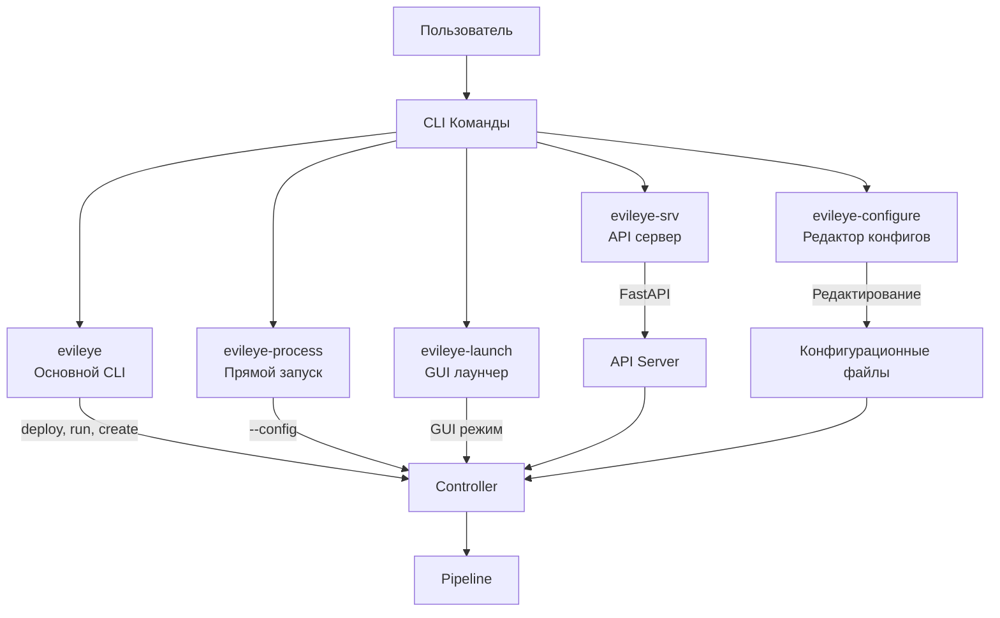
```mermaid
graph TB
    User[Пользователь] --> CLI[CLI Команды]
    
    CLI --> Evileye[evileye<br/>Основной CLI]
    CLI --> EvileyeProcess[evileye-process<br/>Прямой запуск]
    CLI --> EvileyeLaunch[evileye-launch<br/>GUI лаунчер]
    CLI --> EvileyeConfigure[evileye-configure<br/>Редактор конфигов]
    CLI --> EvileyeSrv[evileye-srv<br/>API сервер]
    
    Evileye --> |deploy, run, create| Controller[Controller]
    EvileyeProcess --> |--config| Controller
    EvileyeLaunch --> |GUI режим| Controller
    EvileyeConfigure --> |Редактирование| ConfigFiles[Конфигурационные файлы]
    EvileyeSrv --> |FastAPI| APIServer[API Server]
    
    APIServer --> Controller
    
    ConfigFiles --> Controller
    
    Controller --> Pipeline[Pipeline]
```

### Описание компонентов

#### CLI команды

**`evileye`** - Основной CLI интерфейс с полным набором команд:
- `deploy` / `deploy-samples` - Развертывание конфигураций
- `run <config>` - Запуск системы с конфигурацией
- `create <name>` - Создание новой конфигурации
- `list-configs` - Список доступных конфигураций
- `validate <config>` - Валидация конфигурации
- `server` - Запуск API сервера
- `info` - Информация о системе

**`evileye-process`** - Прямой запуск процесса обработки:
- Поддержка флагов `--config`, `--gui`, `--no-gui`, `--autoclose`
- Используется для автоматизации и скриптов

**`evileye-launch`** - GUI лаунчер с управлением конфигурациями:
- Браузер конфигураций
- Управление процессами (старт/стоп)
- Мониторинг статуса
- Просмотр логов

**`evileye-configure`** - Визуальный редактор конфигураций:
- Графический интерфейс для редактирования
- Валидация в реальном времени
- Шаблоны конфигураций

**`evileye-srv`** - FastAPI веб-сервер:
- REST API для удаленного управления
- Стриминг видео
- Управление pipeline через API
- Интерактивная документация на `/docs`

### Поток инициализации

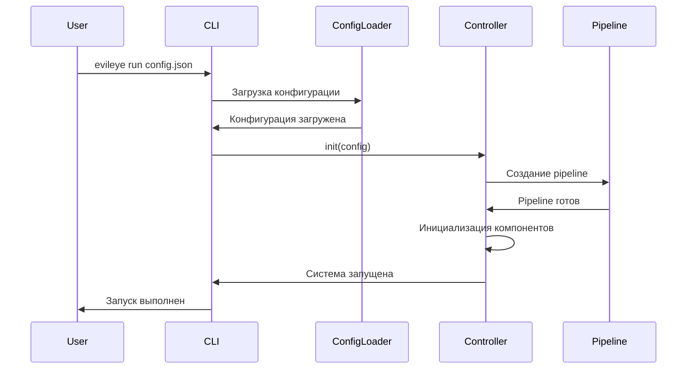
```mermaid
sequenceDiagram
    participant User
    participant CLI
    participant ConfigLoader
    participant Controller
    participant Pipeline
    
    User->>CLI: evileye run config.json
    CLI->>ConfigLoader: Загрузка конфигурации
    ConfigLoader->>CLI: Конфигурация загружена
    CLI->>Controller: init(config)
    Controller->>Pipeline: Создание pipeline
    Pipeline->>Controller: Pipeline готов
    Controller->>Controller: Инициализация компонентов
    Controller->>CLI: Система запущена
    CLI->>User: Запуск выполнен
```

---

## Уровень 2: Контроллер и основные сущности

Контроллер является центральным оркестратором системы, координирующим работу всех основных компонентов.

### Схема архитектуры контроллера

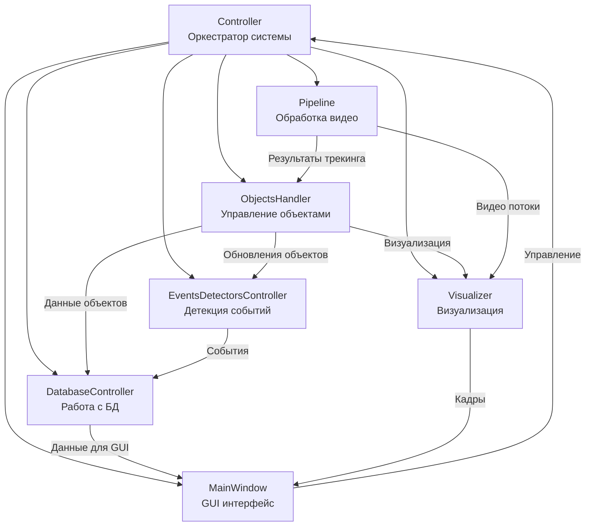
```mermaid
graph TB
    Controller[Controller<br/>Оркестратор системы] --> Pipeline[Pipeline<br/>Обработка видео]
    Controller --> ObjectsHandler[ObjectsHandler<br/>Управление объектами]
    Controller --> EventsDetectors[EventsDetectorsController<br/>Детекция событий]
    Controller --> DatabaseController[DatabaseController<br/>Работа с БД]
    Controller --> Visualizer[Visualizer<br/>Визуализация]
    Controller --> MainWindow[MainWindow<br/>GUI интерфейс]
    
    Pipeline --> |Результаты трекинга| ObjectsHandler
    ObjectsHandler --> |Обновления объектов| EventsDetectors
    ObjectsHandler --> |Данные объектов| DatabaseController
    EventsDetectors --> |События| DatabaseController
    ObjectsHandler --> |Визуализация| Visualizer
    DatabaseController --> |Данные для GUI| MainWindow
    Visualizer --> |Кадры| MainWindow
    
    Pipeline --> |Видео потоки| Visualizer
    
    MainWindow --> |Управление| Controller
```

### Описание компонентов

#### Controller

**Роль**: Центральный оркестратор системы, управляющий жизненным циклом всех компонентов.

**Основные функции**:
- Инициализация и конфигурация всех компонентов
- Управление главным циклом обработки (`run()`)
- Координация между Pipeline, ObjectsHandler, EventsDetectors
- Управление GUI и визуализацией
- Обработка перезапусков и плановых перезапусков

**Ключевые методы**:
- `init(config)` - Инициализация с конфигурацией
- `start()` - Запуск системы
- `run()` - Главный цикл обработки
- `stop()` - Остановка системы

#### Pipeline

**Роль**: Обработка видео потоков через последовательность процессоров.

**Типы pipeline**:
- `PipelineSurveillance` - Полнофункциональная pipeline с детекцией и трекингом
- `PipelineCapture` - Упрощенная pipeline для захвата видео

**Процесс обработки**:
1. Sources - Захват видео
2. Preprocessors - Предобработка кадров
3. Detectors - Детекция объектов
4. Trackers - Трекинг объектов
5. MC Trackers - Межкамерный трекинг
6. Attributes - Детекция атрибутов

#### ObjectsHandler

**Роль**: Управление жизненным циклом объектов (детектированных и отслеживаемых).

**Состояния объектов**:
- `new_objs` - Новые объекты
- `active_objs` - Активные объекты
- `lost_objs` - Потерянные объекты

**Функции**:
- Прием результатов трекинга из Pipeline
- Управление историей объектов
- Интеграция с LabelingManager для сохранения меток
- Интеграция с AttributeManager для управления атрибутами
- Подписка EventsDetectors на обновления

#### EventsDetectorsController

**Роль**: Координация различных детекторов событий.

**Типы детекторов**:
- `CamEventsDetector` - События камер (старт/стоп)
- `FieldOfViewEventsDetector` - События появления объектов в поле зрения
- `ZoneEventsDetector` - События входа/выхода из зон
- `AttributeEventsDetector` - События изменения атрибутов
- `SystemEventsDetector` - Системные события (старт/стоп системы)

#### DatabaseController

**Роль**: Управление сохранением данных в базу данных или JSON файлы.

**Режимы работы**:
- PostgreSQL - Полнофункциональная БД
- JSON - Файловое хранилище (без БД)

**Адаптеры**:
- `DatabaseAdapterObjects` - Сохранение объектов
- `DatabaseAdapterCamEvents` - События камер
- `DatabaseAdapterFovEvents` - FOV события
- `DatabaseAdapterZoneEvents` - События зон
- `DatabaseAdapterAttributeEvents` - События атрибутов
- `DatabaseAdapterSystemEvents` - Системные события

#### Visualizer и MainWindow

**Роль**: Визуализация результатов и пользовательский интерфейс.

**Visualizer**:
- Отрисовка объектов на кадрах
- Отображение треков
- Визуализация зон и ROI

**MainWindow**:
- Главное окно приложения
- Управление конфигурациями
- Журнал событий
- Настройки системы

### Поток данных в главном цикле

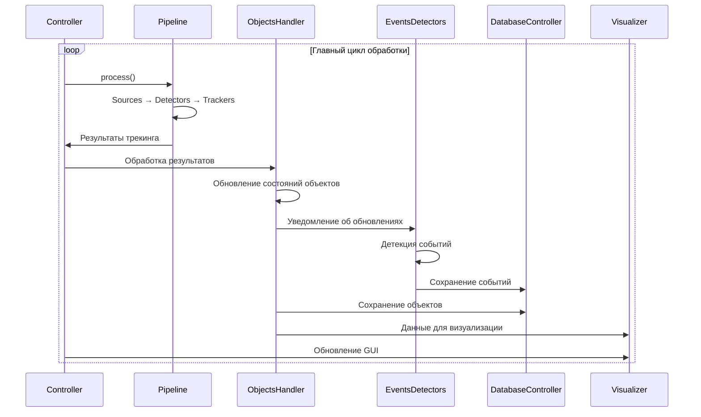
```mermaid
sequenceDiagram
    participant Controller
    participant Pipeline
    participant ObjectsHandler
    participant EventsDetectors
    participant DatabaseController
    participant Visualizer
    
    loop Главный цикл обработки
        Controller->>Pipeline: process()
        Pipeline->>Pipeline: Sources → Detectors → Trackers
        Pipeline->>Controller: Результаты трекинга
        
        Controller->>ObjectsHandler: Обработка результатов
        ObjectsHandler->>ObjectsHandler: Обновление состояний объектов
        
        ObjectsHandler->>EventsDetectors: Уведомление об обновлениях
        EventsDetectors->>EventsDetectors: Детекция событий
        EventsDetectors->>DatabaseController: Сохранение событий
        
        ObjectsHandler->>DatabaseController: Сохранение объектов
        ObjectsHandler->>Visualizer: Данные для визуализации
        
        Controller->>Visualizer: Обновление GUI
    end
```

---

## Уровень 3: Pipeline архитектура

Pipeline архитектура обеспечивает модульную и расширяемую обработку видео потоков.

### Иерархия классов Pipeline

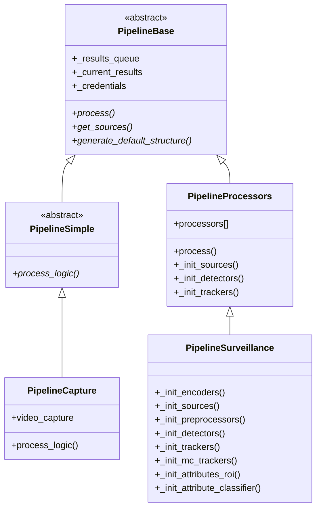
```mermaid
classDiagram
    class PipelineBase {
        <<abstract>>
        +_results_queue
        +_current_results
        +_credentials
        +process()*
        +get_sources()*
        +generate_default_structure()*
    }
    
    class PipelineSimple {
        <<abstract>>
        +process_logic()*
    }
    
    class PipelineProcessors {
        +processors[]
        +process()
        +_init_sources()
        +_init_detectors()
        +_init_trackers()
    }
    
    class PipelineCapture {
        +video_capture
        +process_logic()
    }
    
    class PipelineSurveillance {
        +_init_encoders()
        +_init_sources()
        +_init_preprocessors()
        +_init_detectors()
        +_init_trackers()
        +_init_mc_trackers()
        +_init_attributes_roi()
        +_init_attribute_classifier()
    }
    
    PipelineBase <|-- PipelineSimple
    PipelineBase <|-- PipelineProcessors
    PipelineSimple <|-- PipelineCapture
    PipelineProcessors <|-- PipelineSurveillance
```

### PipelineSurveillance: Последовательность процессоров


```mermaid
graph LR
    Start[Начало] --> Encoders[Encoders<br/>Инициализация энкодеров]
    Encoders --> Sources[Sources<br/>Видео источники]
    Sources --> Preprocessors[Preprocessors<br/>Предобработка]
    Preprocessors --> Detectors[Detectors<br/>Детекция объектов]
    Detectors --> Trackers[Trackers<br/>Трекинг объектов]
    Trackers --> MCTrackers[MC Trackers<br/>Межкамерный трекинг]
    MCTrackers --> AttributesROI[Attributes ROI<br/>Извлечение ROI]
    AttributesROI --> AttributeClassifier[Attribute Classifier<br/>Классификация атрибутов]
    AttributeClassifier --> End[Результаты]
    
    style Sources fill:#e1f5ff
    style Detectors fill:#fff4e1
    style Trackers fill:#e8f5e8
    style MCTrackers fill:#f3e5f5
```

### Описание компонентов Pipeline

#### PipelineBase

**Базовый класс** для всех реализаций pipeline.

**Общая функциональность**:
- Управление очередью результатов (`_results_queue`)
- Хранение текущих результатов (`_current_results`)
- Управление учетными данными (`_credentials`)
- Методы доступа к результатам (`get_results_list()`, `peek_latest_result()`)

**Абстрактные методы**:
- `get_sources()` - Возвращает список видео источников
- `generate_default_structure(num_sources)` - Генерирует структуру конфигурации

#### PipelineSimple

**Простая реализация** pipeline без процессоров.

**Особенности**:
- Абстрактный метод `process_logic()` для реализации логики
- Возвращает пустой список источников
- Используется для простых задач (например, захват видео)

#### PipelineProcessors

**Процессор-базированная** pipeline с последовательностью процессоров.

**Особенности**:
- Список процессоров (`processors[]`)
- Последовательная обработка через `process()`
- Методы инициализации для каждого типа процессора
- Управление результатами каждого этапа

#### PipelineCapture

**Простая pipeline** для захвата видео файла.

**Особенности**:
- Использует `VideoCapture` напрямую
- Упрощенная конфигурация (параметры из секции `sources`)
- Метод `get()` для чтения кадров
- Возвращает `CaptureImage` объекты

**Последовательность обработки**:
```python
VideoCapture.get() → CaptureImage → Результат
```

#### PipelineSurveillance

**Полнофункциональная** surveillance pipeline.

**Последовательность инициализации**:
1. **Encoders** - Инициализация энкодеров для трекинга (если требуется)
2. **Sources** - Создание видео источников (IP камеры, файлы, устройства)
3. **Preprocessors** - Инициализация предобработчиков кадров
4. **Detectors** - Инициализация детекторов объектов (YOLO, RT-DETR, RF-DETR)
5. **Trackers** - Инициализация трекеров (BoTSORT)
6. **MC Trackers** - Инициализация межкамерных трекеров
7. **Attributes ROI** - Инициализация извлечения ROI для атрибутов
8. **Attribute Classifier** - Инициализация классификатора атрибутов

**Процесс обработки**:
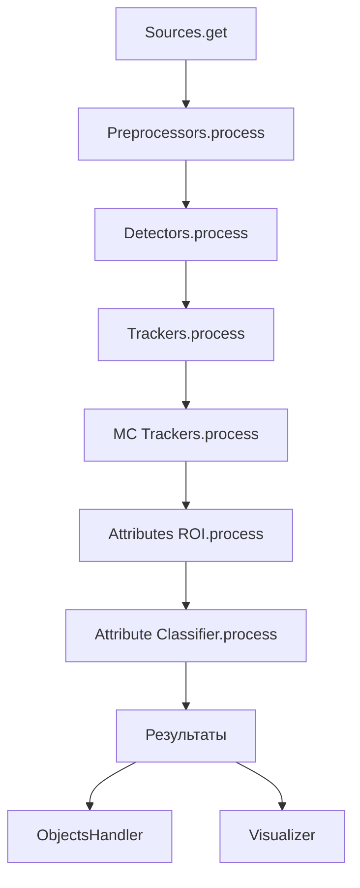
```mermaid
flowchart TD
    A[Sources.get] --> B[Preprocessors.process]
    B --> C[Detectors.process]
    C --> D[Trackers.process]
    D --> E[MC Trackers.process]
    E --> F[Attributes ROI.process]
    F --> G[Attribute Classifier.process]
    G --> H[Результаты]
    
    H --> I[ObjectsHandler]
    H --> J[Visualizer]
```

### Регистрация и обнаружение Pipeline классов

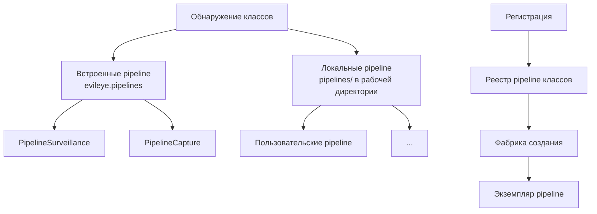
```mermaid
graph TB
    Discovery[Обнаружение классов] --> Builtin[Встроенные pipeline<br/>evileye.pipelines]
    Discovery --> Local[Локальные pipeline<br/>pipelines/ в рабочей директории]
    
    Builtin --> PipelineSurveillance[PipelineSurveillance]
    Builtin --> PipelineCapture[PipelineCapture]
    
    Local --> CustomPipeline1[Пользовательские pipeline]
    Local --> CustomPipeline2[...]
    
    Registration[Регистрация] --> Registry[Реестр pipeline классов]
    Registry --> Factory[Фабрика создания]
    Factory --> Instance[Экземпляр pipeline]
```

---

## Уровень 4: Видеозахват и запись

Система поддерживает различные бэкенды для захвата и записи видео.

### Архитектура видеозахвата

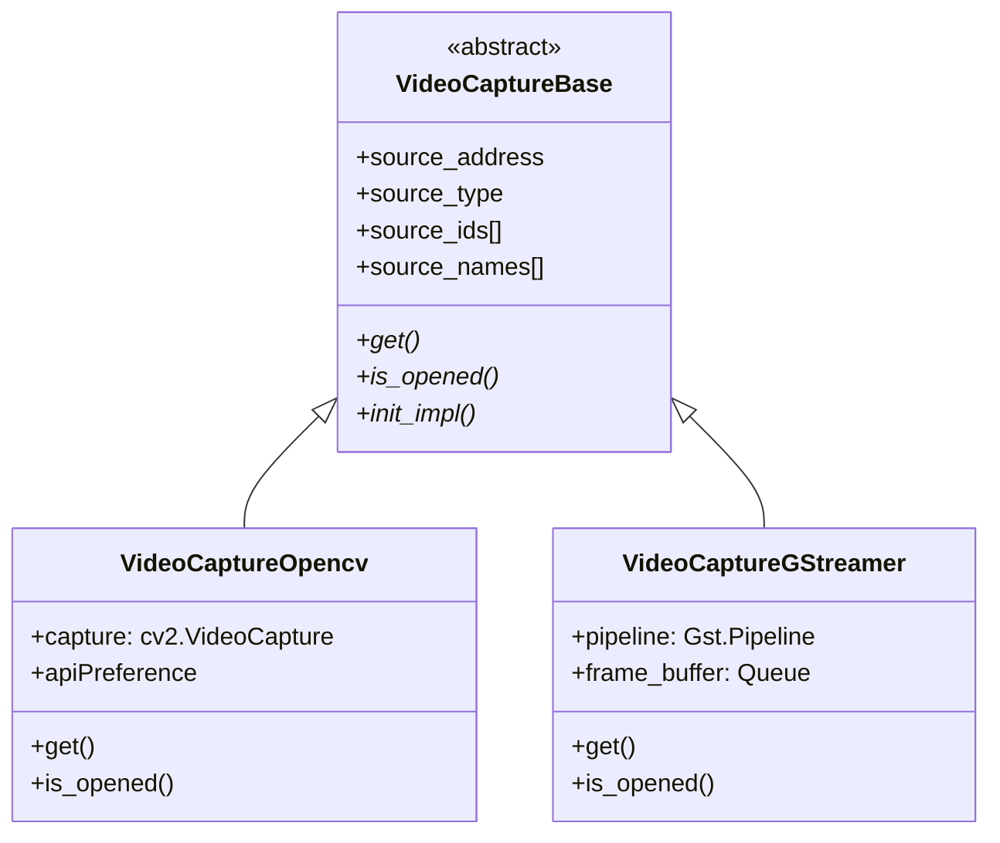
```mermaid
classDiagram
    class VideoCaptureBase {
        <<abstract>>
        +source_address
        +source_type
        +source_ids[]
        +source_names[]
        +get()*
        +is_opened()*
        +init_impl()*
    }
    
    class VideoCaptureOpencv {
        +capture: cv2.VideoCapture
        +apiPreference
        +get()
        +is_opened()
    }
    
    class VideoCaptureGStreamer {
        +pipeline: Gst.Pipeline
        +frame_buffer: Queue
        +get()
        +is_opened()
    }
    
    VideoCaptureBase <|-- VideoCaptureOpencv
    VideoCaptureBase <|-- VideoCaptureGStreamer
```

### Схема выбора бэкенда захвата

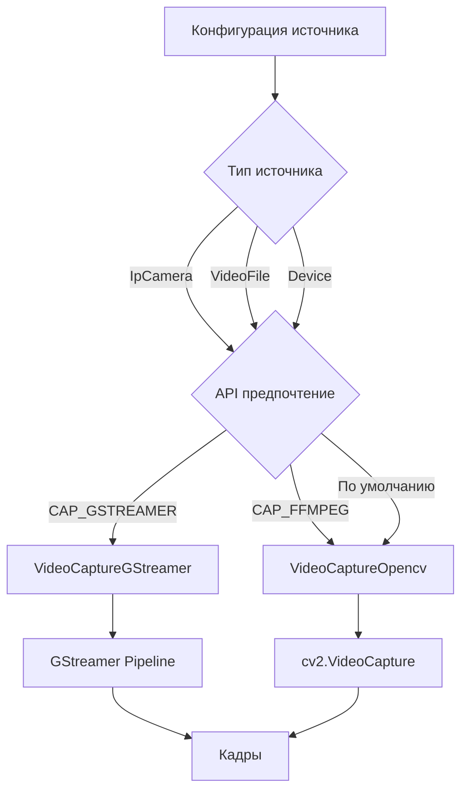
```mermaid
graph TB
    Config[Конфигурация источника] --> CheckType{Тип источника}
    
    CheckType -->|IpCamera| CheckAPI{API предпочтение}
    CheckType -->|VideoFile| CheckAPI
    CheckType -->|Device| CheckAPI
    
    CheckAPI -->|CAP_GSTREAMER| GStreamer[VideoCaptureGStreamer]
    CheckAPI -->|CAP_FFMPEG| OpenCV[VideoCaptureOpencv]
    CheckAPI -->|По умолчанию| OpenCV
    
    GStreamer --> GStreamerPipeline[GStreamer Pipeline]
    OpenCV --> OpenCVCapture[cv2.VideoCapture]
    
    GStreamerPipeline --> Frames[Кадры]
    OpenCVCapture --> Frames
```

### Типы источников и их обработка

#### IP Camera (RTSP)

**OpenCV**:
```
rtsp://url → cv2.VideoCapture(CAP_FFMPEG) → Кадры
```

**GStreamer**:
```
rtspsrc location=rtsp://url → rtph264depay → h264parse → 
avdec_h264 → videoconvert → appsink → Кадры
```

#### Video File

**OpenCV**:
```
/path/to/video.mp4 → cv2.VideoCapture(CAP_FFMPEG) → Кадры
```

**GStreamer**:
```
filesrc location=/path/to/video.mp4 → decodebin → 
videoconvert → appsink → Кадры
```

#### USB Camera (Device)

**OpenCV**:
```
device_index → cv2.VideoCapture(device_index) → Кадры
```

**GStreamer**:
```
v4l2src device=/dev/video0 → videoconvert → appsink → Кадры
```

### Архитектура записи видео

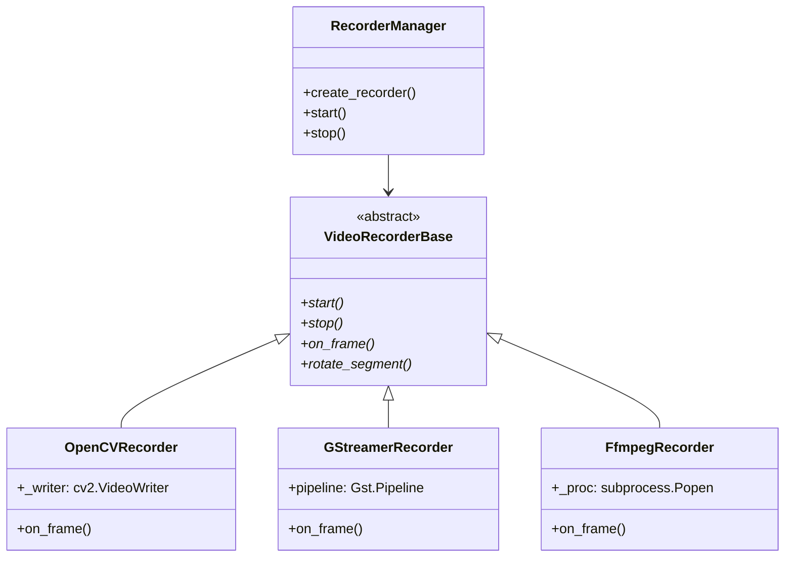
```mermaid
classDiagram
    class VideoRecorderBase {
        <<abstract>>
        +start()*
        +stop()*
        +on_frame()*
        +rotate_segment()*
    }
    
    class RecorderManager {
        +create_recorder()
        +start()
        +stop()
    }
    
    class OpenCVRecorder {
        +_writer: cv2.VideoWriter
        +on_frame()
    }
    
    class GStreamerRecorder {
        +pipeline: Gst.Pipeline
        +on_frame()
    }
    
    class FfmpegRecorder {
        +_proc: subprocess.Popen
        +on_frame()
    }
    
    VideoRecorderBase <|-- OpenCVRecorder
    VideoRecorderBase <|-- GStreamerRecorder
    VideoRecorderBase <|-- FfmpegRecorder
    RecorderManager --> VideoRecorderBase
```

### Выбор рекордера

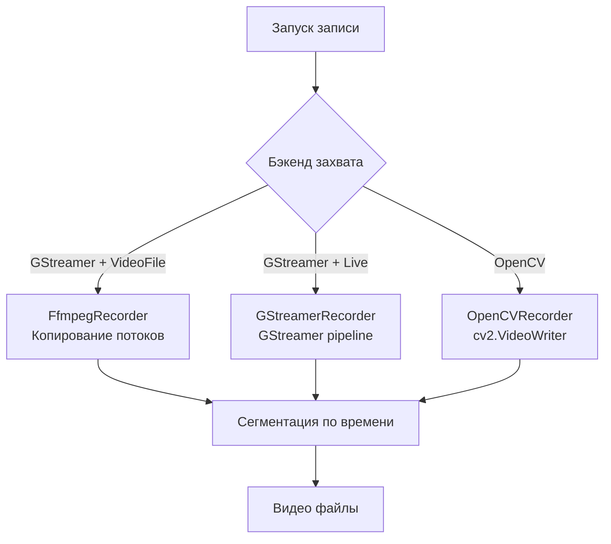
```mermaid
graph TB
    Start[Запуск записи] --> CheckBackend{Бэкенд захвата}
    
    CheckBackend -->|GStreamer + VideoFile| FFmpeg[FfmpegRecorder<br/>Копирование потоков]
    CheckBackend -->|GStreamer + Live| GStreamer[GStreamerRecorder<br/>GStreamer pipeline]
    CheckBackend -->|OpenCV| OpenCV[OpenCVRecorder<br/>cv2.VideoWriter]
    
    FFmpeg --> Segment[Сегментация по времени]
    GStreamer --> Segment
    OpenCV --> Segment
    
    Segment --> Files[Видео файлы]
```

### Особенности записи

**Сегментация**:
- Запись разбивается на сегменты по времени (`segment_length_sec`)
- Автоматическая ротация файлов
- Структура директорий: `YYYY-MM-DD/camera_name/`

**GStreamer Recorder**:
- Интеграция в pipeline захвата
- Использование `tee` элемента для разделения потоков
- Поддержка аппаратного кодирования

**FFmpeg Recorder**:
- Используется для видео файлов с GStreamer
- Копирование потоков без перекодирования
- Сегментация через `-f segment`

**OpenCV Recorder**:
- Простая реализация через `cv2.VideoWriter`
- Поддержка различных кодеков (MPEG4, H264, XVID)
- Ручная сегментация

---

## Уровень 5: Обработка объектов

Система обработки объектов управляет детектированными и отслеживаемыми объектами на протяжении их жизненного цикла.

### Поток обработки объектов

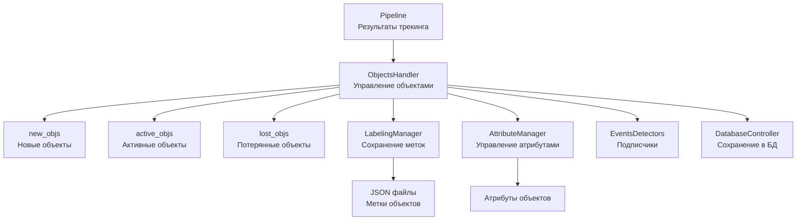
```mermaid
graph TB
    Pipeline[Pipeline<br/>Результаты трекинга] --> ObjectsHandler[ObjectsHandler<br/>Управление объектами]
    
    ObjectsHandler --> NewObjs[new_objs<br/>Новые объекты]
    ObjectsHandler --> ActiveObjs[active_objs<br/>Активные объекты]
    ObjectsHandler --> LostObjs[lost_objs<br/>Потерянные объекты]
    
    ObjectsHandler --> LabelingManager[LabelingManager<br/>Сохранение меток]
    ObjectsHandler --> AttributeManager[AttributeManager<br/>Управление атрибутами]
    
    LabelingManager --> JSONFiles[JSON файлы<br/>Метки объектов]
    AttributeManager --> ObjectAttributes[Атрибуты объектов]
    
    ObjectsHandler --> EventsDetectors[EventsDetectors<br/>Подписчики]
    ObjectsHandler --> DatabaseController[DatabaseController<br/>Сохранение в БД]
```

### Жизненный цикл объекта

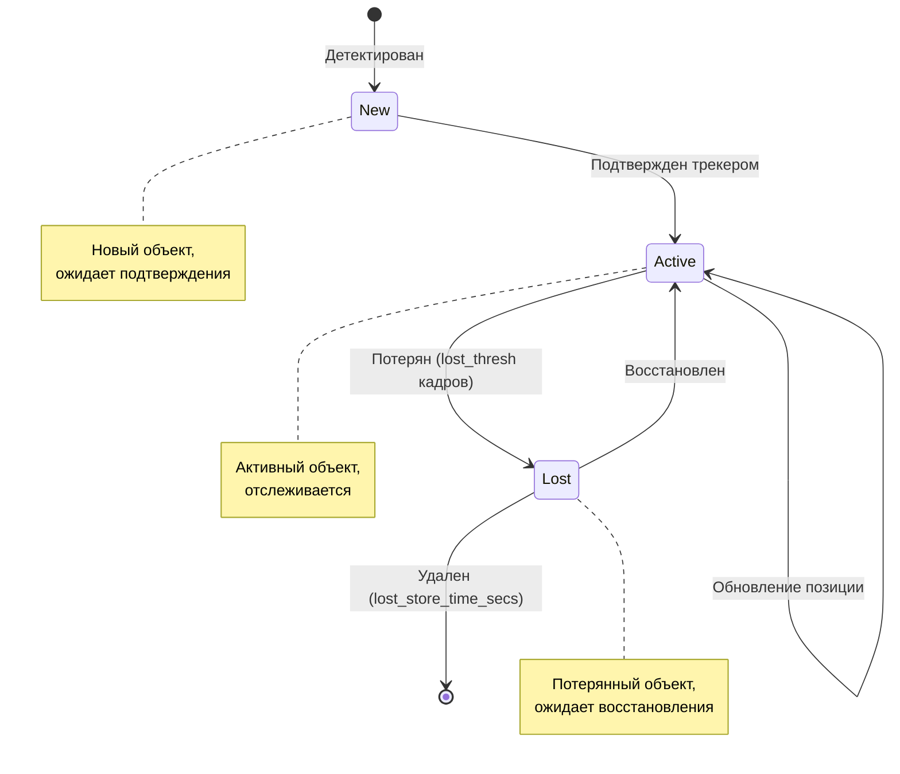
```mermaid
stateDiagram-v2
    [*] --> New: Детектирован
    New --> Active: Подтвержден трекером
    Active --> Active: Обновление позиции
    Active --> Lost: Потерян (lost_thresh кадров)
    Lost --> Active: Восстановлен
    Lost --> [*]: Удален (lost_store_time_secs)
    
    note right of New
        Новый объект,
        ожидает подтверждения
    end note
    
    note right of Active
        Активный объект,
        отслеживается
    end note
    
    note right of Lost
        Потерянный объект,
        ожидает восстановления
    end note
```

### ObjectsHandler: Внутренняя структура

```mermaid
classDiagram
    class ObjectsHandler {
        +objs_queue: Queue
        +new_objs: ObjectResultList
        +active_objs: ObjectResultList
        +lost_objs: ObjectResultList
        +labeling_manager: LabelingManager
        +attribute_manager: AttributeManager
        +subscribers[]
        +handle_objs()
        +_handle_active()
        +_handle_lost()
    }
    
    class LabelingManager {
        +save_labels()
        +save_detections()
        +save_tracking_results()
    }
    
    class AttributeManager {
        +update()
        +get_state()
        +_calculate_decision_state()
    }
    
    class ObjectResult {
        +object_id
        +track_id
        +history[]
        +last_image
        +attributes{}
    }
    
    ObjectsHandler --> LabelingManager
    ObjectsHandler --> AttributeManager
    ObjectsHandler --> ObjectResult
```

### Обработка результатов трекинга

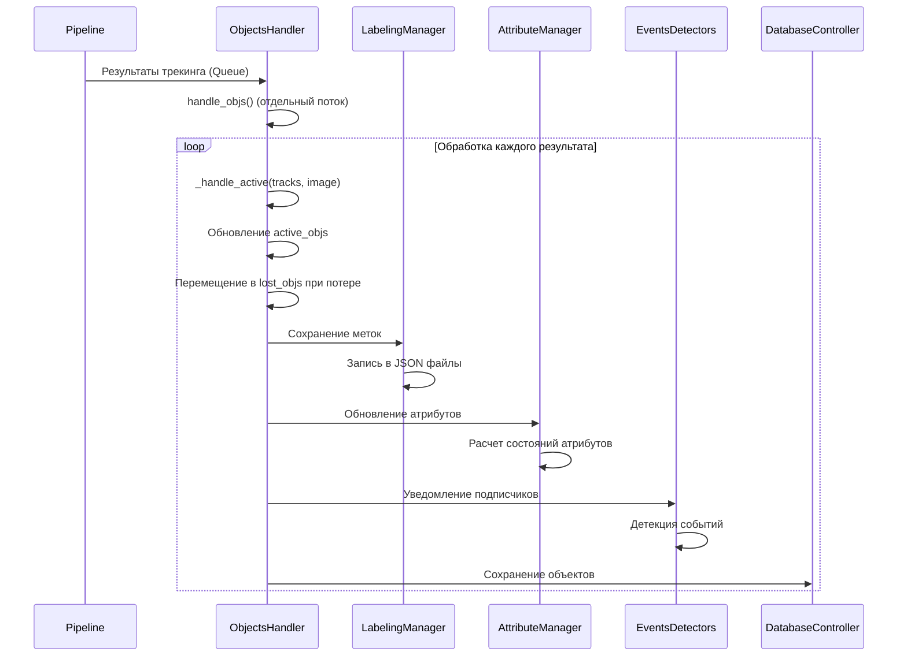
```mermaid
sequenceDiagram
    participant Pipeline
    participant ObjectsHandler
    participant LabelingManager
    participant AttributeManager
    participant EventsDetectors
    participant DatabaseController
    
    Pipeline->>ObjectsHandler: Результаты трекинга (Queue)
    ObjectsHandler->>ObjectsHandler: handle_objs() (отдельный поток)
    
    loop Обработка каждого результата
        ObjectsHandler->>ObjectsHandler: _handle_active(tracks, image)
        ObjectsHandler->>ObjectsHandler: Обновление active_objs
        ObjectsHandler->>ObjectsHandler: Перемещение в lost_objs при потере
        
        ObjectsHandler->>LabelingManager: Сохранение меток
        LabelingManager->>LabelingManager: Запись в JSON файлы
        
        ObjectsHandler->>AttributeManager: Обновление атрибутов
        AttributeManager->>AttributeManager: Расчет состояний атрибутов
        
        ObjectsHandler->>EventsDetectors: Уведомление подписчиков
        EventsDetectors->>EventsDetectors: Детекция событий
        
        ObjectsHandler->>DatabaseController: Сохранение объектов
    end
```

### LabelingManager: Сохранение меток

**Структура сохранения**:
```
EvilEyeData/
├── Detections/
│   └── YYYY-MM-DD/
│       ├── Metadata/
│       │   ├── objects_found.json
│       │   └── objects_lost.json
│       └── Images/
│           └── source_id/
│               ├── frame_XXXXX.jpg
│               └── ...
```

**Формат JSON**:
- `objects_found.json` - Новые объекты
- `objects_lost.json` - Потерянные объекты
- Метаданные: object_id, track_id, bbox, class_id, confidence, timestamp

### AttributeManager: Управление атрибутами

**Состояния атрибутов**:
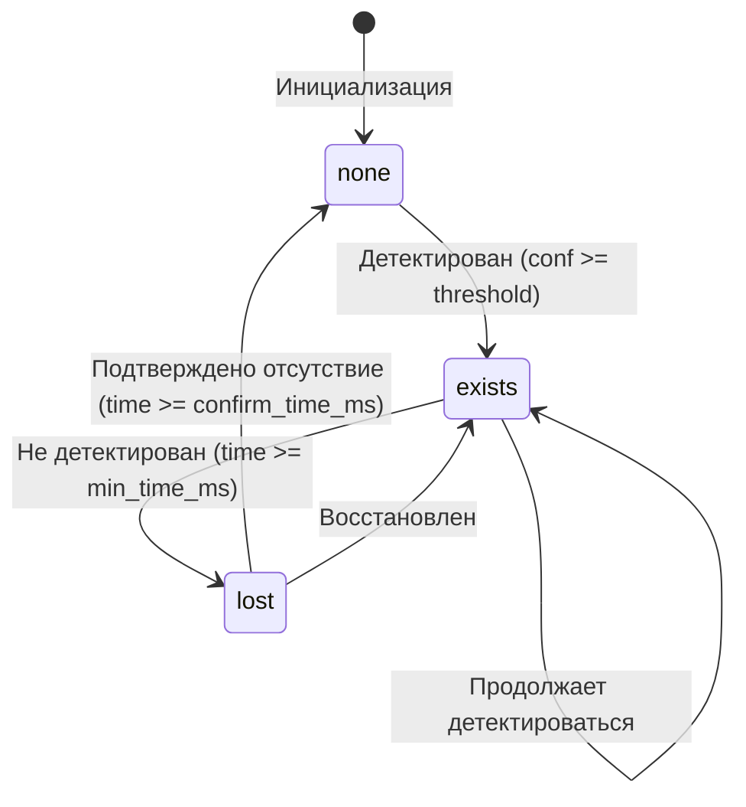
```mermaid
stateDiagram-v2
    [*] --> none: Инициализация
    none --> exists: Детектирован (conf >= threshold)
    exists --> lost: Не детектирован (time >= min_time_ms)
    lost --> none: Подтверждено отсутствие (time >= confirm_time_ms)
    lost --> exists: Восстановлен
    exists --> exists: Продолжает детектироваться
```

**Параметры**:
- `confidence_thresholds` - Пороги доверия для каждого атрибута
- `time_thresholds.min_time_ms` - Время до перехода в "lost"
- `time_thresholds.confirm_time_ms` - Время подтверждения состояния
- `ema_alpha` - Коэффициент EMA-сглаживания доверия

---

## Уровень 6: Обработка событий

Система детекции событий отслеживает различные типы событий на основе изменений объектов и состояния системы.

### Архитектура детекторов событий

```mermaid
classDiagram
    class EventsDetector {
        <<abstract>>
        +run_flag
        +process()*
        +init()*
    }
    
    class CamEventsDetector {
        +sources[]
        +process()
    }
    
    class FieldOfViewEventsDetector {
        +sources[]
        +active_obj_ids{}
        +process()
    }
    
    class ZoneEventsDetector {
        +zones{}
        +obj_ids_zone{}
        +process()
    }
    
    class AttributeEventsDetector {
        +sources{}
        +process()
    }
    
    class SystemEventsDetector {
        +process()
    }
    
    EventsDetector <|-- CamEventsDetector
    EventsDetector <|-- FieldOfViewEventsDetector
    EventsDetector <|-- ZoneEventsDetector
    EventsDetector <|-- AttributeEventsDetector
    EventsDetector <|-- SystemEventsDetector
```

### Схема обработки событий

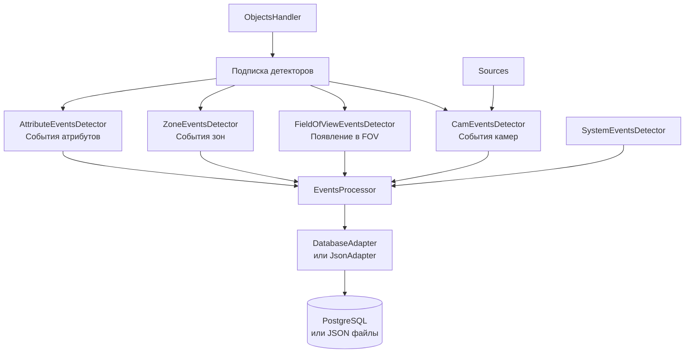
```mermaid
graph TB
    ObjectsHandler[ObjectsHandler] --> Subscribe[Подписка детекторов]
    
    Subscribe --> CamDetector[CamEventsDetector<br/>События камер]
    Subscribe --> FOVDetector[FieldOfViewEventsDetector<br/>Появление в FOV]
    Subscribe --> ZoneDetector[ZoneEventsDetector<br/>События зон]
    Subscribe --> AttrDetector[AttributeEventsDetector<br/>События атрибутов]
    
    Sources[Sources] --> CamDetector
    
    CamDetector --> EventsProcessor[EventsProcessor]
    FOVDetector --> EventsProcessor
    ZoneDetector --> EventsProcessor
    AttrDetector --> EventsProcessor
    SystemDetector[SystemEventsDetector] --> EventsProcessor
    
    EventsProcessor --> DatabaseAdapter[DatabaseAdapter<br/>или JsonAdapter]
    DatabaseAdapter --> Storage[(PostgreSQL<br/>или JSON файлы)]
```

### Типы событий

#### CamEventsDetector

**События**:
- `CameraStarted` - Камера запущена
- `CameraStopped` - Камера остановлена
- `CameraError` - Ошибка камеры

**Механизм**:
- Подписка на источники видео
- Отслеживание изменений состояния камер

#### FieldOfViewEventsDetector

**События**:
- `Alarm` - Объект появился в поле зрения

**Механизм**:
- Отслеживание новых объектов в `active_obj_ids`
- Проверка истории объекта для определения первого появления
- Генерация события при первом появлении

**Параметры**:
- `sources` - Список источников для мониторинга

#### ZoneEventsDetector

**События**:
- `ZoneEntered` - Объект вошел в зону
- `ZoneLeft` - Объект вышел из зоны

**Механизм**:
- Определение зон через координаты полигонов
- Отслеживание позиций объектов относительно зон
- Пороги для подтверждения событий (`event_threshold`, `zone_left_threshold`)

**Параметры**:
- `sources` - Конфигурация зон для каждого источника
- `event_threshold` - Порог подтверждения входа
- `zone_left_threshold` - Порог подтверждения выхода

#### AttributeEventsDetector

**События**:
- `AttributeDetected` - Атрибут обнаружен
- `AttributeLost` - Атрибут потерян

**Механизм**:
- Отслеживание изменений состояний атрибутов через `AttributeManager`
- Генерация событий при переходах состояний

**Параметры**:
- `sources` - Конфигурация для каждого источника

#### SystemEventsDetector

**События**:
- `SystemStarted` - Система запущена
- `SystemStopped` - Система остановлена
- `SystemError` - Ошибка системы

**Механизм**:
- Отслеживание состояния системы
- Генерация событий при изменениях состояния

### EventsProcessor: Обработка и сохранение событий

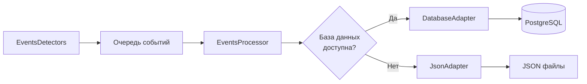
```mermaid
graph LR
    EventsDetectors[EventsDetectors] --> EventsQueue[Очередь событий]
    EventsQueue --> EventsProcessor[EventsProcessor]
    
    EventsProcessor --> CheckDB{База данных<br/>доступна?}
    
    CheckDB -->|Да| DatabaseAdapter[DatabaseAdapter]
    CheckDB -->|Нет| JsonAdapter[JsonAdapter]
    
    DatabaseAdapter --> PostgreSQL[(PostgreSQL)]
    JsonAdapter --> JSONFiles[JSON файлы]
```

### Механизм подписки

```mermaid
sequenceDiagram
    participant ObjectsHandler
    participant FOVDetector
    participant ZoneDetector
    participant AttrDetector
    
    Note over ObjectsHandler: Инициализация детекторов
    ObjectsHandler->>FOVDetector: subscribe()
    ObjectsHandler->>ZoneDetector: subscribe()
    ObjectsHandler->>AttrDetector: subscribe()
    
    loop Главный цикл обработки
        ObjectsHandler->>ObjectsHandler: Обновление объектов
        ObjectsHandler->>FOVDetector: update() (уведомление)
        ObjectsHandler->>ZoneDetector: update()
        ObjectsHandler->>AttrDetector: update()
        
        FOVDetector->>FOVDetector: process() (детекция событий)
        ZoneDetector->>ZoneDetector: process()
        AttrDetector->>AttrDetector: process()
    end
```

---

## Уровень 7: Работа с базой данных

Система поддерживает два режима хранения данных: PostgreSQL и JSON файлы.

### Архитектура работы с БД

```mermaid
classDiagram
    class DatabaseControllerBase {
        <<abstract>>
        +conn_pool
        +queue_in
        +query()
        +_insert_impl()*
    }
    
    class DatabaseControllerPg {
        +_init_connection()
        +_insert_impl()
        +_save_image()
    }
    
    class DatabaseAdapterBase {
        <<abstract>>
        +queue_in
        +_insert_impl()*
        +_update_impl()*
    }
    
    class DatabaseAdapterObjects {
        +_insert_impl()
        +_update_impl()
        +_prepare_for_saving()
    }
    
    class DatabaseAdapterCamEvents {
        +_insert_impl()
        +_execute_query()
    }
    
    class DatabaseAdapterFovEvents {
        +_insert_impl()
    }
    
    class DatabaseAdapterZoneEvents {
        +_insert_impl()
    }
    
    class DatabaseAdapterAttributeEvents {
        +_insert_impl()
    }
    
    class DatabaseAdapterSystemEvents {
        +_insert_impl()
    }
    
    DatabaseControllerBase <|-- DatabaseControllerPg
    DatabaseAdapterBase <|-- DatabaseAdapterObjects
    DatabaseAdapterBase <|-- DatabaseAdapterCamEvents
    DatabaseAdapterBase <|-- DatabaseAdapterFovEvents
    DatabaseAdapterBase <|-- DatabaseAdapterZoneEvents
    DatabaseAdapterBase <|-- DatabaseAdapterAttributeEvents
    DatabaseAdapterBase <|-- DatabaseAdapterSystemEvents
    DatabaseControllerPg --> DatabaseAdapterBase
```

### Схема выбора режима хранения

```mermaid
graph TB
    Config[Конфигурация] --> CheckDB{Секция database<br/>присутствует?}
    
    CheckDB -->|Да| CheckParams{Параметры<br/>корректны?}
    CheckDB -->|Нет| JsonMode[JSON режим]
    
    CheckParams -->|Да| ConnectDB[Подключение к PostgreSQL]
    CheckParams -->|Нет| JsonMode
    
    ConnectDB -->|Успех| DatabaseMode[Режим БД]
    ConnectDB -->|Ошибка| JsonMode
    
    DatabaseMode --> DatabaseAdapters[DatabaseAdapter*]
    JsonMode --> JsonAdapters[JsonAdapter*]
    
    DatabaseAdapters --> PostgreSQL[(PostgreSQL)]
    JsonAdapters --> JSONFiles[JSON файлы]
```

### Структура таблиц PostgreSQL

```mermaid
erDiagram
    projects ||--o{ jobs : "has"
    projects ||--o{ objects : "has"
    projects ||--o{ camera_events : "has"
    projects ||--o{ fov_events : "has"
    projects ||--o{ zone_events : "has"
    projects ||--o{ attribute_events : "has"
    projects ||--o{ system_events : "has"
    
    jobs ||--o{ objects : "has"
    camera_information ||--o{ objects : "has"
    
    projects {
        int project_id PK
        timestamp creation_time
    }
    
    jobs {
        int job_id PK
        int project_id FK
        timestamp creation_time
        timestamp finish_time
        int first_record
        int last_record
        boolean is_terminated
        int configuration_id
        json configuration_info
    }
    
    camera_information {
        text full_address PK
        text short_address
        int[] sources
        int[][] roi
        int video_dur_frames
        int video_dur_ms
        timestamp creation_time
        json calibration_info
        json additional_info
    }
    
    objects {
        int record_id PK
        int project_id FK
        int job_id FK
        text camera_full_address FK
        int source_id
        text source_name
        timestamp time_stamp
        timestamp time_lost
        int object_id
        real[] bounding_box
        real[] lost_bounding_box
        double precision confidence
        int class_id
        text preview_path
        text lost_preview_path
        text frame_path
        text lost_frame_path
        json object_data
    }
    
    camera_events {
        int event_id PK
        int project_id FK
        timestamp time_stamp
        text event_name
        text camera_full_address
    }
    
    fov_events {
        int event_id PK
        int project_id FK
        timestamp time_stamp
        int source_id
        int object_id
        real[] bounding_box
        double precision confidence
        int class_id
    }
    
    zone_events {
        int event_id PK
        int project_id FK
        timestamp time_stamp
        int source_id
        int object_id
        text event_type
        int zone_id
        real[] bounding_box
    }
    
    attribute_events {
        int event_id PK
        int project_id FK
        timestamp time_stamp
        int source_id
        int object_id
        text attribute_name
        text event_type
        double precision confidence
    }
    
    system_events {
        int event_id PK
        int project_id FK
        timestamp time_stamp
        text event_type
        int job_id FK
    }
```

### Поток сохранения данных

```mermaid
sequenceDiagram
    participant Component
    participant DatabaseAdapter
    participant Queue
    participant DatabaseController
    participant PostgreSQL
    
    Component->>DatabaseAdapter: insert(obj/event)
    DatabaseAdapter->>DatabaseAdapter: _prepare_for_saving()
    DatabaseAdapter->>Queue: queue_in.put(query, data)
    
    loop Поток вставки
        DatabaseController->>Queue: queue_in.get()
        DatabaseController->>DatabaseController: Получение соединения из пула
        DatabaseController->>PostgreSQL: execute(query, data)
        PostgreSQL->>DatabaseController: RETURNING record_id
        DatabaseController->>DatabaseController: _save_image()
        DatabaseController->>Component: threading_events.notify()
    end
```

### JSON адаптеры

**Использование**: Когда база данных недоступна или не настроена.

**Структура файлов**:
```
EvilEyeData/
├── objects/
│   └── YYYY-MM-DD/
│       └── objects_*.json
├── camera_events/
│   └── YYYY-MM-DD/
│       └── camera_events_*.json
├── fov_events/
│   └── YYYY-MM-DD/
│       └── fov_events_*.json
├── zone_events/
│   └── YYYY-MM-DD/
│       └── zone_events_*.json
├── attribute_events/
│   └── YYYY-MM-DD/
│       └── attribute_events_*.json
└── system_events/
    └── YYYY-MM-DD/
        └── system_events_*.json
```

**Преимущества JSON режима**:
- Не требует настройки БД
- Простота отладки (читаемые файлы)
- Легкий экспорт данных
- Подходит для небольших проектов

**Ограничения JSON режима**:
- Нет сложных запросов
- Нет транзакций
- Медленнее при больших объемах данных
- Нет Configuration History

### Управление изображениями

**Сохранение изображений**:
- `preview_path` - Миниатюра объекта (preview_width × preview_height)
- `frame_path` - Полный кадр с объектом
- `lost_preview_path` / `lost_frame_path` - Изображения при потере объекта

**Структура директорий**:
```
EvilEyeData/images/
├── previews/
│   └── YYYY-MM-DD/
│       └── source_id/
│           └── preview_*.jpg
└── frames/
    └── YYYY-MM-DD/
        └── source_id/
            └── frame_*.jpg
```

---

## Заключение

Данный документ описывает архитектуру системы EvilEye на семи уровнях абстракции:

1. **CLI и точки входа** - Различные способы запуска и управления системой
2. **Контроллер и основные сущности** - Центральная оркестрация компонентов
3. **Pipeline архитектура** - Модульная обработка видео потоков
4. **Видеозахват и запись** - Поддержка различных бэкендов
5. **Обработка объектов** - Управление жизненным циклом объектов
6. **Обработка событий** - Детекция и сохранение событий
7. **Работа с БД** - Хранение данных в PostgreSQL или JSON

Каждый уровень может быть изучен независимо, что упрощает понимание системы как для новых разработчиков, так и для опытных пользователей.

## Связанные документы

- [Pipeline Refactoring](PIPELINE_REFACTORING_README.md) - Детальное описание архитектуры pipeline
- [UML Diagrams](UML_DIAGRAMS_README.md) - Диаграммы классов и компонентов
- [Attributes Detection](ATTRIBUTES_DETECTION_README.md) - Система детекции атрибутов
- [Database Setup Guide](DATABASE_SETUP_GUIDE.md) - Руководство по настройке БД
