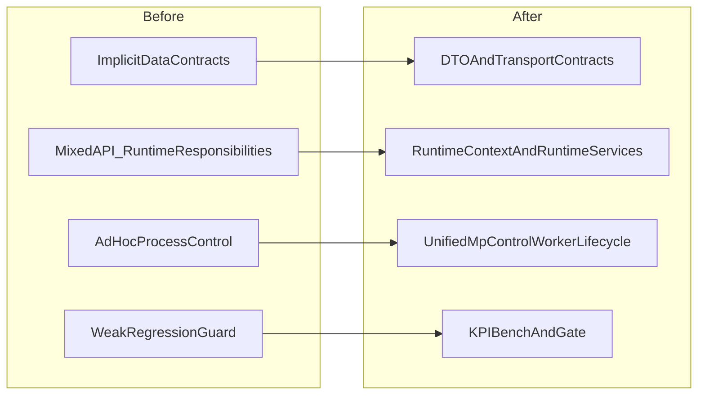
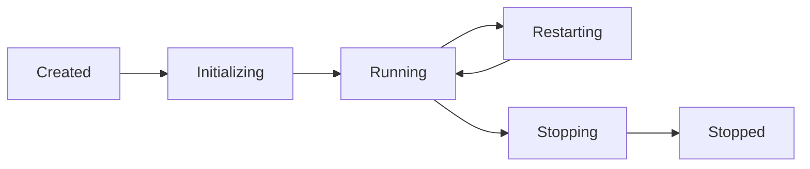
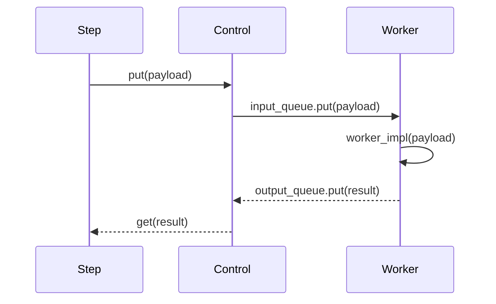
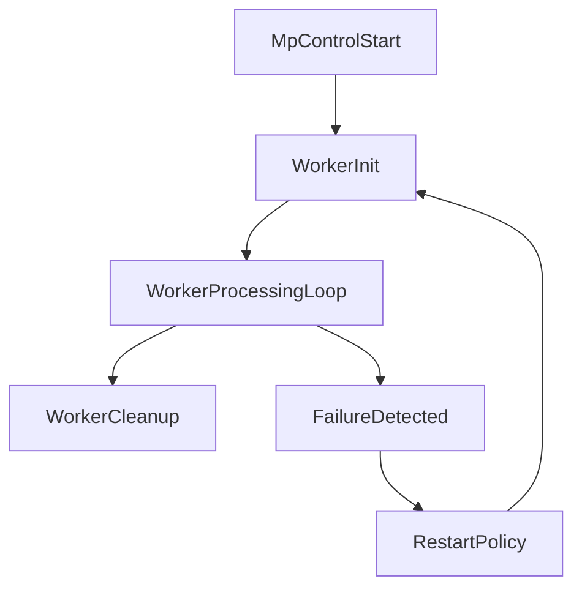
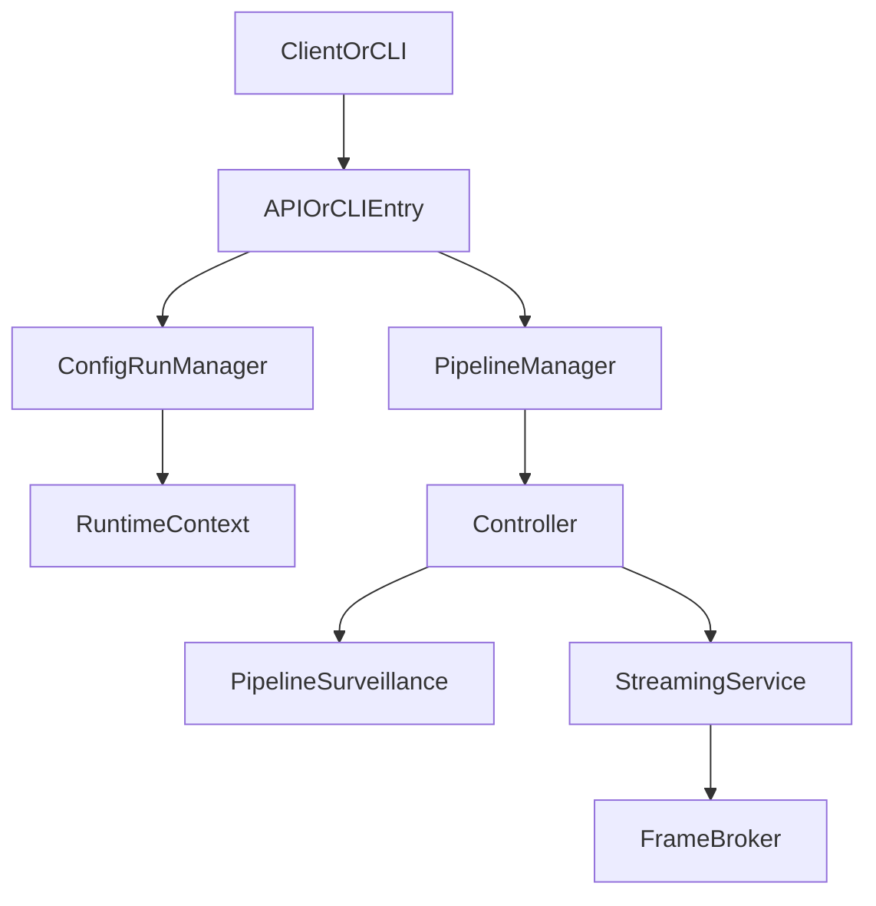
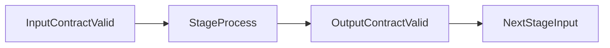
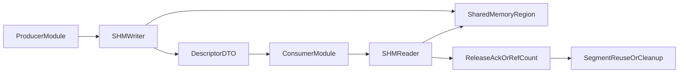
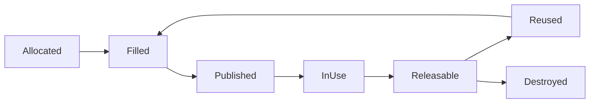

# Архитектурные изменения `mt_refactoring2` относительно `mt_refactoring`

Этот документ объясняет не столько «какие файлы изменились», сколько
**какая архитектурная модель была до** и **какой стала после рефакторинга**,
почему эти изменения были нужны и какой эффект они дают.

## Контекст и цель рефакторинга

Ветка `mt_refactoring2` решает системную проблему: в прежней модели
мультипроцессность, API-orchestration и контракты данных эволюционировали
частично независимо. Это повышало стоимость поддержки и затрудняло предсказуемое
масштабирование.

Цель рефакторинга:

1. Формализовать контракты данных между стадиями.
2. Разделить orchestration/runtime обязанности.
3. Сделать поведение thread/process режимов единообразным.
4. Упростить верификацию регрессий через KPI gate и unit-тесты контрактов.

## Карта «было -> стало»



**Что показывает схема:** это карта соответствий «проблема -> архитектурное решение».
Слева зафиксированы ключевые ограничения старой модели, справа — конкретные
механизмы, которыми `mt_refactoring2` их закрывает. То есть переход читается
по строкам сверху вниз как 1:1 трансформация, а не как вложенная иерархия.

---

## 1) Контракты данных и transport-слой

### Было

- На стыках стадий часто использовались структуры «по соглашению».
- Сигнатуры фактически зависели от реализации конкретных компонент.
- Изменения в одной стадии могли неявно ломать соседние.

### Стало

- Введены явные сущности:
  - `FrameTransport`
  - `InferenceDTO`
  - `TrackingDTO`
  - `IPCContracts`
- Данные между стадиями передаются через согласованные payload-контракты.
- Адаптеры выполняют преобразование форматов на границах, а не внутри бизнес-логики.

### Зачем это сделано

- Снижена связность между стадиями.
- Упрощено тестирование «контрактов», а не конкретной реализации.
- Повышена безопасность рефакторинга при изменении pipeline-этапов.

### Интерфейсы и контракты: было -> стало

#### Было (неявный контракт)

На границах стадий часто использовались словари/tuple с соглашениями по ключам:

```python
# До: payload "по договоренности"
payload = {
    "frame": frame,
    "source_id": source_id,
    "detections": dets,   # формат зависел от детектора
    "meta": meta,         # произвольная структура
}
```

Проблемы такого подхода:

- контракт не self-documented;
- высокая вероятность silent break при добавлении/переименовании полей;
- сложнее строить типизированные адаптеры и целевые unit-тесты.

#### Стало (явный контракт)

Контракты вынесены в DTO/transport слой:

```python
# После: типизированная граница стадий (концептуально)
class FrameTransport:
    source_id: int
    frame_id: int
    frame: "ndarray"
    timestamp: float
    batch_meta: dict

class InferenceDTO:
    source_id: int
    frame_id: int
    boxes: list
    scores: list
    classes: list

class TrackingDTO:
    source_id: int
    frame_id: int
    tracks: list
    associations: dict
```

Что это дает:

- каждый этап подписывается под четкий вход/выход;
- адаптеры концентрируют конверсию форматов;
- контракты валидируются изолированными тестами.

### Диаграмма контрактных границ


**Пояснение:** между процессорами проходят не «сырье» структуры произвольной формы,
а фиксированные контрактные объекты.

---

## 2) Runtime-слой: разделение orchestration и выполнения

### Было

- Часть runtime-решений была размазана между Controller/API/process helper.
- Контекст сессии и runtime-сервисы не были выделены как отдельный слой.

### Стало

- Добавлены:
  - `runtime_context`
  - `runtime_services`
  - `mp_session_registry`
- Появилась более явная модель lifecycle run/session.

### Диаграмма жизненного цикла run/session



**Что изменилось по сути:** сессия перестала быть «скрытым побочным эффектом»
команд запуска и стала объектом с явными состояниями и переходами.

### Интерфейсы runtime: было -> стало

#### Было

- Controller/API напрямую тянули часть runtime-решений.
- Инициализация и остановка выполнялись «по месту», без единого contract API.

#### Стало

Появилась явная контрактная поверхность runtime-сервисов (концептуально):

```python
class RuntimeServices:
    def initialize(self, config: dict) -> None: ...
    def start(self) -> None: ...
    def stop(self, reason: str | None = None) -> None: ...
    def status(self) -> dict: ...

class RuntimeContext:
    run_id: str
    mode: str
    pipeline_id: str
    started_at: float
```

Ключевое отличие: orchestration-слой теперь обращается к runtime через стабильные
методы жизненного цикла, а не через разрозненные вызовы внутренних компонентов.

---

## 3) MP-контур: управление процессами и воркерами

### Было

- Process mode поддерживался, но lifecycle, restart и мониторинг были
  менее стандартизованы между подсистемами.
- Thread/process ветвления местами усложняли pipeline orchestration.

### Стало

- Усилен единый каркас:
  - `MpControl` как управляющий контур
  - `MpWorker` как стандартный контракт worker-процесса
  - `ProcessManager`/реестр сессий и метрик
- Введены более формальные restart policy и метрики MP-контура.

### Диаграмма взаимодействия в process mode



**Зачем:** оставить для оркестратора единый интерфейс `put/get` и скрыть детали
межпроцессного взаимодействия в инфраструктурном слое.

### Контракт MpWorker/MpControl: было -> стало

#### Было

- Разные воркеры могли по-разному реализовывать старт/стоп/обработку ошибок.
- Поведение при сбое и рестарте зависело от конкретного модуля.

#### Стало

Унифицированный контракт worker-процесса (концептуально):

```python
class MpWorker:
    def init_worker(self) -> None: ...
    def worker_impl(self, data): ...
    def cleanup(self) -> None: ...

class MpControl:
    def add_worker(self, worker_cls, *args, **kwargs) -> None: ...
    def start(self) -> None: ...
    def stop(self, timeout: float = 5.0) -> None: ...
    def put(self, payload) -> None: ...
    def get(self):
        ...
```

Operational-эффект:

- одинаковый lifecycle для detector/tracker/attributes workers;
- предсказуемый graceful shutdown;
- единая точка для метрик и restart policy.

### Схема контракта управления процессами



**Пояснение:** рестарт и завершение входят в нормальную модель контракта, а не
являются «исключительными» ручными ветками.

---

## 4) API/Controller/Streaming: новая оркестрация

### Было

- Границы ответственности между API и runtime были менее явными.
- В server-first и run-first сценариях поведение могло отличаться по пути данных.

### Стало

- Усилен orchestration-слой API:
  - `pipeline_manager`
  - `config_run_manager`
  - `server_state`
  - обновленные internal/streaming routes
- Controller и streaming service приведены к более согласованной модели публикации
  и доступа к кадрам.

### Схема управления запуском



**Зачем:** сделать run/session и streaming управляемыми сущностями, а не
распределенной логикой в нескольких слоях.

### API-контракты run/session: было -> стало

#### Было

- Управление запуском и наблюдением runtime могло расходиться по сценариям.
- Internal/streaming пути логически пересекались с orchestration.

#### Стало

- Контур run/session более явно оформлен через менеджеры состояния.
- Internal-маршруты сфокусированы на межсервисном взаимодействии.
- Streaming-маршруты сфокусированы на выдаче кадра/потока клиенту.

Концептуальное разделение контрактов:

```text
/api/v1/configs/runs/*      -> lifecycle run/session
/api/v1/internal/*          -> service-to-service transport
/api/v1/.../stream*         -> client-facing streaming
```

Это снижает шанс смешения обязанностей и упрощает сопровождение API.

---

## 5) Pipeline-архитектура и доменные стадии

### Было

- Поведение ряда стадий зависело от неявных структур и локальных правил.
- Политики выбора результата, окон и троттлинга были менее формализованы.

### Стало

- Уточнены переходы:
  - capture -> preprocess -> detect -> track -> attributes -> objects
- Добавлены/обновлены policy-механизмы:
  - `results_selection_mode`
  - оконная логика результатов
  - restart-related правила на уровне pipeline-контуров

### Схема e2e-пайплайна


**Что это дало:** выше предсказуемость результата между режимами запуска и
меньше «плавающих» эффектов из-за изменения отдельной стадии.

### Контракт этапов pipeline: было -> стало

#### Было

- Этап мог неявно модифицировать payload, что не всегда прозрачно соседним этапам.

#### Стало

- Каждый этап имеет ожидаемый входной/выходной контракт.
- Policy (selection/window/restart) декларируется на orchestration-уровне.

Минимальная идея этапного интерфейса:

```python
class PipelineStage:
    def put(self, payload) -> None: ...
    def get(self):
        ...
```

Независимо от mode (`thread`/`process`) внешняя модель взаимодействия одинаковая.

### Схема инвариантов pipeline-контрактов



**Пояснение:** ключевой инвариант — валидный выход каждой стадии является валидным
входом следующей стадии.

---

## 6) Конфигурационная модель

### Было

- Конфиги поддерживали мультипроцессность, но не все новые policy-кейсы
  отражались единообразно в профилях.

### Стало

- Профили в `configs/*` выровнены под текущие MP/DTO/policy сценарии.
- Включены конфигурации для стабильного benchmark/gate процесса.

### Схема миграции конфига


**Зачем:** минимизировать риск «формально валидного, но поведенчески
неэквивалентного» конфига после миграции.

---

## 7) KPI/gate и тестовая верификация

### Было

- Регрессионная проверка архитектурных изменений была менее формализованной.

### Стало

- Добавлены benchmark/gate скрипты:
  - `scripts/benchmark_ipc_kpi.py`
  - `scripts/run_ipc_kpi_gate.py`
- Расширено покрытие unit-тестами на уровне контрактов, адаптеров и policy.

### Что это меняет операционно

- Можно проверять не только «работает/не работает», но и устойчивость
  архитектурных инвариантов (latency, restart behavior, contract integrity).

---

## 8) Shared-memory транспорт между модулями

Этот блок описывает архитектурную детализацию по транспорту кадров/пакетов
через shared memory (SHM) как межмодульному каналу низкой задержки.

### Было

- Базовый IPC-контур опирался главным образом на очереди/сериализацию payload.
- Для крупных кадровых структур это приводило к дополнительным копированиям
  и заметному overhead на pickle/queue границах.
- Утилизация CPU/latency в высоконагруженных режимах масштабировалась хуже.

### Стало

- Введен и структурирован SHM-подход для передачи «тяжелых» данных
  (кадры, батчи фич/метаданных) между модулями.
- Контракт разделен на:
  1. **Data plane (SHM):** сами бинарные данные.
  2. **Control plane (IPC/DTO):** дескрипторы сегментов, offsets, размеры,
     frame_id/source_id, флаги готовности и срок жизни.
- Модули обмениваются не массивом байтов, а компактным дескриптором доступа.

### Почему это важно

- Снижается количество копирований на критичном пути.
- Уменьшается latency передачи между стадиями.
- Повышается пропускная способность при многокамерных профилях.

### Логическая схема SHM-транспорта



**Пояснение:** бинарные данные идут через SHM-регион, а межмодульный контракт
передает только descriptor DTO (имя сегмента, offset, shape/size, frame metadata).

### Контракт дескриптора (концептуально)

```python
class SharedMemoryDescriptor:
    shm_name: str           # имя сегмента shared memory
    offset: int             # смещение внутри сегмента
    nbytes: int             # размер полезных данных
    dtype: str              # тип данных (например uint8/float32)
    shape: tuple            # форма массива/кадра
    source_id: int
    frame_id: int
    timestamp: float
    generation: int         # версия/эпоха сегмента
```

### Было -> стало на уровне интерфейсов

#### Было

```python
# Передача "тяжелого" payload через очередь
queue.put(frame_bytes_or_array)
```

#### Стало

```python
# Запись в SHM + передача только дескриптора
descriptor = shm_writer.write(frame_array, meta)
queue.put(descriptor)
```

### Модель владения и жизненный цикл сегмента



**Пояснение:** сегменты предпочтительно переиспользуются из пула, чтобы не
создавать/уничтожать SHM-объекты на каждом кадре.

### Синхронизация и безопасность контракта

Ключевые инварианты:

1. **Descriptor-first validity:** consumer читает SHM только после получения
   валидного дескриптора.
2. **Generation check:** защита от чтения переиспользованного сегмента
   старым consumer.
3. **Bounds check:** `offset + nbytes` всегда в пределах сегмента.
4. **Release protocol:** освобождение/ack строго после завершения чтения.
5. **Timeout/fallback:** при деградации SHM допускается fallback в queue mode
   (снижение производительности, но сохранение работоспособности).

### Отказоустойчивость: что меняется по сравнению с queue-only

- При падении consumer:
  - сегмент не должен «утекать» бесконечно;
  - cleanup выполняется по timeout/refcount/heartbeat политике.
- При падении producer:
  - consumer корректно обрабатывает отсутствие новых дескрипторов;
  - stale-сегменты собираются GC-процедурой.
- При рестарте worker:
  - generation/epoch отделяет «старые» и «новые» публикации.

### Практический эффект для архитектуры

- SHM переводит тяжелый payload из control plane в data plane.
- DTO/контракты остаются управляющим каналом и точкой совместимости.
- Pipeline сохраняет интерфейсную модель стадий, но получает более дешевый
  транспорт для объемных данных.

---

## Главные архитектурные итоги

1. **Контракты данных стали явными.**  
   Стадии pipeline взаимодействуют через DTO/transport, а не через неявные структуры.

2. **Runtime отделен от orchestration.**  
   Появился отдельный слой контекста/сервисов выполнения.

3. **MP-контур стандартизован.**  
   `MpControl`/`MpWorker` задают единый lifecycle и поведение при сбоях.

4. **API-run/streaming модель стала более целостной.**  
   Run/session и публикация кадров согласованы между сценариями запуска.

5. **Рефакторинг стал измеряемым.**  
   KPI gate и тесты контрактов делают качество изменений воспроизводимым.

6. **Интерфейсные границы стали устойчивыми.**  
   Изменения реализации меньше затрагивают соседние слои благодаря явным контрактам.

---

## Риски и ограничения после рефакторинга

- Для старых конфигов желательно явное выравнивание `execution_mode` и policy-параметров.
- При изменении DTO-контрактов обязательно прогонять contract-тесты и KPI gate.
- Поведенческая совместимость между thread/process режимами теперь лучше, но требует
  регулярной валидации на новых профилях нагрузки.

---

## Рекомендуемый контур проверки

```bash
pytest tests/unit/core -q
pytest tests/unit/pipeline -q
pytest tests/unit/object_detector -q
pytest tests/unit/object_tracker -q
pytest tests/unit/scripts/test_benchmark_ipc_kpi_gate.py -q
```

---

## Связанные документы

- [ARCHITECTURE.md](ARCHITECTURE.md)
- [PIPELINE_ARCHITECTURE.md](PIPELINE_ARCHITECTURE.md)
- [MULTIPROCESSING.md](MULTIPROCESSING.md)
- [CONFIGURATION_GUIDE.md](CONFIGURATION_GUIDE.md)
