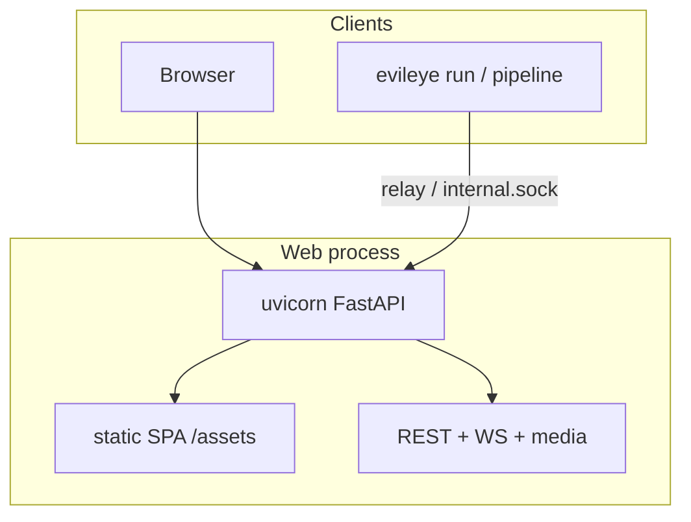
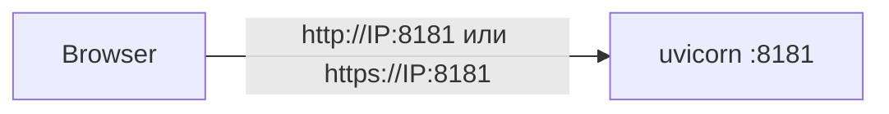
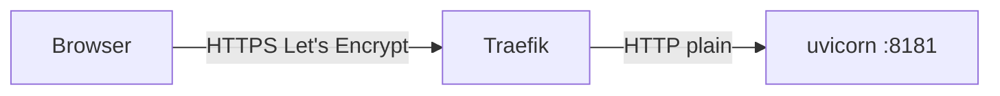

# Web UI: развёртывание без Traefik и за Traefik

Как поднять операционную консоль EvilEye (FastAPI + React SPA) в двух типичных схемах:

1. **Без reverse-proxy** — uvicorn сам отдаёт HTTP или HTTPS на порту **8181**.
2. **За Traefik** (или аналогом) — TLS и публичное имя на прокси, EvilEye слушает **plain HTTP** на 8181.

SPA всегда монтируется из `evileye/api/static/` (`/assets`, SPA fallback). Сборка: `evileye web build` / `npm run build` в `evileye/api/frontend` (см. [WEB_UI_GUIDE.md](WEB_UI_GUIDE.md)).

Связанные материалы: [CLI_SERVICE_COMMANDS.md](CLI_SERVICE_COMMANDS.md), [CONFIGURATION_GUIDE.md](CONFIGURATION_GUIDE.md) (секции `server`, `web_auth`), [CLI_DEPLOY_COMMAND.md](CLI_DEPLOY_COMMAND.md).

---

## Общая архитектура Web UI



| Компонент | Роль |
|-----------|------|
| `evileye server` | OS-сервис / процесс API+SPA (часто `systemctl --user evileye`) |
| `evileye run` | Пайплайн; preview/metadata уходит в API через unix-socket / internal token |
| `configs/system.json` → `server` | `host`, `port`, `ssl_*`, `public_base_url` |
| `credentials.json` → `web_auth` | Пользователи, `secure_cookies`, `protection.trust_proxy` |

Приоритет TLS-путей: CLI `--ssl-*` → env `EVILEYE_SSL_*` → `server.ssl_*`. Пустые/отсутствующие `ssl_*` = **HTTP**. Один порт uvicorn не умеет HTTP+HTTPS одновременно.

Рекомендуемый публичный URL всегда задавайте в `server.public_base_url` (и/или credentials) — его используют ссылки UI, CORS-контекст и часть серверных хелперов.

---

## Вариант A: без Traefik (прямой доступ к :8181)



Подходит для LAN, отладки, одиночного хоста без внешнего reverse-proxy.

### A1. HTTP (проще всего)

`configs/system.json`:

```json
"server": {
  "enabled": true,
  "host": "0.0.0.0",
  "port": 8181,
  "ssl_certfile": "",
  "ssl_keyfile": "",
  "public_base_url": "http://10.245.1.2:8181"
}
```

systemd / CLI **без** `--ssl-certfile` / `--ssl-keyfile`:

```bash
evileye server --host 0.0.0.0 --port 8181 --no-reload
# открыть http://127.0.0.1:8181  или  http://<LAN-IP>:8181
curl -s http://127.0.0.1:8181/ready
```

`web_auth.protection.trust_proxy`: обычно `false` (клиентский IP = прямой peer).

### A2. HTTPS на самом EvilEye (self-signed или свои PEM)

Предпочтительный путь: `evileye deploy` → `evileye service install` (сертификаты в `certs/`, пути в `server.ssl_*`).

```json
"server": {
  "host": "0.0.0.0",
  "port": 8181,
  "ssl_certfile": "certs/server.crt",
  "ssl_keyfile": "certs/server.key",
  "public_base_url": "https://10.245.1.2:8181"
}
```

```bash
evileye server --host 0.0.0.0 --port 8181 --no-reload \
  --ssl-certfile ./certs/server.crt --ssl-keyfile ./certs/server.key
# https://127.0.0.1:8181   (curl -k, пока не импортирован certs/ca.crt)
```

При наличии TLS cookie `Secure` включается автоматически. **HSTS** только явно (`server.hsts` / `EVILEYE_HSTS=1`) и только с доверенным сертификатом.

Доступ не с localhost: задайте  
`EVILEYE_CORS_ALLOW_ORIGINS=https://10.245.1.2:8181`  
и при необходимости `EVILEYE_ALLOWED_HOSTS=10.245.1.2,127.0.0.1`.

### Чеклист A

1. `GET /ready` на том же схеме/порту, что и UI.
2. Логин admin (пароль bootstrap — в логе первого старта).
3. Live / Playback открываются с того же origin.
4. Прямой заход по IP:порт — ожидаемый способ доступа.

---

## Вариант B: за Traefik (рекомендуемая схема с публичным DNS)



**Правило:** TLS терминирует только Traefik. EvilEye за прокси слушает **HTTP**.  
Не делайте double-TLS (Traefik → `https://host:8181` с `insecureSkipVerify`): при Live/WS и обрывах клиентов на uvicorn копятся `CLOSE-WAIT`, fd упираются в лимит → `EMFILE` → снаружи 504.

### B1. EvilEye (backend)

`configs/system.json`:

```json
"server": {
  "enabled": true,
  "host": "0.0.0.0",
  "port": 8181,
  "ssl_certfile": "",
  "ssl_keyfile": "",
  "public_base_url": "https://eye.example.com"
}
```

`credentials.json` → `web_auth`:

```json
"secure_cookies": true,
"protection": {
  "enabled": true,
  "trust_proxy": true,
  "trusted_proxy_ips": ["127.0.0.1", "::1", "172.18.0.10"],
  "whitelist_ips": ["127.0.0.1", "::1"],
  "global_max_requests": 600
}
```

- `trust_proxy` + IP контейнера Traefik (часто `172.18.0.10` / docker bridge) — чтобы баны и rate limit видели реальный клиентский IP из `X-Forwarded-For`.
- `secure_cookies: true` обязательно: backend HTTP, снаружи HTTPS.
- systemd: **без** SSL-аргументов; имеет смысл `LimitNOFILE=65536` (защита от всплесков fd).

```ini
# пример user unit
ExecStart=/usr/bin/evileye server --host 0.0.0.0 --port 8181 --no-reload
LimitNOFILE=65536
```

Проверка с хоста:

```bash
curl -s http://127.0.0.1:8181/ready
# прямой https://IP:8181 больше не обслуживается — это ожидаемо
```

### B2. Traefik (file provider)

Идея роутера (пример для `eye.deepnn.ru`; имена подставьте свои):

```yaml
http:
  serversTransports:
    eye-backend:
      maxIdleConnsPerHost: 32
      forwardingTimeouts:
        dialTimeout: 5s
        responseHeaderTimeout: 60s
        idleConnTimeout: 30s

  routers:
    eye:
      entryPoints: [websecure]
      rule: Host(`eye.example.com`)
      service: eye
      tls:
        certResolver: lets-encrypt

  services:
    eye:
      loadBalancer:
        servers:
          - url: http://host.docker.internal:8181   # HTTP, не https
        serversTransport: eye-backend
        passHostHeader: true
```

Если Traefik в Docker, а EvilEye на хосте:

```yaml
# у сервиса traefik
extra_hosts:
  - "host.docker.internal:host-gateway"
```

EntryPoint `websecure` (долгие WS Live/playback — read/write не резать; idle — резать мёртвые keep-alive):

```bash
TRAEFIK_ENTRYPOINTS_websecure_TRANSPORT_RESPONDINGTIMEOUTS_READTIMEOUT=0s
TRAEFIK_ENTRYPOINTS_websecure_TRANSPORT_RESPONDINGTIMEOUTS_WRITETIMEOUT=0s
TRAEFIK_ENTRYPOINTS_websecure_TRANSPORT_RESPONDINGTIMEOUTS_IDLETIMEOUT=180s
```

После смены env Traefik нужно **пересоздать** контейнер (`docker compose up -d traefik`), одного `restart` мало.

### B3. CORS / Host

```bash
EVILEYE_CORS_ALLOW_ORIGINS=https://eye.example.com
EVILEYE_ALLOWED_HOSTS=eye.example.com,127.0.0.1
```

### Чеклист B

1. `curl -sk https://eye.example.com/ready` → `{"status":"ok"}`.
2. В HTML публичного origin актуальный `/assets/index-*.js`.
3. Live WS и Playback media через тот же HTTPS-origin.
4. Под нагрузкой: `ss -tn | grep :8181` — нет тысяч `CLOSE-WAIT`; число fd процесса далеко от лимита.
5. Прямой `https://<LAN-IP>:8181` не используется (будет «Invalid HTTP request» / отказ) — только публичный URL.

---

## Сравнение

| | Без Traefik | За Traefik |
|--|-------------|------------|
| Публичный URL | `http(s)://IP:8181` | `https://eye.example.com` |
| TLS | нет или на uvicorn | только на Traefik |
| `server.ssl_*` | пусто или PEM | **пусто** |
| `public_base_url` | URL с портом 8181 | HTTPS без порта (443) |
| `trust_proxy` | обычно false | **true** + IP прокси |
| `secure_cookies` | авто при TLS uvicorn | **явно true** |
| Точка входа пользователя | :8181 | :443 → proxy → :8181 |

---

## Типичные ошибки

| Симптом | Причина | Что сделать |
|---------|---------|-------------|
| Снаружи 504 / таймауты, на хосте `EMFILE` / куча `CLOSE-WAIT` к :8181 | Double-TLS Traefik→HTTPS uvicorn | Backend только HTTP; пересоздать Traefik |
| Логин ок, но cookie не держится по HTTPS-имени | Backend HTTP без `secure_cookies` | `"secure_cookies": true` |
| Баны бьют IP прокси, а не клиента | `trust_proxy` выключен или нет IP Traefik в `trusted_proxy_ips` | Включить trust + docker IP |
| «Invalid HTTP request» на :8181 | Клиент шлёт TLS на HTTP-порт | Ходить на публичный HTTPS URL |
| Старый UI после деплоя | Кэш SPA | Hard reload; проверить имя `index-*.js` |
| Pipeline не достучится до API | Relay ждёт HTTPS+CA, а порт уже HTTP | Пустые `ssl_*`; relay уйдёт на `http://127.0.0.1:8181` |

---

## Минимальный smoke после смены схемы

```bash
# backend
curl -sS http://127.0.0.1:8181/ready

# публично (вариант B)
curl -skS https://eye.example.com/ready
curl -skS https://eye.example.com/ | grep -oE 'assets/index-[^"]+'

# здоровье сокетов (не должно расти без отдачи)
ss -tn | awk '/:8181/ {print $1}' | sort | uniq -c
```

Откройте в браузере Live и Playback на публичном URL; убедитесь, что превью и перемотка архива работают без пропадания UI.
