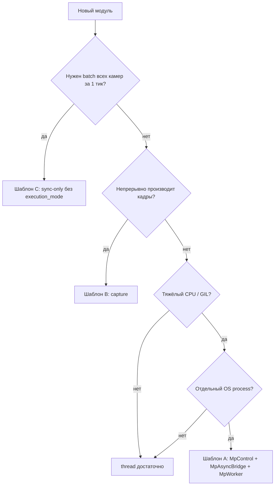

# Разработка модулей с поддержкой thread и process

Пошаговое руководство для добавления стадий pipeline в EvilEye с `execution_mode`. Каждый раздел заканчивается **конкретными** файлами, фрагментами конфига и типичными ошибками.

**Перед началом прочитайте:** [thread_vs_mp_contracts.md](thread_vs_mp_contracts.md) §3 (общая схема) и §8 (post-drain).

---

## §C1. Decision tree



Process path: parent **feed/drain** + [`MpAsyncBridge`](../evileye/core/mp_async_bridge.py); inference only in child ([`YoloRuntime`](../evileye/object_detector/yolo_runtime.py) for YOLO). Do not copy-paste `_enqueue_mp_*`.

### C1.1. Таблица решений (примеры из EvilEye)

| Модуль | Режим в production | Шаблон | Почему |
|--------|-------------------|--------|--------|
| `VideoCaptureOpencv` | process (poly-videos) | B | decode + GIL |
| `ObjectDetectorYolo` | process | A | Ultralytics inference |
| `ObjectTrackingBotsort` | process | A | BoT-SORT + ONNX ReID |
| `ObjectMultiCameraTracking` | — (нет mode) | C | batch по всем sid |
| `AttributeClassifier` | thread/process | A | малый YOLO на ROI |
| Preprocessing | часто thread | A или thread-only | лёгкий CPU |

### C1.2. Жёсткие правила

1. **Один `class_name` в config** + `"execution_mode": "thread"|"process"`. Не плодить `FooMp` классы (**DUP-018**).
2. **Child worker всегда `thread` внутри** если это capture child (`mp_worker_capture.py` L82).
3. **Не nested `process`:** daemon/spawn ограничения multiprocessing.
4. **Facade queues = `threading.Queue`** в parent всегда (см. `object_detection_base.py` L86–89).

---

## §C2. Шаблон A — compute-bound (detector / tracker)

### C2.1. Структура репозитория

```text
evileye/my_detector/
  __init__.py
  my_detector_base.py      # @register("MyDetector") — put/get, dispatcher
  my_detection_thread.py   # thread: DetectionThreadBase subclass
  my_detection_thread_mp.py # process: feed/drain + MpAsyncBridge
  mp_worker_my.py          # class MpWorkerMy(MpWorker): worker_impl only
```

Регистрация:

```python
from evileye.core.base_class import EvilEyeBase

@EvilEyeBase.register("MyDetector")
class MyDetector(ObjectDetectorBase):  # или свой base по аналогии
    ...
```

### C2.2. Контракт facade (обязательные методы)

| Метод | Семантика | Ошибка если пропустить |
|-------|-----------|------------------------|
| `set_params_impl` | Читать `execution_mode`, `source_ids`, ROI | Default process неожиданно |
| `init_impl` | Branch: `_init_process_mode` vs thread workers | MP не стартует |
| `put` | Non-blocking; drop oldest; return success | Pipeline hang |
| `get` | `get_nowait` → None или `[Result, Frame/Image]` | Blocking pipeline |
| `start`/`stop` | Поднять/остановить threads + MpControl | Zombie processes |
| `is_ready` | thread: model ok; process: mp alive | Controller стартует рано |
| `get_source_ids` | list[int] для ProcessorStep routing | Кадры в wrong detector |

### C2.3. Parent queues — пример кода

```python
from queue import Queue
from evileye.core.mp_queue_config import (
    detector_input_queue_size,
    detector_output_queue_size,
)

def _init_queues(self):
    # ВАЖНО: threading.Queue, НЕ multiprocessing.Queue
    self.queue_in = Queue(maxsize=detector_input_queue_size())
    self.queue_out = Queue(maxsize=detector_output_queue_size())
```

**Почему:** `ProcessorStep` и dispatcher в **том же PID**, что controller. MP pickle на hot path не нужен — MP только внутри `MyDetectionThreadMp` → `MpControl`.

### C2.4. Пример конфига (poly-videos style)

```json
{
  "class_name": "ObjectDetectorYolo",
  "enable": true,
  "execution_mode": "process",
  "source_ids": [2],
  "model": "models/yolo11n.pt",
  "roi": [[0, 0, 1920, 1080]],
  "stride": 1,
  "confidence": 0.25
}
```

**Omit `execution_mode`** → будет **`process`** (`DEFAULT_EXECUTION_MODE`).

**Thread bench** — как в `configs/poly-videos-thread.json`: явный `"execution_mode": "thread"` в каждом блоке det/track/source.

### C2.5. Process mode — пошаговый init (10 шагов)

| # | Шаг | Код / файл |
|---|-----|------------|
| 1 | Создать `MpControl(max_input, max_output)` | размеры из `mp_control_queue_size(roi_count, role="detector")` |
| 2 | `MpWorkerMy(params)` + `mp_control.add_worker` | `mp_worker_my.py` |
| 3 | `mp_control.start()` | spawn child |
| 4 | Создать `MyDetectionThreadMp` в `detection_threads[]` | по числу threads в config |
| 5 | `thread.start()` → feed + drain **daemon threads** | не `processing_thread` base |
| 6 | Feed: read `queue_in`, build IPC payload | SHM; pack frame — [`frame_worker_meta`](../evileye/core/frame_worker_meta.py) |
| 7 | `bridge.enqueue(payload, job)` с cap `mp_pending_cap_*()` | [`MpAsyncBridge`](../evileye/core/mp_async_bridge.py), [`mp_pending_jobs`](../evileye/core/mp_pending_jobs.py) |
| 8 | Drain: `get(timeout=mp_drain_poll_sec())`, `bridge.pop_head()` | FIFO MUST match put order |
| 9 | `stop`: poison `None`, join, `bridge.clear()`, release SHM | leak test |
| 10 | **Не** вызывать `load_model()` в parent | только в child/worker |

**Эталон feed/drain:** `evileye/object_detector/detection_thread_yolo_mp.py`.

### C2.5b. Pack кадра для worker (`frame_worker_meta`)

Трекер и детектор в process mode передают в child не сырой `numpy` в очереди MP, а `FrameHandle` / descriptor. Используйте [`frame_worker_meta.py`](../evileye/core/frame_worker_meta.py) (и зеркало в `object_tracking_base._pack_for_worker`) — не `getattr(frame, ...)` разбросанно по модулю.

### C2.6. Thread mode — отличия

| Аспект | Thread | Process |
|--------|--------|---------|
| Worker class | `MyDetectionThread` | `MyDetectionThreadMp` |
| Infer | `_process_impl` in parent thread | `MpWorkerMy.worker_impl` |
| MP queues | нет | `MpControl` |
| `is_ready` | model loaded | processes alive |

### C2.7. Интеграция с `ProcessorStep`

Вход одного тика detectors:

```python
# step_result от sources — list of [CaptureImage] or wrapped
for inp in input_list:
    processor.put(_adapt_input_for_processor(inp, processor))
# затем только post-drain:
processor.get()  # в _drain_processor_outputs
```

**Ваш модуль должен:**

- Принимать `CaptureImage` (det) или `(DetectionResultList, Frame)` (track).
- Возвращать пару с тем же `CaptureImage` / `Frame` reference где возможно (для latency metrics).

### C2.8. Типичные баги (шаблон A)

| Симптом | Причина | Fix |
|---------|---------|-----|
| MC пустые треки | pre-drain в custom step | только post-drain |
| SHM leak | нет release on drop | `_release_handles` в finally |
| Out-of-order detections | drain без pending FIFO | pop pending в drain |
| `pending` всегда 0 в thread bench | нормально | не использовать для thread tuning |
| Double model RAM | init YOLO в parent+child | model only in worker |

---

## §C3. Шаблон B — continuous producer (capture)

### C3.1. Когда использовать

- Источник **сам** генерирует поток кадров (камера, файл).
- Нет смысла в «один job — один ответ» как у YOLO.

### C3.2. Отличия от шаблона A

| Аспект | Capture (B) | Detector (A) |
|--------|-------------|--------------|
| Worker API | `__call__` loop | `worker_impl(job)` |
| Parent `get` | `_get_frames_from_queue` | facade `get` из algo queue |
| Child mode | **forced thread** | thread inside child |
| IPC payload | `{frame_handle, frame_meta}` | list handles / DTO |

### C3.3. Checklist (5 пунктов + тест)

1. `VideoCaptureBase._init_process_mode` — dispatch thread стартует при `start()`.
2. Parent **никогда** не вызывает `get_frames_impl` при `execution_mode==process`.
3. При split stream — dedup по `source_id` в `_get_frames_from_queue`.
4. Документировать 3 уровня буферов в PR (см. contracts §4.3).
5. Тест: `tests/unit/capture/test_mp_worker_capture_execution_mode.py` — child params thread.

### C3.4. Пример params block

```json
{
  "type": "VideoCaptureOpencv",
  "source": "VideoFile",
  "camera": "/path/to/video.mp4",
  "source_ids": [0],
  "source_names": ["Cam1"],
  "execution_mode": "process",
  "desired_fps": 30
}
```

---

## §C4. Шаблон C — sync-only (mc_trackers)

### C4.1. Когда использовать

- Нужны данные **от всех** `source_id` **одновременно** на этом тике.
- Логика — корреляция ID между камерами, не per-frame inference.

### C4.2. Реализация (пошагово)

1. `@EvilEyeBase.register("MyMultiCameraStage")`.
2. Реализовать `ingest_tick_batch(self, batch: dict[int, tuple[...]]) -> list`.
3. Установить `_pipeline_tick_batch = True` (см. `ObjectMultiCameraTracking`) чтобы base не стартовал `processing_thread`.
4. В `PipelineSurveillance` добавить `_add_my_stage` если новая секция.
5. В `ProcessorStep.process`:

```python
if self.processor_name == "my_stage":
    return self._process_my_stage_sync(input_list)
```

6. **Не** добавлять `"execution_mode"` в JSON — это вводит в заблуждение (COUP-005, S6).

### C4.3. Контракт batch

```python
batch: dict[int, tuple[TrackingResultList, Frame]] = {}
# key = source_id from frame
emitted: list = mc.ingest_tick_batch(batch)
# emitted — list of pairs для downstream (attributes)
```

### C4.4. Эталоны

- `evileye/object_multi_camera_tracker/custom_object_tracking.py`
- `processor_step.py` — `_process_mc_trackers_sync` L187+

---

## §C5. Интеграция в pipeline (полная цепочка)

### C5.1. От JSON до runtime

```text
configs/*.json
  → Controller loads pipeline section
  → PipelineSurveillance.__init__ / _add_detectors
  → ProcessorStep(class_name, num_processors, order)
  → ProcessorBase.set_params(list of dicts per instance)
  → EvilEyeBase.create_instance(class_name) per processor
  → processor.set_params(**dict)  # execution_mode here
  → processor.init()
```

### C5.2. Добавление новой секции (редко)

Если нужна секция `my_stage` кроме detectors/trackers:

1. Поле в `PipelineSurveillance` + `_add_my_stage`.
2. `ProcessorStep(processor_name="my_stage", ...)`.
3. Порядок `order` в цепочке `processors` (между trackers и mc_trackers?).
4. Обновить `CONFIGURATION_GUIDE.md`.

### C5.3. Что видит ваш модуль на каждом тике

| Стадия | Тип `step_result` на вход |
|--------|---------------------------|
| detectors | list от sources (кадры) |
| trackers | list от detectors `[DetectionResultList, CaptureImage]` |
| mc_trackers | list от trackers |
| attributes | sticky от mc |

---

## §C6. Frame transport flags (детально)

Определены на `EvilEyeBase` (`base_class.py`):

```python
self.accepts_frame_handle = False       # default
self.requires_materialized_frame = True  # default
```

| Комбинация | Поведение ProcessorStep |
|------------|-------------------------|
| default (True, False) | Если только `frame_handle` — `consume_frame` → numpy |
| (False, True) | Передать handle в processor как есть |
| preprocessing | часто `accepts_frame_handle=True` |

**Пример:** трекер в process mode получает materialized frame в parent queue, но внутри feed упаковывает снова в SHM для child — это нормально (два hop).

---

## §C7. PR checklist (20 пунктов, с пояснениями)

Скопируйте в PR и отмечайте:

- [ ] **1.** Один `class_name` + `execution_mode`; не `FooMp` в production config.
- [ ] **2.** Parent `queue_in`/`queue_out` = `threading.Queue`.
- [ ] **3.** Child через `MpControl` / `get_spawn_context()`.
- [ ] **4.** Child params не содержат `execution_mode=process`.
- [ ] **5.** Contract test: формат `get()` documented in test.
- [ ] **6.** Thread unit test `_process_impl` with mock model.
- [ ] **7.** MP test: pending FIFO order (regression async).
- [ ] **8.** `is_ready()` оба режима.
- [ ] **9.** `stop()` без SHM leak (valgrind optional / repeat start-stop).
- [ ] **10.** `mp_pending_depth()` после R3 или bridge delegate.
- [ ] **11.** Нет `isinstance(MyMp)` в `pipeline_surveillance`.
- [ ] **12.** Нет `load_model` в parent при process.
- [ ] **13.** JSON example в PR body.
- [ ] **14.** CONFIGURATION_GUIDE если новые keys.
- [ ] **15.** ROI split — [`detection_preprocess`](../evileye/object_detector/detection_preprocess.py) (обязательно, не дублировать).
- [ ] **16.** `get_module_logger(__name__)`.
- [ ] **17.** `_diag_mp_put_dropped` / `_diag_mp_pending_evict` если MP.
- [ ] **18.** Docstring: supported modes thread/process.
- [ ] **19.** Smoke poly-videos или targeted script.
- [ ] **20.** `poly-videos-thread` smoke если трогали det/track/capture.

---

## §C8. Анти-паттерны (с примерами)

| Плохо | Хорошо |
|-------|--------|
| `class ObjectDetectorYoloMp` в config | `ObjectDetectorYolo` + `"execution_mode":"process"` |
| `self.mp_queue = multiprocessing.Queue()` на facade | `MpControl` внутри `*ThreadMp` |
| `get()` перед `put()` в custom ProcessorStep | post-drain only |
| `if isinstance(th, MyMp):` in pipeline | Protocol `mp_pending_depth` |
| `self.model = YOLO()` в `MyDetector.__init__` при process | model in `MpWorker` only |
| `"execution_mode":"process"` на mc_trackers | sync-only, no key |
| Copy-paste `_enqueue_mp_*` | [`MpAsyncBridge`](../evileye/core/mp_async_bridge.py) + [`mp_pending_jobs`](../evileye/core/mp_pending_jobs.py) |

---

## §C9. Тестирование

### C9.1. Минимальный набор файлов

```text
tests/unit/my_module/
  test_put_get_contract.py
  test_thread_process_impl.py
  test_mp_async_ordering.py   # if process mode
```

### C9.2. Команды

```bash
# Модуль
pytest tests/unit/my_module/ -q

# Регрессия pipeline MP
pytest tests/unit/core/test_sync_mp_adaptive.py -q
pytest tests/unit/object_detector/test_detection_thread_yolo_mp_async.py -q

# Config policy (паттерн)
pytest tests/unit/ -k execution_mode_policy -q
```

### C9.3. Что assert в contract test

```python
def test_detector_get_format(detector):
    detector.put(mock_capture_image)
    # ... pump or wait ...
    item = detector.get()
    assert item is None or (
        isinstance(item, list) and len(item) == 2
    )
```

---

## §C10. ENV и production tuning

| Переменная | Default (2026) | Влияет на |
|------------|----------------|-----------|
| `EVILEYE_MP_QUEUE_SCALE` | 1 | размеры facade queues |
| `EVILEYE_MP_DRAIN_POLL_SEC` | 0.01 | частота drain `mp_control.get` |
| `EVILEYE_CONTROLLER_BACKPRESSURE` | soft | controller sleep |
| `EVILEYE_PIPELINE_SYNC_MP` | off | timed extra drain |
| `EVILEYE_MP_PENDING_CAP` | auto ROI | detector pending |
| `EVILEYE_MP_PENDING_CAP_TRACKER` | 4 | tracker pending |

**Thread-only bench:** env backpressure почти не работает (`pending≈0`). См. [multiprocessing_benchmark.md](multiprocessing_benchmark.md).

---

## Связанные документы

- [Контракты и аудит](thread_vs_mp_contracts.md)
- [План рефакторинга](thread_vs_mp_refactoring_plan.md)
- [Упрощение интеграции](module_integration_simplification.md)
- [PIPELINE_ARCHITECTURE.md](PIPELINE_ARCHITECTURE.md)
- [MULTIPROCESSING.md](MULTIPROCESSING.md)
