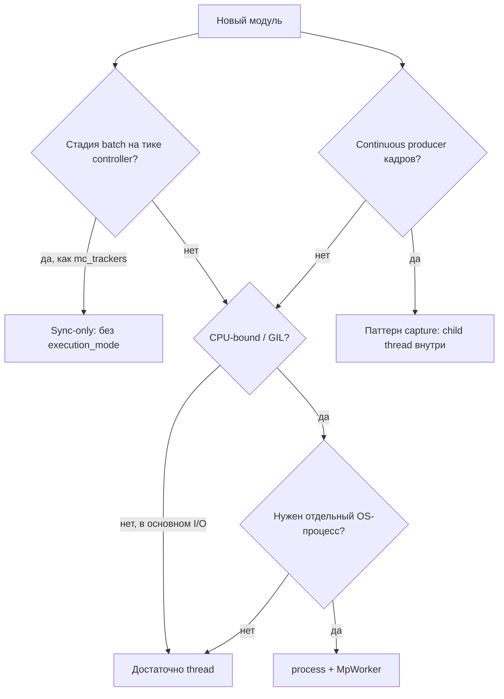

# Разработка модулей с поддержкой thread и process

Руководство для добавления новых стадий pipeline в EvilEye с опциональным `execution_mode`. Опирается на [аудит контрактов](thread_vs_mp_contracts.md) и [план рефакторинга](thread_vs_mp_refactoring_plan.md).

---

## §C1. Decision tree



### Правила выбора

| Ситуация | Режим |
|----------|--------|
| Декодирование RTSP, тяжёлый CV в GIL | `process` для capture |
| YOLO / ONNX inference | `process` (отдельный worker на thread/ROI) |
| Лёгкая постобработка, агрегация | `thread` |
| Сборка multi-camera batch на тике | **sync-only** (без `execution_mode`) |
| Child worker | **всегда** `execution_mode=thread` внутри (no nested MP) |

---

## §C2. Шаблон A — compute-bound (detector / tracker-like)

### Структура пакета

```text
evileye/my_module/
  my_processor_base.py    # EvilEyeBase: put/get, queues, dispatcher
  my_worker_thread.py     # thread: processing_thread + _process_impl
  my_worker_mp.py         # process: feed/drain (или MpAsyncBridge после R1)
  mp_worker_my.py         # только algorithm + IPC deserialize
```

### Обязательные методы facade

| Метод | Контракт |
|-------|----------|
| `set_params_impl` | Читать `execution_mode`, `source_ids`, ROI и т.д. |
| `init_impl` | `if process: _init_process_mode()` else thread worker |
| `put` | Non-blocking; при full — drop oldest, вернуть dropped id |
| `get` | `queue_out.get_nowait()` → пара `[Result, Frame]` или None |
| `start` / `stop` | Thread: `processing_thread`; Process: feed + drain threads + `MpControl.stop` |
| `is_ready` | Thread: model loaded; Process: `mp_control.is_alive()` |
| `get_source_ids` | Для маршрутизации в `ProcessorStep` |

### Parent queues (обязательно)

```python
# Всегда threading.Queue в parent — даже при execution_mode == "process"
self.queue_in = Queue(maxsize=...)
self.queue_out = Queue(maxsize=...)
```

MP boundary — **внутри** worker thread класса, не на facade.

### Пример блока конфига

```json
{
  "class_name": "ObjectDetectorYolo",
  "execution_mode": "process",
  "source_ids": [0],
  "model": "models/yolo11n.pt",
  "roi": [[0, 0, 1920, 1080]],
  "stride": 1
}
```

### Process init checklist

1. Создать `MpControl` с размерами из `mp_queue_config` (или своими константами).
2. Зарегистрировать `MpWorkerMy` через `add_worker`.
3. `start()` на control → feed thread + drain thread.
4. Feed: читать `queue_in`, pack IPC (`FrameHandle` или DTO).
5. `_mp_pending` + cap + drop policy (после R1 — через `MpAsyncBridge`).
6. Drain: `get(timeout=mp_drain_poll_sec())`, unpack, `_put_out_drop_oldest`.
7. `stop()`: poison, join threads, `_clear_mp_pending`, release SHM.
8. Не грузить тяжёлую модель в parent при process.
9. Реализовать `MpPendingReporter` (после R3) для backlog stats.
10. Unit-тест FIFO pending (см. `test_detection_thread_yolo_mp_async.py`).

### Эталоны

| Роль | Файл |
|------|------|
| Facade | `evileye/object_detector/object_detection_base.py` |
| Thread | `evileye/object_detector/detection_thread_yolo.py` |
| MP wrapper | `evileye/object_detector/detection_thread_yolo_mp.py` |
| Worker | `evileye/object_detector/mp_worker_yolo.py` |

---

## §C3. Шаблон B — continuous producer (capture-like)

### Отличия от шаблона A

| Аспект | Capture pattern |
|--------|-----------------|
| Worker loop | Непрерывный `get()` из backend, не job queue |
| Child mode | **Принудительно** `execution_mode=thread` в `MpWorkerCapture` |
| Parent `get()` | `_get_frames_from_queue`, не `get_frames_impl` |
| Recording | Часто в child `start()` |
| IPC | `dict{frame_handle, frame_meta}` |

### Checklist

1. `VideoCaptureBase._init_process_mode` + dispatch thread.
2. Не вызывать `get_frames_impl` в parent при process.
3. Dedup по `source_id` при drain parent queue (split stream).
4. Три уровня буферизации — документировать в PR.
5. Тест: `test_mp_worker_capture_execution_mode.py` — no nested process.

### Эталоны

- `evileye/capture/video_capture_base.py`
- `evileye/capture/mp_worker_capture.py`

---

## §C4. Шаблон C — sync-only (mc_trackers-like)

### Когда применять

- Стадия должна видеть **все** source_id за один тик.
- Нет смысла в async MP queue между тиками.

### Реализация

1. `@EvilEyeBase.register("MyMultiCameraStage")`
2. Метод `ingest_tick_batch(batch: dict[int, tuple[...]]) -> list`.
3. Флаг `_pipeline_tick_batch = True` — не поднимать `processing_thread` из base (см. `ObjectMultiCameraTracking`).
4. В `ProcessorStep`: ветка `processor_name == "my_stage"` → `_process_my_stage_sync` (как `_process_mc_trackers_sync`).
5. **Не** добавлять `execution_mode` в JSON без необходимости.

### Эталоны

- `evileye/object_multi_camera_tracker/custom_object_tracking.py`
- `evileye/core/processor_step.py` — `_process_mc_trackers_sync`

---

## §C5. Интеграция в pipeline

| Шаг | Действие |
|-----|----------|
| 1 | `@EvilEyeBase.register("ClassName")` |
| 2 | Секция в JSON: `pipeline.detectors[]` / `trackers[]` / новая секция |
| 3 | `PipelineSurveillance._add_*` — только если новый **тип** секции |
| 4 | `ProcessorStep(processor_name=..., class_name=..., num_processors=N)` |
| 5 | `set_params` / `init` в pipeline init order |

### Ожидания `ProcessorStep` к вашему процессору

- Вход: `list[[data, Frame], ...]` за тик.
- `source_id` на `Frame` для маршрутизации.
- Явно задать на классе:
  - `requires_materialized_frame = True` (default) или `False`
  - `accepts_frame_handle = True` если работаете с SHM до worker
- **Не** полагаться на pre-drain.
- После put другие стадии могут вызвать ваш `get()` в том же тике.

### Регистрация в config

```json
"pipeline": {
  "detectors": [
    {
      "class_name": "MyDetector",
      "execution_mode": "process",
      "enable": true,
      "source_ids": [0]
    }
  ]
}
```

Omit `execution_mode` → **`process`** (см. `DEFAULT_EXECUTION_MODE`).

---

## §C6. Frame transport flags

| Flag | Default | `True` когда | `False` когда |
|------|---------|--------------|---------------|
| `requires_materialized_frame` | `True` | Алгоритм читает `frame.image` в parent | Только handle до worker |
| `accepts_frame_handle` | `False` | Preprocess принимает descriptor | Нужен numpy в step |

`ProcessorStep._adapt_input_for_processor` materialize через `SharedFrameTransport.consume_frame` если `requires_materialized_frame` и есть `frame_handle`.

---

## §C7. PR checklist (20 пунктов)

Скопируйте в описание PR:

- [ ] 1. Один `class_name` + `execution_mode`, не отдельный `*Mp` в production config
- [ ] 2. Parent `queue_in` / `queue_out` = `threading.Queue`
- [ ] 3. Child worker через `get_spawn_context()` / `MpControl`
- [ ] 4. Child не использует `execution_mode=process`
- [ ] 5. Contract test: формат `put`/`get`
- [ ] 6. Unit test thread `_process_impl` (mock model)
- [ ] 7. Unit test MP ordering / pending (mock `MpControl`)
- [ ] 8. `is_ready()` для thread и process
- [ ] 9. `stop()` освобождает SHM и очищает `_mp_pending`
- [ ] 10. `mp_pending_depth()` или Protocol (post-R3)
- [ ] 11. Нет нового `isinstance(MyMp)` в `pipeline_surveillance`
- [ ] 12. Тяжёлая модель не в parent при process
- [ ] 13. Пример JSON в PR description
- [ ] 14. CONFIGURATION_GUIDE обновлён при новых keys
- [ ] 15. Нет дублирования preprocess в feed и `_process_impl` (использовать shared module post-R2)
- [ ] 16. Логирование через `get_module_logger`
- [ ] 17. Diag counters `_diag_mp_*` если async MP
- [ ] 18. Docstring документирует `execution_mode`
- [ ] 19. Smoke: poly-videos или targeted bench если hot path
- [ ] 20. Thread-only config не сломан

---

## §C8. Анти-паттерны

| Анти-паттерн | Почему плохо | Вместо |
|--------------|--------------|--------|
| Отдельный `FooMp` в config | Два init path, legacy | `Foo` + `execution_mode` |
| `multiprocessing.Queue` на facade | Ломает `ProcessorStep`, pickle | `MpControl` внутри |
| Pre-drain в custom step | Stale results, ломает MC batch | Post-drain only |
| `isinstance` в pipeline | Coupling | `MpPendingReporter` |
| YOLO/ONNX init в parent при process | Память × N, GIL | Только в worker |
| `execution_mode` на sync batch stage | Путаница | `stage_kind: sync_batch` (S6) |
| Дублировать ROI split | DUP-003 | `detection_preprocess` |
| Nested process в capture worker | Daemon spawn error | forced thread в child |

---

## §C9. Тестирование

| Тип | Паттерн имени | Пример |
|-----|---------------|--------|
| Contract put/get | `test_*_put_get_contract.py` | формат пар, dropped id |
| MP FIFO | `test_*_mp_async.py` | порядок pending |
| Config policy | `test_*_execution_mode_policy.py` | defaults в real configs |
| Worker IPC | `test_mp_worker_*.py` | serialize roundtrip |

Минимум перед merge:

```bash
pytest tests/unit/<your_module>/ -q
pytest tests/unit/core/test_sync_mp_adaptive.py -q  # если затронут processor_step
```

---

## §C10. ENV и production tuning

MP-specific (не влияют на pure thread bench):

| Переменная | Назначение |
|------------|------------|
| `EVILEYE_MP_QUEUE_SCALE` | Размеры очередей |
| `EVILEYE_MP_DRAIN_POLL_SEC` | Timeout drain/get в MP loops |
| `EVILEYE_CONTROLLER_BACKPRESSURE` | `soft` / `0` |
| `EVILEYE_PIPELINE_SYNC_MP` | Bench: adaptive sync drain |

См. [multiprocessing_benchmark.md](multiprocessing_benchmark.md).

---

## Связанные документы

- [Контракты и аудит](thread_vs_mp_contracts.md)
- [План рефакторинга](thread_vs_mp_refactoring_plan.md)
- [Упрощение интеграции](module_integration_simplification.md)
- [PIPELINE_ARCHITECTURE.md](PIPELINE_ARCHITECTURE.md)
- [MULTIPROCESSING.md](MULTIPROCESSING.md)
