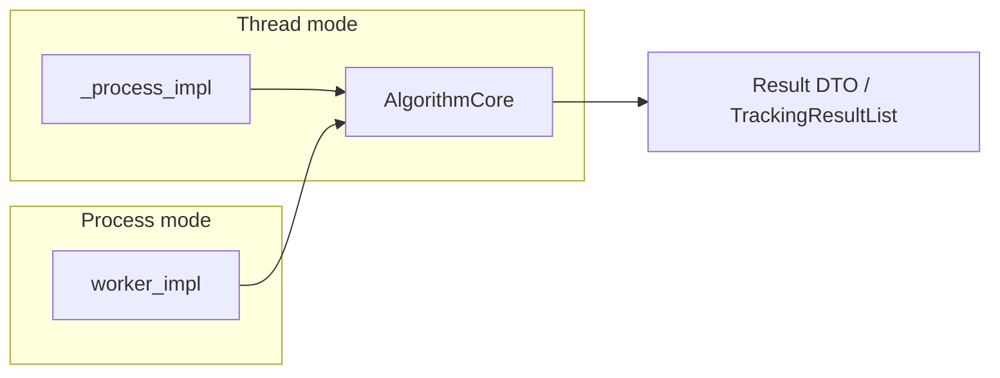

# Упрощение интеграции новых модулей (thread / MP)

Предложения по снижению порога входа. Это **design options** — не всё нужно реализовывать сразу. Каждый пункт: проблема → как сейчас → целевое API → файлы → оценка → рекомендация.

**Контекст:** новый MP-модуль сегодня ≈ **200+ LOC** boilerplate (pending deque, feed/drain threads, cap, diag, SHM) + отдельный `mp_worker_*.py` + знание post-drain policy.

---

## §D1. Сводная таблица

| ID | Название | SP | Зависит от | v1 рекомендация |
|----|----------|-----|------------|-----------------|
| S1 | `DualModeProcessor` base | 8 | R1 | После R1 |
| S2 | `MpPendingReporter` | 5 | R3 | **Вместе с R3** |
| S3 | `AlgorithmCore` | 13 | R2 | **Det+track** |
| S4 | `module_capabilities` JSON | 8 | R5 | Отложить |
| S5 | `create_execution_backend()` | 5 | S1 | Опционально |
| S6 | `stage_kind: sync_batch` | 5 | doc | Doc + validator |
| S7 | Config overlay profiles | 3 | — | Bench only |

---

## §D2. S1 — базовый класс `DualModeProcessor`

### Проблема

Каждый новый detector-like модуль копирует:

- `_init_queues()` с `threading.Queue`
- `init_impl` branch thread/process
- `start`/`stop` join order
- подъём feed/drain daemon threads

→ **DUP-006**, ошибки в stop/join, расхождение diag counters.

### Как сейчас (фрагмент)

Два больших класса: `DetectionThreadYoloMp` (~280 LOC) и process block в `ObjectTrackingBase` (~150 LOC MP-specific).

### API sketch (целевой)

```python
# evileye/core/dual_mode_processor.py
class DualModeProcessor(EvilEyeBase):
    """Facade for ProcessorStep; MP hidden behind hooks."""

    execution_mode: str = DEFAULT_EXECUTION_MODE

    def init_impl(self, **kwargs) -> bool:
        self._init_facade_queues()
        if self.execution_mode == EXEC_MODE_PROCESS:
            return self._init_mp_backend()
        return self._init_thread_backend()

    # --- hooks implemented by subclass ---
    def create_mp_worker(self) -> MpWorker: ...
    def pack_job(self, item) -> Any: ...
    def apply_result(self, meta, raw_result) -> None: ...
    def process_item_thread(self, item) -> None: ...
```

`DualModeProcessor` владеет `MpAsyncBridge` (S1 после R1).

### Затрагиваемые файлы

| Действие | Файл |
|----------|------|
| Create | `evileye/core/dual_mode_processor.py` |
| Migrate later | `detection_thread_yolo_mp.py` |
| Migrate later | `object_tracking_base.py` (process) |
| **Не** migrate | `video_capture_base.py` (шаблон B) |

### Плюсы / минусы

| + | − |
|---|---|
| Новый модуль: override 4 methods вместо 200 LOC | Наследование скрывает edge cases |
| Единый stop/shutdown | Большой refactor существующих классов |
| Тесты bridge один раз | Capture не вписывается |

### Оценка: **8 SP** | Зависит: **R1**

### Рекомендация

**Делать после R1.** Для **новых** модулей — optional base class; старые мигрировать постепенно.

---

## §D3. S2 — `MpPendingReporter`

### Проблема

`PipelineSurveillance.estimate_mp_backlog_stats` импортирует `DetectionThreadYoloMp` и лезет в `_mp_pending` (**COUP-002**). Новый MP-модуль без этого класса **невидим** для backpressure.

### Как сейчас

```python
# pipeline_surveillance.py ~455
if isinstance(th, DetectionThreadYoloMp):
    with th._mp_pending_lock:
        pending += len(th._mp_pending)
```

### API sketch

```python
# mp_pending_protocol.py
class MpPendingReporter(Protocol):
    def mp_pending_depth(self) -> int: ...
    def mp_diag_put_dropped(self) -> int: ...
    def mp_diag_pending_evict(self) -> int: ...
```

**Регистрация:** duck typing — любой detection thread / tracker с этими методами.

**Новый модуль:**

```python
class MyDetectionThreadMp(..., MpPendingReporter):
    def mp_pending_depth(self) -> int:
        return self._bridge.pending_depth()
```

### Затрагиваемые файлы

- `evileye/core/mp_pending_protocol.py` (new)
- `pipeline_surveillance.py` (replace isinstance)
- `detection_thread_yolo_mp.py`, `object_tracking_base.py` (implement)

### Оценка: **5 SP** | Зависит: **R3** (реализуется вместе)

### Рекомендация

**v1 обязательно** с R3. В [developing_dual_mode_modules.md](developing_dual_mode_modules.md) checklist §10.

---

## §D4. S3 — `AlgorithmCore`

### Проблема

**DUP-004:** YOLO в `DetectionThreadYolo.predict` и `MpWorkerYolo.worker_impl`.

**DUP-007:** BoT-SORT update в `ObjectTrackingBotsort._process_impl` и `MpWorkerTracker`.

Любой фикс багов (NMS, coords, track id) нужно дублировать.

### API sketch

**Detection:**

```python
# detection_preprocess.py
def split_rois(image, roi_cfg) -> list[RoiSlice]: ...

# yolo_runtime.py
@dataclass
class YoloRuntime:
    model: Any
    def predict_slices(self, slices: list[RoiSlice]) -> list[RawPredict]: ...

def build_detection_result_list(
    capture_image, slices, raw_preds
) -> DetectionResultList: ...
```

**Tracking:**

```python
# track_update_core.py
def update_tracks(
    tracker_state: TrackerState,
    frame: Frame,
    detections: DetectionResultList,
) -> TrackingResultList: ...
```

### Потоки данных



### Затрагиваемые файлы

- `detection_preprocess.py`, `yolo_runtime.py` (new)
- `track_update_core.py` (new)
- `mp_worker_yolo.py`, `detection_thread_yolo.py`
- `mp_worker_tracker.py`, `object_tracking_botsort.py`

### Оценка: **13 SP** | Зависит: **R2**

### Рекомендация

**Highest ROI v1** для det+track. Attributes (**DUP-016**) — второй эшелон после стабилизации.

---

## §D5. S4 — `module_capabilities` в JSON

### Проблема

Разработчик должен знать про:

- `requires_materialized_frame`
- `accepts_frame_handle`
- поведение `_adapt_input_for_processor`

Ошибка → лишний SHM copy или `frame.image is None` в worker.

### API sketch

```json
{
  "class_name": "MyPreprocessor",
  "execution_mode": "thread",
  "capabilities": {
    "accepts_frame_handle": true,
    "requires_materialized_frame": false,
    "heavy_compute": false
  }
}
```

`ProcessorStep` при put:

```python
caps = (processor.params or {}).get("capabilities", {})
if caps.get("requires_materialized_frame", True):
    inp = self._adapt_input_for_processor(inp, processor)
```

### Затрагиваемые файлы

- `processor_step.py`
- `CONFIGURATION_GUIDE.md`
- Все примеры configs

### Плюсы / минусы

| + | − |
|---|---|
| Declarative, видно в JSON | Дублирует атрибуты класса |
| Проще для codegen | Churn всех configs |

### Оценка: **8 SP** | Зависит: R5

### Рекомендация

**Отложить.** Пока задавать на классе:

```python
class MyStage(EvilEyeBase):
    accepts_frame_handle = True
    requires_materialized_frame = False
```

---

## §D6. S5 — `create_execution_backend()`

### Проблема

**COUP-012 / DUP-011:** каждый модуль повторяет:

```python
def init_impl(self, **kwargs):
    if self.execution_mode == EXEC_MODE_PROCESS:
        return self._init_process_mode()
    return self._init_thread_mode()
```

### API sketch

```python
def create_execution_backend(
    mode: str,
    *,
    thread_setup: Callable[[], None],
    process_setup: Callable[[], None],
) -> None:
    if mode == EXEC_MODE_PROCESS:
        process_setup()
    else:
        thread_setup()
```

Тонкая обёртка; не заменяет S1 полностью.

### Оценка: **5 SP** | Зависит: S1

### Рекомендация

**Опционально** после S1 — sugar для новых модулей.

---

## §D7. S6 — `stage_kind: sync_batch`

### Проблема

MC-tracker: hardcoded `processor_name == "mc_trackers"` + `isinstance(ObjectMultiCameraTracking)` (**COUP-005**). Новая batch-стадия → копипаста ветки в `ProcessorStep`.

### API sketch

**Config:**

```json
{
  "class_name": "ObjectMultiCameraTracking",
  "stage_kind": "sync_batch",
  "enable": true
}
```

**Validator (evileye run load):**

```text
WARN: stage_kind=sync_batch must not set execution_mode (ignored)
```

**ProcessorStep (v2):**

```python
if getattr(step, "stage_kind", None) == "sync_batch":
    return self._process_sync_batch(input_list)
```

### v1 без большого рефакторинга

- Документировать в CONFIGURATION_GUIDE: MC = sync-only.
- Lint script: grep `execution_mode` в `mc_trackers` section → warning.

### Оценка: **5 SP** (validator 2 SP + doc 1 SP)

### Рекомендация

**v1: doc + validator.** Полный dispatch по `stage_kind` — v2.

---

## §D8. S7 — Config overlay profiles

### Проблема

`poly-videos.json` vs `poly-videos-thread.json` — **идентичны**, кроме 13× `"execution_mode": "thread"`. Дублирование риска рассинхрона ROI/paths.

### API sketch (bench-only)

**`configs/poly-videos.base.json`** — без execution_mode.

**`configs/profiles/thread_overlay.json`:**

```json
{
  "overlay": {
    "pipeline.sources[*].execution_mode": "thread",
    "pipeline.detectors[*].execution_mode": "thread",
    "pipeline.trackers[*].execution_mode": "thread"
  }
}
```

**`scripts/poly_mode_compare_lib.py`:**

```python
def load_config(name, profile=None):
    base = load_json("poly-videos.base.json")
    if profile == "thread":
        deep_merge(base, overlay)
    return base
```

**Не** менять `evileye run` без ADR-007.

### Оценка: **3 SP**

### Рекомендация

**Делать для bench/scripts only** — упрощает сравнение, не упрощает runtime integration нового модуля.

---

## §D9. Roadmap

| Квартал | Deliverable | Что упрощается |
|---------|-------------|----------------|
| Q1 | contracts + dev-guide (готово) | Понимание |
| Q2 | R0, R1, R3 | S2, начало S1 |
| Q3 | R2, R6 | S3 |
| Q4 | R5, optional R4 | S4 prep |
| v2 | S1 base + S6 dispatch | Новый модуль 4 hooks |
| bench | S7 overlay | Меньше дубль JSON |

---

## §D10. ADR-заготовки (полные тезисы)

### ADR-001: Default execution_mode = process

- **Контекст:** GIL, production poly-videos omit key.
- **Решение:** `DEFAULT_EXECUTION_MODE = "process"`.
- **Последствия:** thread bench требует явного JSON.

### ADR-002: Facade queues stay threading.Queue

- **Контекст:** pickle overhead, ProcessorStep same PID.
- **Решение:** MP only inside `*Mp` + MpControl.
- **Последствия:** Нельзя `multiprocessing.Queue` на facade.

### ADR-003: MC sync-only

- **Контекст:** batch correlation across cameras.
- **Решение:** no MpControl for mc_trackers.
- **Последствия:** MC lag follows per-source trackers only.

### ADR-004: Mandatory MpAsyncBridge for new MP modules (post-R1)

- **Контекст:** DUP-006.
- **Решение:** новые модули не копируют `_enqueue_mp_*`.
- **Последствия:** bridge API stable contract.

### ADR-005: AlgorithmCore for heavy stages (post-R2)

- **Контекст:** DUP-004/007.
- **Решение:** worker_impl и _process_impl вызывают один core.
- **Последствия:** single place for model opts.

---

## §D11. Минимальный путь «сегодня» (без S1–S7)

| Шаг | Действие | Время |
|-----|----------|-------|
| 1 | Выбрать шаблон A/B/C (§C1 tree) | 30 min |
| 2 | Скопировать эталонные файлы (§C2.5 таблица) | 2 h |
| 3 | `@EvilEyeBase.register` + JSON block | 30 min |
| 4 | Пройти [checklist 20](developing_dual_mode_modules.md#c7-pr-checklist-20-пунктов-с-пояснениями) | 1 h |
| 5 | Unit tests contract + mp async | 2–4 h |
| 6 | Не добавлять isinstance в pipeline | — |
| 7 | Smoke `measure_poly_e2e_fps` если hot path | 30 min |

**После merge R1/R3:** заменить copied pending code на bridge + reporter.

---

## §D12. Сравнение «сложность интеграции»

| Подход | LOC нового MP модуля | Риск бага | Когда |
|--------|---------------------|-----------|-------|
| Copy yolo_mp | ~250 | высокий | сейчас |
| S1 + S2 + S3 | ~80 hooks + core | средний | post R1–R3 |
| Thread only | ~80 | низкий | если CPU ok |
| Sync-only C | ~50 batch API | низкий | aggregation |

---

## Связанные документы

- [thread_vs_mp_contracts.md](thread_vs_mp_contracts.md)
- [thread_vs_mp_refactoring_plan.md](thread_vs_mp_refactoring_plan.md)
- [developing_dual_mode_modules.md](developing_dual_mode_modules.md)
