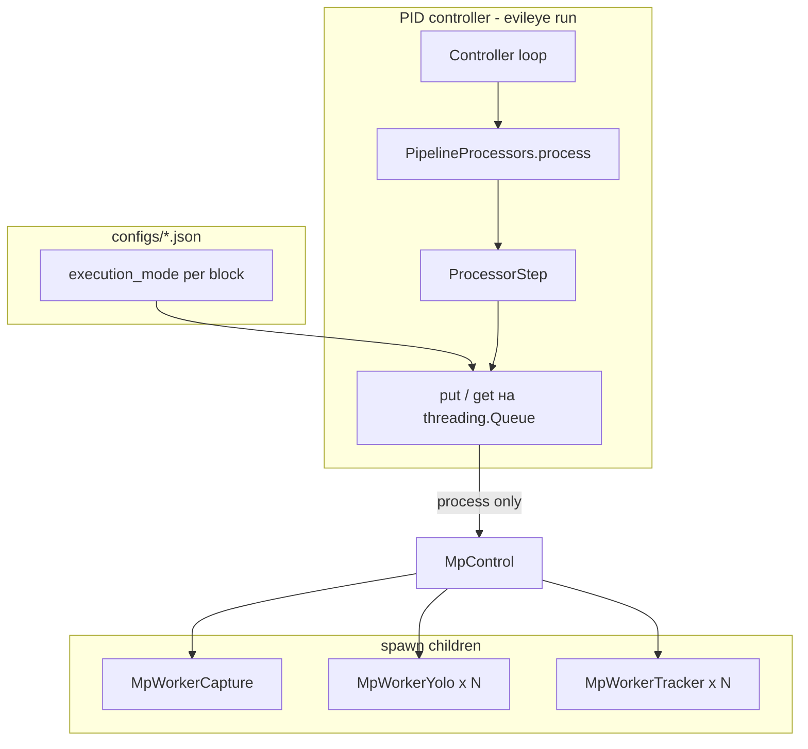
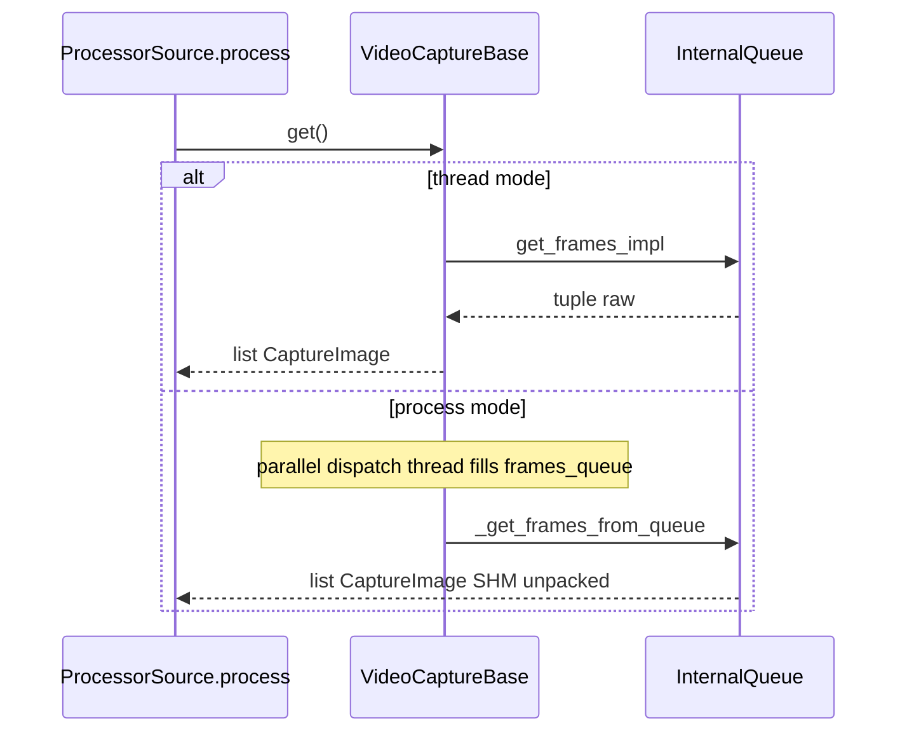
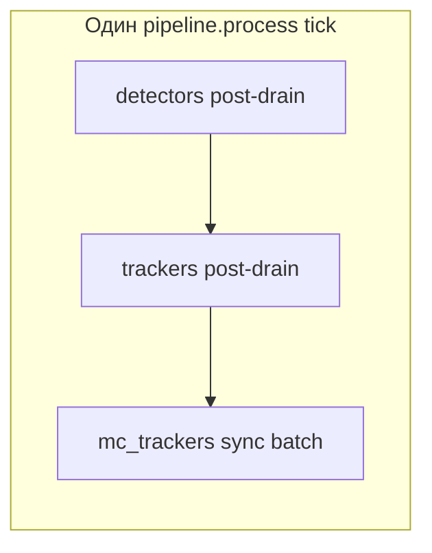

# Thread vs MP: контракты и аудит реализации

Подробное описание того, **как именно** в EvilEye устроены режимы `thread` и `process` (`execution_mode`) для захвата, детектора, трекера, mc-трекера и пайплайна.

**Как читать документ:** сначала §3 (общая схема), затем слой, который меняете (§4–§8). Реестры COUP/DUP (§11–§12) — для рефакторинга и code review. Gap vs [MULTIPROCESSING.md](MULTIPROCESSING.md) — §13.

**Связанные материалы:** [план рефакторинга](thread_vs_mp_refactoring_plan.md), [гайд разработчика](developing_dual_mode_modules.md), [PIPELINE_ARCHITECTURE.md](PIPELINE_ARCHITECTURE.md), [multiprocessing_benchmark.md](multiprocessing_benchmark.md).

---

## §1. Введение и scope

### 1.1. Аудитория и типовые задачи

| Задача | Что смотреть в документе |
|--------|-------------------------|
| Сравнить FPS process vs thread | §1.3 bench-конфиги, §10 матрица прозрачности |
| Добавить новый детектор с MP | §5 + [developing_dual_mode_modules.md](developing_dual_mode_modules.md) шаблон A |
| Понять, почему растёт `pending` | §5.3 `_mp_pending`, §8.1 snapshot, §8.3 backpressure |
| Почему MC «видит» старые треки | §8.2 post-drain policy |
| Рефакторинг без поломки E2E | §12 DUP + [thread_vs_mp_refactoring_plan.md](thread_vs_mp_refactoring_plan.md) |

### 1.2. Граница анализа

| Слой | Ключевые файлы | Роль `execution_mode` |
|------|----------------|------------------------|
| Захват | `evileye/capture/video_capture_base.py`, `mp_worker_capture.py`, `video_capture_opencv.py` | process → child decode; thread → grab/retrieve в parent |
| Детектор | `object_detection_base.py`, `detection_thread_yolo.py`, `detection_thread_yolo_mp.py`, `mp_worker_yolo.py` | process → YOLO в child; facade queues в parent |
| Трекер | `object_tracking_base.py`, `object_tracking_botsort.py`, `mp_worker_tracker.py` | process → BoT-SORT в child |
| MC-трекер | `custom_object_tracking.py`, `processor_step._process_mc_trackers_sync` | **нет** — всегда sync в parent |
| Пайплайн | `pipeline_processors.py`, `processor_step.py`, `pipeline_surveillance.py` | оркестрация, backlog, encoders |
| Controller | `controller.py` | soft backpressure по `pending` |

### 1.3. Вне scope (одной строкой каждый пункт)

- **`server.execution_mode`** — отдельный процесс FastAPI/uvicorn, не путать с pipeline MP.
- **Database / events / GUI** — потребляют результаты pipeline, но не реализуют dual-mode.
- **Attributes** — кратко §9; полный audit отложен (**DUP-016**).

### 1.4. Bench-конфиги (конкретика)

| Файл | `execution_mode` в JSON | Поведение при `evileye run` |
|------|-------------------------|-----------------------------|
| `configs/poly-videos.json` | **0 ключей** | `DEFAULT_EXECUTION_MODE = "process"` из [`processor_base.py`](../evileye/core/processor_base.py) |
| `configs/poly-videos-thread.json` | **13 ключей** `"thread"` | Явно in-process threads для capture/det/track |

**Разбивка 13 ключей** (проверено обходом JSON):

- `pipeline.sources[0..6].execution_mode` — **7** источников (poly-videos: 7 блоков `sources`).
- `pipeline.detectors[0..4].execution_mode` — **5** детекторов (по камерам/ROI).
- `pipeline.trackers[0..4].execution_mode` — **5** трекеров.

**Не меняется между конфигами:** `mc_trackers`, `attributes`, `visualizer`, пути к видео, ROI, модели, `class_name`.

**Практический вывод:** bench «process vs thread» изолирует **только** способ выполнения sources/detectors/trackers; MC и атрибуты сравниваются в одинаковом режиме orchestration.

---

## §2. Глоссарий (развёрнутый)

| Термин | Что это на практике | Где в коде | Типичная ошибка |
|--------|---------------------|------------|-----------------|
| `execution_mode` | `"thread"` = потоки в процессе controller; `"process"` = child OS process + `MpControl` | `EXEC_MODE_*` в `processor_base.py` | Думать, что `process` на facade означает `mp.Queue` на `put`/`get` |
| `DEFAULT_EXECUTION_MODE` | `"process"` если ключ в JSON опущен | `processor_base.py` L9 | В `poly-videos.json` нет ключа — это **не** thread |
| **Facade** | Класс, который видит `ProcessorStep`: `put`/`get` | `ObjectDetectorBase`, `ObjectTrackingBase`, `VideoCaptureBase` | Менять сигнатуру `get()` под MP |
| `MpControl` | Обёртка: `input_queue`, `output_queue`, spawn, restart | `mp_control.py` | Создавать второй `MpControl` на одном компоненте без need |
| `MpWorker` | Код в child; loop через `run_mp_worker_entry` | `mp_worker.py`, `mp_worker_yolo.py`, … | Вызвать `execution_mode=process` внутри capture child |
| `FrameHandle` | Ссылка на numpy в shared memory | `frame_transport.py` | Забыть `relinquish_frame` / `consume_frame` → утечка SHM |
| `_mp_pending` | Очередь заданий **до** успешного `put_nowait` в `MpControl.input_queue` | `deque` + lock в yolo_mp / tracking_base | Считать `len(input_queue)` = backlog (это не то же самое) |
| **post-drain** | `get()` только **после** всех `put` в одном `ProcessorStep.process` | `processor_step.py` L307–308, L369–374 | Pre-drain → stale detections в mc_trackers |
| **continuous producer** | Child сам крутит `capture.get()` в цикле | `MpWorkerCapture.__call__` | Ждать request/response на capture как на YOLO |
| **request/response** | Feed кладёт job → drain ждёт ответ с тем же FIFO pending | det/track MP loops | Нарушить FIFO pending ↔ результат |
| **sync-only** | Вся стадия за один вызов `process()` | `mc_trackers` | Добавить `execution_mode` на MC «для симметрии» |

---

## §3. Архитектура переключения

### 3.1. Два процесса, одна точка конфигурации



**Главный инвариант:** `ProcessorStep` вызывает только `processor.put()` и `processor.get()`. Он **не** знает про `MpControl`, кроме опционального `_sync_mp_drain_after_put` и env.

### 3.2. Кто читает `execution_mode` (детально)

| Компонент | Механизм | При `process` | При `thread` |
|-----------|----------|---------------|--------------|
| `ProcessorBase.set_params` | `params[0]['execution_mode']` → `self.execution_mode` на **контейнере** step | Используется в `_sync_mp_drain_after_put` для проверки «есть ли MP процессор» | sync drain обычно no-op |
| `VideoCaptureBase` | `set_params_impl` L448 | `_init_process_mode`, dispatch thread | `init_impl` OpenCV/GST в parent |
| `ObjectDetectorBase` | `set_params_impl` меняет mode → `_init_queues()` | `DetectionThreadYoloMp` в `detection_threads[]` | `DetectionThreadYolo` |
| `ObjectTrackingBase` | `init_impl` L176+ | `_init_process_mode`, feed/drain | `processing_thread` + `_process_impl` |
| `AttributeClassifier` | `init_impl` L79 | `_init_process_mode` (если включён) | `_init_thread_mode` |
| `PipelineSurveillance._init_encoders` | `_trackers_use_process_mode` | **Не** грузить `OnnxEncoder` в parent | Encoders в `self.encoders` |
| `ProcessorStep` | `getattr(processor, 'execution_mode')` L85 | Может включить timed sync drain | — |

**Важно:** `ProcessorBase.execution_mode` — значение с **первого** блока params в секции; у каждого **инстанса** `processor` внутри step может быть свой mode из `params[i]`. Sync drain смотрит **per-instance** `processor.execution_mode`.

### 3.3. Внешний контракт det/track (что можно считать «стабильным API»)

```python
# Детектор (упрощённо)
detector.put(capture_image: CaptureImage) -> bool  # через dispatcher → thread.put
item = detector.get()  # None или [DetectionResultList, CaptureImage]

# Трекер
tracker.put((detection_result_list, frame)) -> (success, dropped_id)
item = tracker.get()  # None или (TrackingResultList, Frame)
```

Граница MP: внутри `DetectionThreadYoloMp` / `ObjectTrackingBase` (process), **не** на `ObjectDetectorBase.queue_in` (это `threading.Queue` — см. комментарий L86–89 в `object_detection_base.py`).

---

## §4. Capture

### 4.1. Thread mode — пошаговый lifecycle

1. **`init` / `set_params_impl`** — `execution_mode=thread`, открывается `cv2.VideoCapture` или GStreamer pipeline в **parent**.
2. **`start`** — `_start_capture_threads()`: `grab_thread`, `retrieve_thread` пишут в `DropOldestQueue` (maxsize ≈ 2).
3. **Элемент очереди** — tuple: `[is_read, src_image, frame_id, video_frame, video_pos]`.
4. **`ProcessorSource` → `get()`** — `get_frames_impl()`: один `get` из очереди, при `split_stream` — несколько `CaptureImage`.
5. **`stop`** — join grab/retrieve, cleanup.

**Размеры:** внутренняя очередь маленькая (2) — держим «последний» кадр, старые отбрасываются.

### 4.2. Process mode — пошаговый lifecycle

1. **Parent `init`** — `_init_process_mode()`: создаётся `MpControl`, worker `MpWorkerCapture`, **не** вызывается `init_impl` OpenCV в parent.
2. **Child `init_worker`** — `child_params["execution_mode"] = thread` (L82 `mp_worker_capture.py`) — **обязательно**, иначе nested MP / spawn из daemon.
3. **Child loop** (`__call__`): бесконечно `frames = self._capture.get()` → для каждого кадра `_pack_frame_for_ipc` → `output_queue.put`; при `Full` — drop oldest на **output_queue** (L153–158).
4. **Parent `start`** — только `_capture_dispatch_loop` (thread): читает `MpControl.output_queue`, SHM unpack → `frames_queue` (`DropOldestQueue` готовых `CaptureImage`).
5. **Parent `get()`** — `_get_frames_from_queue()`: drain `frames_queue`, **не более одного кадра на `source_id`** за вызов (важно для split Cam2+Cam3 на одном worker).
6. **`stop`** — `MpControl.stop(timeout=2.0)`, join dispatch.

### 4.3. Три уровня буферизации (зачем каждый)

| Уровень | Где | Что хранится | Зачем |
|---------|-----|--------------|-------|
| 1 | Child `DropOldestQueue` | tuple до retrieve | Изоляция grab/retrieve от MP IPC |
| 2 | Child `MpControl.output_queue` | `dict{frame_handle, frame_meta}` | IPC без копии полного numpy в parent до unpack |
| 3 | Parent `frames_queue` | `CaptureImage` | Единый API `get()` для `ProcessorSource` |

**Симптом переполнения:** рост задержки кадра, dropped frames в логах capture; это **не** попадает в `estimate_mp_backlog_stats` (там только det/track `_mp_pending`).

### 4.4. Прозрачность и coupling (capture)

| Критерий | Оценка 1–5 | Пояснение |
|----------|------------|-----------|
| Один `get()` в API | 4 | Сигнатура та же; latency и память разные (SHM) |
| Одинаковый decode code | 4 | Тот же `VideoCaptureOpencv` класс в child |
| Метрики pending с det/track | 2 | Capture backlog отдельный |

- **COUP-001:** `video_capture_gstreamer.py` — при `EXEC_MODE_PROCESS` `start()` делегирует в `super().start()` (process path), иначе свой GStreamer grab — две ветки поддержки.
- **DUP-001:** drop-oldest в `DropOldestQueue.put` и ручной `get_nowait` на `output_queue` в worker.
- **DUP-002:** выбор OpenCV vs GStreamer в `MpWorkerCapture._create_capture` дублирует логику parent.

### 4.5. Sequence: тик `ProcessorSource`



---

## §5. Detector

### 5.1. Facade `ObjectDetectorBase` — полный путь кадра

**Цепочка `put(CaptureImage)`:**

1. `ObjectDetectorBase.put` → `queue_in` (размер: `detector_input_queue_size()` = max(2, 10×`QUEUE_SCALE`)).
2. `processing_thread` (dispatcher) → round-robin `detection_threads[i].put(image)`.
3. Thread mode: `DetectionThreadYolo` → `queue_in` thread → `_process_impl`.
4. Process mode: `DetectionThreadYoloMp` → `queue_in` thread → `_mp_det_feed_loop`.

**Цепочка `get()`:**

1. `queue_out.get_nowait()` на facade (размер: max(4, 4×SCALE)).
2. Элемент: `[DetectionResultList, CaptureImage]` — строится в `_detection_result_from_predict` (общий для thread и MP drain).

### 5.2. Thread: `DetectionThreadYolo`

```
queue_in.get (timeout 0.5)
  → split ROI (create_roi / roi_coords_per_camera)
  → predict(images)  # Ultralytics в этом потоке
  → _detection_result_from_predict
  → queue_out.put_nowait [DetectionResultList, CaptureImage]
```

**Модель:** загружается в `init_detection_implementation` / `predict` в **том же процессе**, что controller.

### 5.3. Process: `DetectionThreadYoloMp` — feed, pending, drain

**Feed loop** (`_mp_det_feed_loop`, L184+):

1. `queue_in.get(timeout=0.5)` — `CaptureImage`.
2. Split ROI (та же логика, что в `_process_impl` — **DUP-003**).
3. `_build_mp_payload` — для каждого ROI `SharedFrameTransport.alloc_frame` → `list[FrameHandle]`.
4. `_enqueue_mp_det_job(split_image, capture_image, payload, handles)`.

**`_enqueue_mp_det_job` (L136–166) — критичный контракт FIFO:**

1. Под lock: `_enforce_pending_cap()` — если `len(_mp_pending) >= cap`, popleft + `_release_handles` (**evict**).
2. `append (split_image, capture_image, handles)` в `_mp_pending`.
3. `mp_control.put_nowait(payload)`.
4. При failure: drop oldest из **input_queue** MP, popleft pending + release handles, retry put.
5. При повторном failure: снять tail pending если тот же `capture_image`, release handles, `_diag_mp_put_dropped++`.

**Drain loop** (`_mp_det_drain_loop`, L210+):

1. `predict_results = mp_control.get(timeout=mp_drain_poll_sec())` — default **0.01 s** ([`mp_queue_config.py`](../evileye/core/mp_queue_config.py)).
2. Под lock: `popleft` **первый** pending → `(split_image, capture_image, handles)`.
3. `_detection_result_from_predict(split_image, predict_results)`.
4. `_put_detection_output` → facade `queue_out`.
5. `finally`: `_release_handles(handles)`.

**Инвариант:** порядок результатов = порядок успешных `put_nowait` в MP = порядок FIFO `_mp_pending`. Тест: `tests/unit/object_detector/test_detection_thread_yolo_mp_async.py`.

### 5.4. IPC child `MpWorkerYolo`

| Направление | Тип | Поля DTO (bbox) |
|-------------|-----|-----------------|
| → child | `list[FrameHandle]` | SHM, по одному на ROI |
| ← child | `list[list[dict]]` | `bbox_xyxy`, `confidence`, `class_id` |
| worker error | `[[]] * n_rois` | пустые детекции, pipeline не падает |

**Парсинг:** thread — `roi_boxes_to_image_coords(Ultralytics Result)`; MP — `mp_dict_list_to_image_coords` (**DUP-005**).

### 5.5. Legacy `ObjectDetectorYoloMp`

| Аспект | Legacy `ObjectDetectorYoloMp` | Рекомендуемый путь |
|--------|------------------------------|-------------------|
| Config class | Отдельное имя класса | `ObjectDetectorYolo` |
| Factory | `"yolo_mp"` | `"yolo"` + `execution_mode: process` |
| Restart policy | Может отличаться в factory | Единый путь через `ObjectDetectorYolo.init_impl` |

См. **DUP-018**, фаза **R0**.

### 5.6. `is_ready()` — COUP-003

В process mode готовность = дочерние процессы `MpControl` alive + feed/drain running; в thread — загружена модель в `DetectionThreadYolo`. Код: `object_detection_base.py` `is_ready` — не смешивать проверки при гибридном конфиге (часть thread, часть process).

### 5.7. Parity table det MP vs track MP

См. §5.6 в предыдущей версии — методы 1:1; отличие: tracker pack `detection_result + frame_handle`, detector pack list handles per ROI.

---

## §6. Tracker (per-source)

### 6.1. Facade контракт

```python
tracker.put((DetectionResultList, Frame))  # queue_in, drop oldest if full
out = tracker.get()  # (TrackingResultList, Frame) or None
```

`queue_in`/`queue_out` sizes: `tracker_input_queue_size()` = max(2, 2×SCALE), output max(4, 4×SCALE).

### 6.2. Thread: `ObjectTrackingBotsort`

- `processing_thread` → `_process_impl` → `BOTSORT.update` в parent.
- `PipelineSurveillance._init_encoders` загрузил `OnnxEncoder` в parent → ReID доступен.

### 6.3. Process path

- `_init_process_mode` → `MpWorkerTracker`, feed/drain как у detector.
- `_pack_for_worker` — descriptor с detections + SHM frame.
- **COUP-004:** `ObjectTrackingBotsort.init_impl` может всё равно создать `BOTSORT` в parent — память и время без пользы (**R6**).

### 6.4. Encoder coupling (COUP-007) — таблица «где живёт ReID»

| Режим trackers | Parent `self.encoders` | Worker |
|----------------|------------------------|--------|
| все `thread` | `OnnxEncoder` загружен | не используется в parent для MP |
| любой `process` | **пусто** (skip init L254–258) | encoder в `MpWorkerTracker` |

MC-tracker не грузит encoder сам; получает уже готовые `TrackingResultList` с per-source trackers.

---

## §7. MC-tracker

### 7.1. Почему нет `execution_mode`

MC должен за **один тик** pipeline получить согласованный срез по **всем** `source_id`. Async MP между тиками размазал бы batch (пустые/старые треки в `ingest_tick_batch`).

### 7.2. Точка входа (код)

`ProcessorStep.process` → если `processor_name == "mc_trackers"` → `_process_mc_trackers_sync(input_list)` (L300).

1. Собрать `batch: dict[int, (TrackingResultList, Frame)]` из входного списка (после trackers).
2. `mc.ingest_tick_batch(batch)` → `list` emitted pairs.
3. Type guard: `isinstance(mc, ObjectMultiCameraTracking)` — **COUP-005**.

### 7.3. Косвенная зависимость от det/track mode

| Если trackers process | Эффект на MC |
|----------------------|--------------|
| Больше async lag | batch может содержать tracks с большим frame lag |
| Encoders только в worker | MC не меняется; качество embedding косвенно |



---

## §8. Pipeline, ProcessorStep, Controller

### 8.1. Полный тик `PipelineProcessors.process` (порядок)

1. **Snapshot backlog** (L218–230): `estimate_mp_backlog_stats()` → `pending`, присваивается каждому `ProcessorStep._mp_pending_snapshot` перед его `process()`.
2. **sources** — `ProcessorSource` / `run_sources` → список `[CaptureImage, …]`.
3. **detectors** — `ProcessorStep`: put all → post-drain → optional sync drain.
4. **trackers** — то же.
5. **mc_trackers** — **только sync**, без post-drain MP на самой стадии.
6. **attributes** — sticky от результатов mc (L255–258 в `pipeline_processors.py`).

### 8.2. Post-drain policy (почему нельзя pre-drain)

Комментарий L307–308 `processor_step.py`:

> Do not drain before put: stale MP results would be forwarded downstream in the same pipeline.process() pass (e.g. empty tracker rows into mc_trackers).

**Сценарий бага при pre-drain:**

1. В начале тика trackers вызывают `get()` и получают **старый** MP результат от прошлого кадра.
2. Затем `put` новый detection.
3. MC batch смешивает stale + new → «пустые» или дублирующие треки.

**Правильный порядок:** все `put` для входного списка → `_drain_processor_outputs` (до 64 items/proc) → `_sync_mp_drain_after_put` (если env).

### 8.3. `_adapt_input_for_processor`

Если у processor `requires_materialized_frame=True` (default) и на `Frame` только `frame_handle`:

1. `SharedFrameTransport.consume_frame(handle)` → `frame.image` numpy.
2. Handle обнуляется на frame.

Preprocessing с `accepts_frame_handle=True` может пропустить materialize.

### 8.4. Adaptive sync drain (bench / env)

`EVILEYE_PIPELINE_SYNC_MP=adaptive` + `_mp_pending_snapshot`:

- Sync wait до `EVILEYE_PIPELINE_SYNC_MP_MS` (default 8 ms) **только если** `pending < EVILEYE_SYNC_MP_PENDING_MAX` (default 2×sources).
- Production default F2: sync **выключен** — см. [mp_fps_phase3_summary.md](mp_fps_phase3_summary.md).

### 8.5. Controller backpressure (асимметрия thread vs process)

В конце тика controller (`controller.py` L527+):

- default `EVILEYE_CONTROLLER_BACKPRESSURE=soft`
- `pending` из `estimate_mp_backlog_stats`
- extra sleep: `min(40ms, (pending - 8×num_sources) × 1.5ms)`

**В thread bench** `pending` ≈ 0 → backpressure не работает. Сравнение pipeline_hz process vs thread **не** сопоставимо 1:1 без учёта этого.

### 8.6. `estimate_mp_backlog_stats` (COUP-002)

`pipeline_surveillance.py` L449–484:

- Суммирует `len(_mp_pending)` для каждого `DetectionThreadYoloMp` (**isinstance**).
- Плюс trackers с `_mp_pending` под lock.
- Возвращает `{pending, put_dropped, pending_evict}`.

**Не включает:** capture queues, facade `queue_in` depth.

---

## §9. Attributes (кратко, DUP-016)

`AttributeClassifier` (`attribute_classifier.py`):

- `queue_in` maxsize=2, `queue_out` maxsize=4.
- `init_impl`: branch process → `_init_process_mode` / thread → `_process_impl`.
- Для нового модуля с YOLO на ROI — копировать шаблон A; после **R2** — `yolo_runtime`.

---

## §10. Матрица прозрачности (с пояснением оценок)

| Слой | Config switch | ProcessorStep | Algorithm reuse | Observability | Комментарий |
|------|---------------|---------------|-----------------|---------------|-------------|
| Capture | 5 | 4 | 4 | 2 | Один `get()`, три буфера в process |
| Detector | 5 | 5 | 2 | 3 | Facade стабилен; YOLO ×2 |
| Tracker | 5 | 5 | 2 | 3 | BoT-SORT ×2 |
| MC | — | 4 | 5 | 4 | Всегда sync |
| ProcessorStep | 5 | 5 | — | 3 | post-drain, adapt |
| Pipeline | 4 | 4 | — | 2 | isinstance backlog |

**Практический вывод:** меняя только JSON `execution_mode`, вы **не** меняете код алгоритма в parent — меняете **где** он выполняется (thread vs child) и **сколько** async слоёв между put и get.

---

## §11. Реестр связанности (COUP) — развёрнутый

| ID | Симптом | Где | Severity | Снятие |
|----|---------|-----|----------|--------|
| COUP-001 | GStreamer ведёт себя иначе в process | `video_capture_gstreamer.py` | med | R4 |
| COUP-002 | Pipeline импортирует `DetectionThreadYoloMp` | `pipeline_surveillance.py` ~455 | high | R3 Protocol |
| COUP-003 | `is_ready` false positive/negative | `object_detection_base.py` | low | doc + R2 |
| COUP-004 | RAM spike при process trackers | `object_tracking_botsort.py` init | med | R6 |
| COUP-005 | Нельзя подменить MC без правки step | `processor_step.py` ~197 | med | S6 |
| COUP-006 | Забыли `execution_mode` в JSON → process | poly-videos | doc | явный thread config |
| COUP-007 | ReID не там где ожидали | `_init_encoders` | high | R6 table |
| COUP-008 | Лишний SHM copy | `_adapt_input_for_processor` | med | S4 / flags |
| COUP-009 | Thread bench без backpressure | controller + env | med | документировать |
| COUP-010 | Step.execution_mode ≠ instance | `processor_base.py` ~69 | low | doc |
| COUP-011 | Nested MP в capture | `mp_worker_capture.py` L82 | design | не менять |
| COUP-012 | Два init path YOLO | `object_detection_yolo.py` | med | R0/R2 |

---

## §12. Реестр дублей (DUP) — развёрнутый

| ID | Что дублируется | Файлы | ~LOC | Симптом без рефакторинга | Фаза |
|----|-----------------|-------|------|--------------------------|------|
| DUP-001 | drop-oldest | `queue_utils.py`, `mp_worker_capture.py` | 40 | Разная семантика overflow | R4 |
| DUP-002 | create capture | `mp_worker_capture`, `video_capture_base` | 60 | Расхождение fallback GST | R4 |
| DUP-003 | ROI split | `detection_thread_base`, `yolo_mp feed` | 80 | Фикс ROI в двух местах | R2 |
| DUP-004 | YOLO load/predict | `detection_thread_yolo`, `mp_worker_yolo` | 150+ | Дрейф оптимизаций | R2 |
| DUP-005 | bbox parse | `bbox_utils`, drain | 50 | Разные баги coords | R2 |
| DUP-006 | MP async bridge | `yolo_mp`, `tracking_base` | 200+ | Фикс pending ×2 | R1 |
| DUP-007 | BoT-SORT | `botsort`, `mp_worker_tracker` | 120+ | Дрейф track logic | R2 |
| DUP-008 | output drop | tracking bases | 30 | — | R1/R5 |
| DUP-009 | empty track | several | 40 | — | R2 |
| DUP-010 | normalize meta | `processor_step`, `processor_frame` | 50 | Расхождение meta | R5 |
| DUP-011 | detector init fork | detection_base/yolo | 30 | — | R0 |
| DUP-012 | pending cap | mp_queue_config ×2 | 20 | — | R1 |
| DUP-013 | `_diag_mp_*` | yolo_mp, tracking | 30 | — | R1 |
| DUP-014 | SHM release | yolo_mp, tracking | 40 | leak если один путь забыт | R1 |
| DUP-015 | put detection out | base, yolo_mp | 25 | — | R1 |
| DUP-016 | AttributeClassifier | `attribute_classifier.py` | 100 | — | post-R2 |
| DUP-017 | drain poll | env + loops | 10 | doc | doc |
| DUP-018 | legacy YoloMp class | whole file | — | Два способа включить MP | R0 |

---

## §13. Gap analysis vs MULTIPROCESSING.md

| Тема в MULTIPROCESSING | Факт в коде (2026) | Рекомендуемое действие |
|------------------------|-------------------|------------------------|
| Гибрид thread+process | Работает (разные секции JSON) | OK |
| Parent detector queues | `threading.Queue`, комментарий L86–89 | OK, выделить в FAQ |
| Default mode | `process` | Явно в §config MULTIPROCESSING |
| Главный класс детектора | `ObjectDetectorYolo` + mode | Deprecate `ObjectDetectorYoloMp` в doc (R0) |
| MC multiprocess | Нет | Секция «MC sync-only» + ссылка на §7 |
| FrameHandle везде | Только det/track/capture IPC; step materializes | Диаграмма data plane |
| Backpressure | default `soft`, см. controller | Таблица env обновить |
| SYNC_MP | bench adaptive, не prod F2 | Ссылка phase3 summary |
| N процессов YOLO | 1 worker на detection thread / ROI setup | OK |
| Capture child thread | L82 mp_worker_capture | Warning «no nested process» |

---

## §14. Связанные документы

- [План рефакторинга](thread_vs_mp_refactoring_plan.md)
- [Разработка dual-mode модулей](developing_dual_mode_modules.md)
- [Упрощение интеграции](module_integration_simplification.md)
- [mp_fps_phase3_summary.md](mp_fps_phase3_summary.md)
