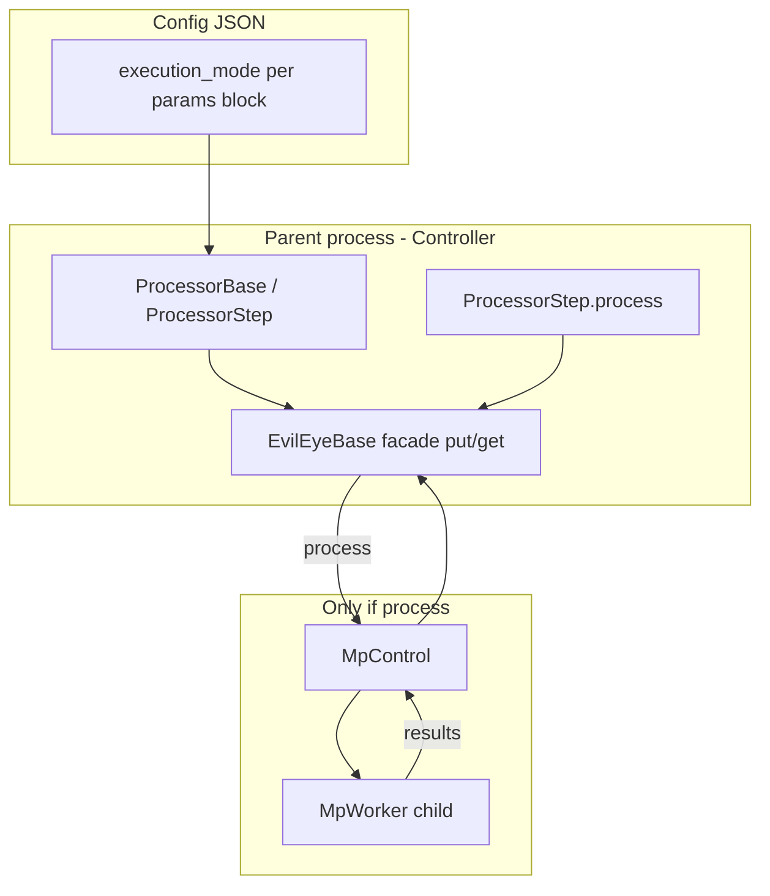
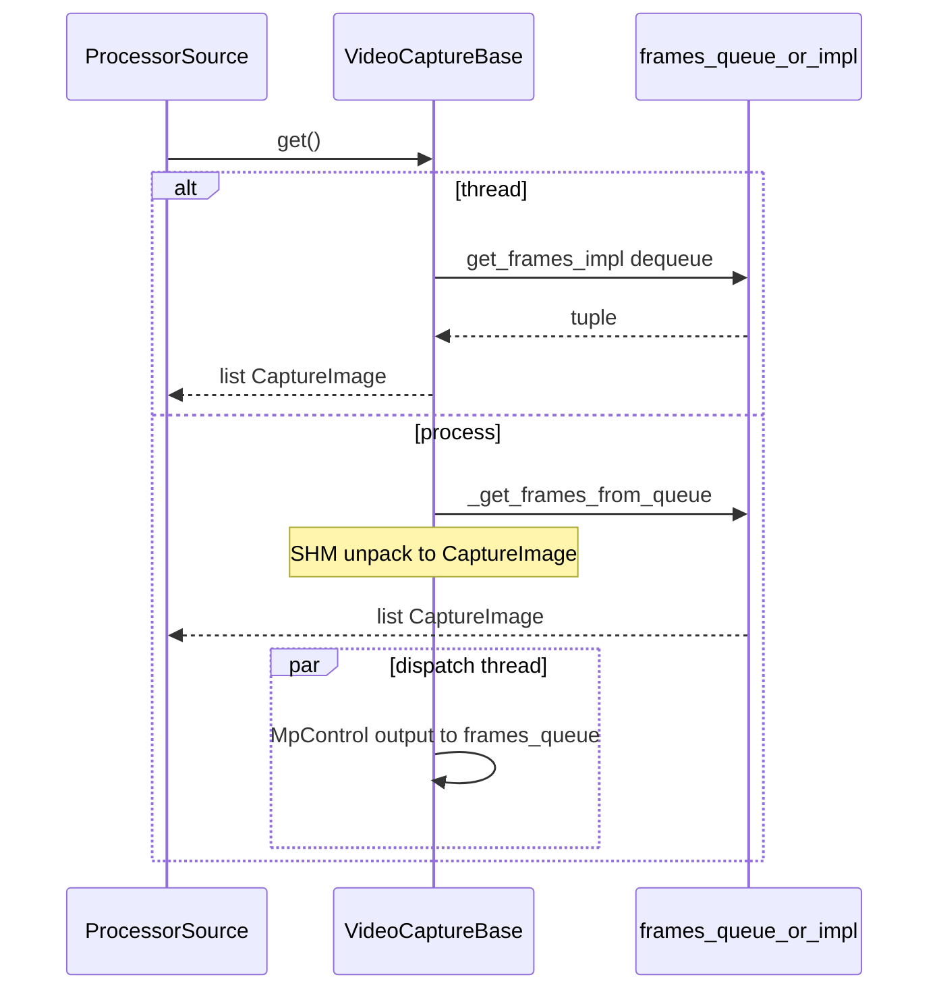

# Thread vs MP: контракты и аудит реализации

Документ фиксирует, как в EvilEye реализованы режимы `thread` и `process` (`execution_mode`) для захвата, детектора, трекера, mc-трекера и пайплайна. Используется как основа для [плана рефакторинга](thread_vs_mp_refactoring_plan.md) и [гайда разработчика](developing_dual_mode_modules.md).

**Связанные материалы:** [MULTIPROCESSING.md](MULTIPROCESSING.md), [PIPELINE_ARCHITECTURE.md](PIPELINE_ARCHITECTURE.md), [multiprocessing_benchmark.md](multiprocessing_benchmark.md).

---

## §1. Введение и scope

### Аудитория

Разработчики, которые меняют pipeline, добавляют стадии обработки, тюнят MP backlog / E2E FPS или сравнивают `poly-videos` (process) с `poly-videos-thread`.

### Граница анализа

| Включено | Пакеты / файлы |
|----------|----------------|
| Захват | `evileye/capture/*`, `mp_worker_capture.py` |
| Детектор | `evileye/object_detector/*` |
| Трекер (per-source) | `evileye/object_tracker/*`, `mp_worker_tracker.py` |
| MC-трекер (интеграция) | `object_multi_camera_tracker/custom_object_tracking.py`, `processor_step._process_mc_trackers_sync` |
| Пайплайн | `evileye/core/processor_*.py`, `pipeline_processors.py`, `pipelines/pipeline_surveillance.py` |
| Controller (MP tuning) | `controller.py` — backpressure, `estimate_mp_backlog_stats` |

### Вне scope

- `server.execution_mode` (отдельный веб-процесс)
- База данных, events, GUI (кроме того, что они потребляют выход pipeline)
- Полный audit attributes (кратко в §9)

### Bench-конфиги

| Файл | `execution_mode` |
|------|------------------|
| [`configs/poly-videos.json`](../configs/poly-videos.json) | **не задан** → default `"process"` на всех стадиях с поддержкой mode |
| [`configs/poly-videos-thread.json`](../configs/poly-videos-thread.json) | **13** явных `"execution_mode": "thread"` |

Разбивка 13 ключей в thread-конфиге (проверка скриптом по JSON):

- `pipeline.sources[]` — по одному на каждый из **7** источников (в poly-videos — 7 блоков sources)
- `pipeline.detectors[]` — **5** детекторов (по ROI/камере)
- `pipeline.trackers[]` — **5** трекеров

Секции `mc_trackers`, `attributes`, `visualizer` и прочие поля **идентичны** между конфигами; меняется только режим выполнения capture/det/track.

---

## §2. Глоссарий

| Термин | Определение | Якорь в коде |
|--------|-------------|--------------|
| `execution_mode` | `"thread"` — работа в процессе controller; `"process"` — тяжёлая работа в child через `MpControl` | `evileye/core/processor_base.py` (`EXEC_MODE_THREAD`, `EXEC_MODE_PROCESS`) |
| `DEFAULT_EXECUTION_MODE` | `"process"` если ключ в JSON опущен | `processor_base.py` |
| `MpControl` | Пул `mp.Queue` in/out, spawn workers, restart, poison `None` | `evileye/core/mp_control.py` |
| `MpWorker` | Базовый child loop; entry `run_mp_worker_entry` | `evileye/core/mp_worker.py` |
| `FrameHandle` | Дескриптор кадра в shared memory | `evileye/core/frame_transport.py` |
| `_mp_pending` | `deque` FIFO: задания, ещё не принятые в `input_queue` MP | det: `detection_thread_yolo_mp.py`; track: `object_tracking_base.py` |
| **post-drain** | `processor.get()` вызывается **после** всех `put` в том же `ProcessorStep.process` | `processor_step.py` ~369–374 |
| **continuous producer** | Child постоянно публикует кадры (capture), не по запросу на job | `mp_worker_capture.py` |
| **request/response** | Parent кладёт job → child возвращает результат (det/track) | feed/drain loops |
| **sync-only stage** | Стадия без `execution_mode`; синхронный batch на тике controller | `mc_trackers` |
| **Facade** | Класс с `put`/`get` для `ProcessorStep` (`ObjectDetectorBase`, `ObjectTrackingBase`, `VideoCaptureBase`) | — |
| **post-drain policy** | Намеренно нет drain до put (stale MP + mc batch) | комментарий в `processor_step.py` |

---

## §3. Архитектура переключения



### Кто читает `execution_mode`

| Компонент | Где читается | При `process` |
|-----------|--------------|---------------|
| `ProcessorBase.set_params` | `params[0]['execution_mode']` | Копия на контейнер step (для sync drain) |
| `VideoCaptureBase.set_params_impl` | `params.get('execution_mode', DEFAULT)` | `_init_process_mode()`, dispatch thread |
| `ObjectDetectorBase` | `set_params_impl` / threads | `DetectionThreadYoloMp` per thread |
| `ObjectTrackingBase.init_impl` | `params['execution_mode']` | `_init_process_mode()`, feed/drain |
| `AttributeClassifier.init_impl` | L79+ | `_init_process_mode()` или thread (§9) |
| `ProcessorStep._sync_mp_drain_after_put` | `getattr(processor, 'execution_mode')` | Timed extra drain, env `EVILEYE_PIPELINE_SYNC_MP` |
| `PipelineSurveillance._trackers_use_process_mode` | каждый tracker params | Skip `OnnxEncoder` в parent |

### Внешний контракт стадий det/track (стабильный)

Для `ProcessorStep` детектор и трекер выглядят одинаково:

- `put(payload)` — неблокирующий приём
- `get()` — `get_nowait` из `queue_out`
- Формат det: `[DetectionResultList, CaptureImage]`
- Формат track: `[TrackingResultList, Frame]`

Граница MP **внутри** экземпляра (`DetectionThreadYoloMp`, `ObjectTrackingBase` process path), не на уровне `ProcessorStep`.

---

## §4. Capture

### §4.1 Thread mode

| Поле | Значение |
|------|----------|
| Public API | `init`, `start`, `stop`, `get()` → `list[CaptureImage]` |
| Где I/O | Main process: `VideoCaptureOpencv` / GStreamer |
| Внутренняя очередь | `DropOldestQueue` (maxsize ≈ 2), элемент — tuple `[is_read, src_image, frame_id, video_frame, video_pos]` |
| Потоки | `_grab_frames`, `_retrieve_frames` после `start()` |
| Путь `get()` | `get_frames_impl()` — один dequeue, split stream при необходимости |

Файлы: `evileye/capture/queue_utils.py`, `video_capture_base.py`, `video_capture_opencv.py`.

### §4.2 Process mode

| Поле | Значение |
|------|----------|
| Parent shell | `VideoCaptureBase` + `MpControl` + `_capture_dispatch_loop` |
| Child | `MpWorkerCapture` — внутри создаёт тот же backend с **`execution_mode=thread`** (запрет вложенного MP) |
| IPC | `SharedFrameTransport`: `dict{frame_handle, frame_meta}` на `output_queue` |
| Parent буфер | `frames_queue` (`DropOldestQueue`) готовых `CaptureImage` |
| Путь `get()` | `_get_frames_from_queue()` — **не** `get_frames_impl`; dedup ≤1 кадр на `source_id` за drain |
| `start()` parent | Только dispatch thread, без grab/retrieve в parent |

**Три уровня drop-oldest / переполнения:**

1. **Child internal** — `DropOldestQueue` для grab/retrieve tuple.
2. **Child → MpControl** — при full `output_queue` worker снимает oldest (`mp_worker_capture.py`).
3. **Parent `frames_queue`** — dispatch кладёт распакованные `CaptureImage`; политика очереди parent.

### §4.3 Прозрачность, coupling, дубли

| Критерий | Оценка |
|----------|--------|
| API для `ProcessorSource` | Один метод `get()` — **средняя** прозрачность (разная глубина буферов и стоимость SHM) |
| Алгоритм decode | Тот же OpenCV/GStreamer класс в child | **высокая** |
| Наблюдаемость | Отдельные очереди MP vs thread | **низкая** сравнимость метрик pending |

См. реестры: **COUP-001**, **DUP-001**, **DUP-002**.

### §4.4 Sequence: один тик ProcessorSource



---

## §5. Detector

### §5.1 Facade `ObjectDetectorBase`

| Метод | Контракт | Thread | Process |
|-------|----------|--------|---------|
| `put(CaptureImage)` | Round-robin в `detection_threads[i]` | `DetectionThreadYolo.put` | `DetectionThreadYoloMp.put` |
| `get()` | Non-blocking | `[DetectionResultList, CaptureImage]` | то же |
| `queue_in` / `queue_out` | **Всегда** `queue.Queue` в parent | Комментарий L86–89: MP boundary inside `*Mp` | |

Dispatcher thread (`ObjectDetectorBase.processing_thread`) маршрутизирует `queue_in` → threads в обоих режимах.

### §5.2 Thread: `DetectionThreadYolo`

```
put(image) → queue_in
processing_thread → _process_impl → split ROI → predict (Ultralytics) → _detection_result_from_predict → queue_out
```

Файлы: `detection_thread_yolo.py`, `detection_thread_base.py`.

### §5.3 Process: `DetectionThreadYoloMp`

| Метод | Роль |
|-------|------|
| `_mp_det_feed_loop` | Читает `queue_in`, split ROI, `_enqueue_mp_det_job` |
| `_enqueue_mp_det_job` | FIFO `_mp_pending`, cap, retry `put_nowait`, drop oldest |
| `_mp_det_drain_loop` | `mp_control.get(timeout=mp_drain_poll_sec())` |
| `_build_mp_payload` | `list[FrameHandle]` для child |
| `_put_detection_output` | Сборка `[DetectionResultList, CaptureImage]` → facade `queue_out` |
| `MpWorkerYolo.worker_impl` | YOLO в child, возврат DTO |

**IPC:**

| Направление | Тип |
|-------------|-----|
| Parent → child | `list[FrameHandle]` |
| Child → parent | `list[list[dict]]` — `bbox_xyxy`, `confidence`, `class_id` |
| Ошибка / пустой ввод | `[[]] * num_rois` |

`get_bboxes` в MP парсит dict; в thread — Ultralytics `Result` (`roi_boxes_to_image_coords` vs `mp_dict_list_to_image_coords`).

### §5.4 Legacy: `ObjectDetectorYoloMp`

Отдельный класс + factory type `"yolo_mp"`. Рекомендуемый путь: **`ObjectDetectorYolo` + `"execution_mode": "process"`**. См. **DUP-018**, фаза **R0** в [плане рефакторинга](thread_vs_mp_refactoring_plan.md).

### §5.5 Coupling / дубли (detector)

| ID | Описание |
|----|----------|
| COUP-002 | `estimate_mp_backlog_stats` — `isinstance(DetectionThreadYoloMp)` |
| COUP-003 | `is_ready()` — alive MP vs loaded model |
| DUP-003 | ROI split в feed и в `_process_impl` |
| DUP-004 | Два YOLO runtime (thread + `MpWorkerYolo`) |
| DUP-005 | Два парсера bbox |
| DUP-006 | MP async pattern ≈ tracker (§5.6) |

### §5.6 Parity: detector MP vs tracker MP

| Concern | Detector | Tracker |
|---------|----------|---------|
| Pending enqueue | `_enqueue_mp_det_job` | `_enqueue_mp_tracker_job` |
| Cap | `_enforce_pending_cap` + `mp_pending_cap_detector()` | + `mp_pending_cap_tracker()` |
| Feed | `_mp_det_feed_loop` | `_mp_tracker_feed_loop` |
| Drain | `_mp_det_drain_loop` | `_mp_tracker_drain_loop` |
| Clear stop | `_clear_mp_pending` | `_clear_mp_pending` |
| SHM release | `_release_handles` | `_release_frame_handle` |
| Diag | `_diag_mp_put_dropped`, `_diag_mp_pending_evict` | то же |

---

## §6. Tracker (per-source)

### §6.1 Facade `ObjectTrackingBase`

| Метод | Контракт |
|-------|----------|
| `put((DetectionResultList, Frame))` | `queue_in`, drop oldest при full |
| `get()` | `(TrackingResultList, Frame)` или None |
| `queue_in/out` | `threading.Queue` даже в process mode |

### §6.2 Thread: `ObjectTrackingBotsort`

- `processing_thread` → `_process_impl` → BoT-SORT в **parent**.
- ReID: `OnnxEncoder` в parent (если pipeline инициализировал encoders).

### §6.3 Process

- `_init_process_mode` → `MpControl` + `MpWorkerTracker`.
- `_mp_tracker_feed_loop` / `_mp_tracker_drain_loop` — аналог detector.
- `_pack_for_worker` — descriptor: detection + `frame_handle` + meta.
- Child выполняет track update; parent `_emit_mp_tracker_result` → `queue_out`.

### §6.4 Encoder coupling

`PipelineSurveillance._init_encoders`: если **любой** tracker в `process`, parent **не** создаёт `OnnxEncoder` — модель грузится в `MpWorkerTracker`.

**COUP-004:** `ObjectTrackingBotsort.init_impl` всё равно может создать `BOTSORT` в parent при process — лишняя инициализация (**R6**).

### §6.5 Дубли (tracker)

| ID | Имя |
|----|-----|
| DUP-007 | BoT-SORT в Botsort vs `MpWorkerTracker` |
| DUP-008 | `_put_out_drop_oldest` vs MC base |
| DUP-009 | Пустой tracking output в нескольких местах |

---

## §7. MC-tracker

| Вопрос | Ответ |
|--------|-------|
| `execution_mode` | **Не используется** |
| Вход | `ProcessorStep._process_mc_trackers_sync` — batch `dict[source_id → (TrackingResultList, Frame)]` |
| API | `ObjectMultiCameraTracking.ingest_tick_batch(batch)` |
| MP | Нет `MpControl` |
| Type guard | `isinstance(mc, ObjectMultiCameraTracking)` — **COUP-005** |

### Косвенная зависимость от thread/MP

MC не переключает режим, но:

- Латентность и состав batch зависят от выходов per-source trackers (async MP vs sync thread).
- Encoders/ReID при process trackers не в parent — влияет на MC только через качество/задержку tracks.


---

## §8. Pipeline, ProcessorStep, Controller

### §8.1 Порядок тика `PipelineProcessors.process`

1. `pending = estimate_mp_backlog_stats()['pending']` → `_mp_pending_snapshot` на каждый `ProcessorStep`.
2. Цепочка: sources → detectors → trackers → **mc_trackers (sync)** → …
3. Attributes: sticky с `mc_trackers`.

### §8.2 Контракт `ProcessorStep`

| Правило | Реализация |
|---------|------------|
| Маршрутизация | `frame.source_id in processor.get_source_ids()` |
| Put | `_adapt_input_for_processor` при materialized image |
| **No pre-drain** | Перед put не вызывается `get()` (stale + MC) |
| **Post-drain** | `_drain_processor_outputs` + опционально `_sync_mp_drain_after_put` |
| Dummy passthrough | Несовпадение source → `dummy_processor.ResultType` + frame |

**Frame flags** (`evileye/core/base_class.py`):

- `requires_materialized_frame` — default `True`
- `accepts_frame_handle` — default `False`
- Preprocessing может принимать handle без materialize в step

### §8.3 Controller backpressure

В конце тика: `EVILEYE_CONTROLLER_BACKPRESSURE` (default **`soft`**) → extra sleep от `estimate_mp_backlog_stats()['pending']`.

**Асимметрия:** в thread mode `_mp_pending` ≈ 0 → backpressure почти не срабатывает; tuning MP-specific.

### §8.4 Дубли pipeline

**DUP-010:** `_normalize_result_meta` в `ProcessorStep` vs логика в `ProcessorFrame.process`.

---

## §9. Attributes (кратко)

`AttributeClassifier` (`evileye/attributes_detection/attribute_classifier.py`):

- Тот же fork: `init_impl` → thread (`_process_impl`) или `_init_process_mode`.
- Facade `put`/`get` на `queue.Queue`.
- Полный audit не входит в scope; паттерн **аналогичен detector** (**DUP-016**).

---

## §10. Матрица прозрачности

Оценка 1 (плохо) … 5 (отлично).

| Слой | Config-only switch | ProcessorStep contract | Algorithm reuse | Observability |
|------|-------------------|------------------------|-----------------|---------------|
| Capture | 5 | 4 | 4 | 2 |
| Detector | 5 | 5 | 2 | 3 |
| Tracker | 5 | 5 | 2 | 3 |
| MC-tracker | N/A (sync) | 4 | 5 | 4 |
| ProcessorStep | 5 | 5 | — | 3 |
| Pipeline / Controller | 4 | 4 | — | 2 |

**Итог:** переключение **прозрачно для конфига и оркестратора**; **непрозрачно для ядра алгоритма** (два runtime, feed/drain, SHM) и для MP-specific tuning.

---

## §11. Реестр связанности (COUP)

| ID | Описание | Файл | Severity | Снятие |
|----|----------|------|----------|--------|
| COUP-001 | GStreamer `start()` fork для process | `video_capture_gstreamer.py` | med | R4 |
| COUP-002 | `isinstance(DetectionThreadYoloMp)` в backlog | `pipeline_surveillance.py` ~455–463 | high | R3 |
| COUP-003 | `is_ready()` разная семантика thread/MP | `object_detection_base.py` | low | R2/doc |
| COUP-004 | BOTSORT init в parent при process | `object_tracking_botsort.py` | med | R6 |
| COUP-005 | MC hard `isinstance` guard | `processor_step.py` ~197 | med | S6 |
| COUP-006 | Omit `execution_mode` = process | `processor_base.py`, poly-videos | doc | C §4 |
| COUP-007 | Skip parent encoders if process trackers | `pipeline_surveillance.py` ~254 | high | R6 |
| COUP-008 | Materialize frame in step | `processor_step.py` ~146 | med | S4 |
| COUP-009 | ENV backpressure/sync MP-only | `controller.py`, `processor_step.py` | med | doc |
| COUP-010 | `ProcessorBase.execution_mode` vs per-instance | `processor_base.py` ~69 | low | doc |
| COUP-011 | Capture child forced thread | `mp_worker_capture.py` ~82 | by design | C §3 |
| COUP-012 | `ObjectDetectorYolo.init_impl` fork | `object_detection_yolo.py` | med | R0/R2 |

---

## §12. Реестр дублей (DUP)

| ID | Имя | Файлы | ~LOC | Риск | Фаза |
|----|-----|-------|------|------|------|
| DUP-001 | capture drop-oldest ×2 | `queue_utils.py`, `mp_worker_capture.py` | 40 | med | R4 |
| DUP-002 | capture factory dup | `mp_worker_capture.py`, `video_capture_base.py` | 60 | low | R4 |
| DUP-003 | ROI split detector | `detection_thread_base.py`, `detection_thread_yolo_mp.py` | 80 | med | R2 |
| DUP-004 | dual YOLO runtime | `detection_thread_yolo.py`, `mp_worker_yolo.py` | 150+ | high | R2 |
| DUP-005 | bbox parsers | `bbox_utils.py`, drain paths | 50 | low | R2 |
| DUP-006 | MP async det≈track | `detection_thread_yolo_mp.py`, `object_tracking_base.py` | 200+ | high | R1 |
| DUP-007 | BoT-SORT dual | `object_tracking_botsort.py`, `mp_worker_tracker.py` | 120+ | high | R2 |
| DUP-008 | queue_out drop | `object_tracking_base.py`, MC base | 30 | low | R1/R5 |
| DUP-009 | empty track output | several | 40 | low | R2 |
| DUP-010 | normalize meta | `processor_step.py`, `processor_frame` | 50 | med | R5 |
| DUP-011 | ObjectDetector init fork | `object_detection_base.py`, `object_detection_yolo.py` | 30 | low | R0 |
| DUP-012 | pending cap ×2 | `mp_queue_config.py` + 2 classes | 20 | low | R1 |
| DUP-013 | diag `_diag_mp_*` | yolo_mp, tracking_base | 30 | low | R1 |
| DUP-014 | SHM release helpers | yolo_mp, tracking_base | 40 | low | R1 |
| DUP-015 | put detection output | base, yolo_mp | 25 | low | R1 |
| DUP-016 | AttributeClassifier MP | `attribute_classifier.py` | 100 | med | post-R2 |
| DUP-017 | `mp_drain_poll_sec` in loops | yolo_mp, tracking_base | 10 | low | doc |
| DUP-018 | legacy `ObjectDetectorYoloMp` | `object_detection_yolo_mp.py` | file | low | R0 |

---

## §13. Gap analysis vs MULTIPROCESSING.md

| Тема в MULTIPROCESSING | Факт в коде (2026) | Действие |
|------------------------|-------------------|----------|
| Гибрид thread/process | Поддерживается | OK |
| Parent detector queues thread-local | Комментарий L86–89 актуален | OK |
| Default mode | Код: `process`; в старых примерах может быть неявно | Уточнить §config |
| `ObjectDetectorYoloMp` как основной класс | Заменён на `ObjectDetectorYolo` + mode | R0 deprecate doc |
| MC в отдельном process | **Не реализовано** | Явно «sync-only» |
| FrameHandle end-to-end | Capture/det/track частично; step materializes по умолчанию | Дополнить диаграмму |
| Backpressure | Default `soft` в controller | Обновить таблицу env |
| Adaptive `PIPELINE_SYNC_MP` | Bench-only, не production default | Ссылка на phase3 summary |
| 15 YOLO processes | По-прежнему отдельные workers на ROI/thread | OK |
| Capture child always thread | `mp_worker_capture` L82 | Документировать ограничение |

---

## §14. Связанные документы

- [План рефакторинга](thread_vs_mp_refactoring_plan.md) — фазы R0–R6, закрытие DUP/COUP
- [Разработка dual-mode модулей](developing_dual_mode_modules.md) — шаблоны и чеклист
- [Упрощение интеграции](module_integration_simplification.md) — S1–S7
- [mp_fps_phase3_summary.md](mp_fps_phase3_summary.md) — production env и KPI
