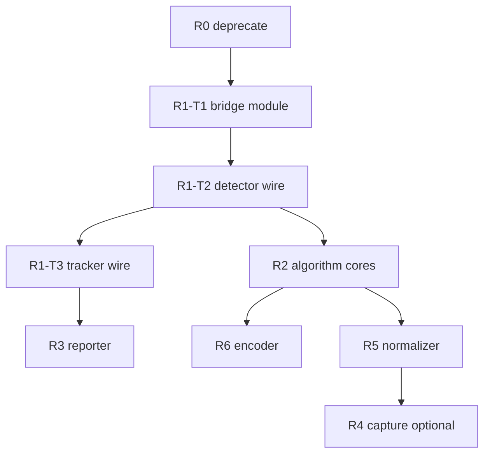

# План рефакторинга: thread vs MP

Дорожная карта по [аудиту контрактов](thread_vs_mp_contracts.md). Здесь — **что делать в коде**, в каком порядке, как проверить, что не сломать. Сам код в этом документе не меняется.

---

## §B1. Цели и non-goals

### B1.1. Цели (измеримые)

| # | Цель | Как проверить |
|---|------|---------------|
| G1 | Убрать **DUP-006** (два копии MP feed/drain/pending) | Один модуль `mp_async_bridge.py`, det+track используют |
| G2 | Убрать **DUP-004/007** (два runtime YOLO / BoT-SORT) | `yolo_runtime.py`, `track_update_core.py` — единственные вызовы infer/update |
| G3 | Убрать **COUP-002** | Нет `isinstance(DetectionThreadYoloMp)` в `pipeline_surveillance.py` |
| G4 | Сохранить KPI фазы 3 | `measure_poly_e2e_fps`: `staleness_in_band`, `e2e_ratio ≥ 3`, `drop_events=0` |

### B1.2. Non-goals (явно не делаем)

- MC-tracker в subprocess (нарушит batch semantics §7 аудита).
- Descriptor-only pipeline без `consume_frame` в step (большой ADR, отдельный проект).
- Смена default `execution_mode` на `thread` (ломает production ожидания).
- Слияние capture worker + detector worker (разная модель continuous vs request/response).
- R4 без spike — если triple-buffer нельзя упростить без регрессии capture.

---

## §B2. Принципы (с примерами)

### P1. Stable facade

**До/после:** сигнатуры остаются:

```python
# Не менять
def put(self, image: CaptureImage) -> bool: ...
def get(self): ...  # -> Optional[list]
```

Внутри можно менять `DetectionThreadYoloMp` → bridge; `ProcessorStep` без изменений.

### P2. Algorithm core

**Плохо:** Ultralytics `predict` и в `DetectionThreadYolo._process_impl`, и в `MpWorkerYolo.worker_impl` с копией hyperparams.

**Хорошо:**

```python
# yolo_runtime.py
class YoloRuntime:
    def predict_rois(self, images: list[np.ndarray]) -> list: ...

# thread
results = runtime.predict_rois(roi_images)

# child worker_impl
results = runtime.predict_rois(materialized_rois)
```

### P3. Protocol over isinstance

**Сейчас** (`pipeline_surveillance.py`):

```python
if isinstance(th, DetectionThreadYoloMp):
    pending += len(th._mp_pending)
```

**Цель:**

```python
if hasattr(th, "mp_pending_depth"):
    pending += th.mp_pending_depth()
```

### P4. Incremental PR

Каждый PR: unit tests + при изменении hot path — smoke `measure_poly_e2e_fps` 30–90 s.

### P5. Bench gate

Перед merge **R2** и **R3**: 3×120 s `run_poly_videos_mode_compare` process; thread config — 1 run без crash.

---

## §B3. Фазы R0–R6 (детально)

### R0 — Documentation & deprecation (~2 SP, 1 PR)

**Цель:** один рекомендуемый способ включить MP-детектор; legacy не ломаем.

| Task | Конкретные действия | Файлы | Критерий готовности |
|------|---------------------|-------|---------------------|
| R0-T1 | В docstring класса: «Use ObjectDetectorYolo + execution_mode=process» | `object_detection_yolo_mp.py` | grep docstring |
| R0-T2 | В MULTIPROCESSING §config: таблица primary vs legacy | `docs/MULTIPROCESSING.md` | PR doc only |
| R0-T3 | `logger.warning` если `create(..., type="yolo_mp")` | `detection_thread_factory.py` | unit test warning |
| R0-T4 | Не удалять класс | — | старые configs работают |

**Verify:**

```bash
grep -r "ObjectDetectorYoloMp" configs/ docs/ || true
pytest tests/unit/object_detector/ -q
```

**Закрывает:** DUP-018, частично COUP-012.

---

### R1 — `MpAsyncBridge` (~8 SP, 2 PR)

**Проблема:** `_enqueue_mp_*`, `_enforce_pending_cap`, `_clear_mp_pending`, diag counters — почти копипаста в `detection_thread_yolo_mp.py` и `object_tracking_base.py` (~200 LOC, **DUP-006**).

**PR1 (R1-T1):** новый модуль без подключения к production path.

**Файл:** `evileye/core/mp_async_bridge.py`

**API (целевой контракт):**

```python
class MpAsyncBridge(Generic[JobT, ResultT]):
    """Owns: pending deque, cap evict, put_nowait drop, diag counters."""

    def __init__(
        self,
        *,
        mp_control: MpControl,
        pending_cap: int,
        name: str,
    ): ...

    def enqueue(
        self,
        job_payload: Any,
        *,
        meta: JobT,
        release_on_drop: Callable[[JobT], None],
    ) -> bool:
        """False if put_dropped after retries."""

    def pop_job_for_result(self) -> JobT:
        """Called from drain when mp_control.get returns."""

    def pending_depth(self) -> int: ...
    def diag_put_dropped(self) -> int: ...
    def diag_pending_evict(self) -> int: ...
    def clear(self) -> None: ...
```

**Поведение `enqueue` (должно совпасть с текущим L136–166 yolo_mp):**

1. Lock → evict head if `len >= cap` → append meta.
2. `put_nowait(payload)`.
3. On fail: drop oldest from `input_queue`, pop head pending, release SHM, retry.
4. On fail again: drop tail if same meta key, release, increment `put_dropped`.

**PR2 (R1-T2, R1-T3):** wire detector then tracker.

| Task | Действие | Риск |
|------|----------|------|
| R1-T2 | `DetectionThreadYoloMp` держит `self._bridge: MpAsyncBridge` | Регрессия FIFO order |
| R1-T3 | `ObjectTrackingBase` process path | tracker pending cap 4 default |
| R1-T4 | Tests: cap evict, put drop, FIFO | — |

**Verify:**

```bash
pytest tests/unit/object_detector/test_detection_thread_yolo_mp_async.py -q
pytest tests/unit/core/test_mp_pending_cap.py -q
# Новый: tests/unit/core/test_mp_async_bridge.py
```

**Закрывает:** DUP-006, 012, 013, 014, 015 (частично), 008 (частично).

---

### R2 — Algorithm cores (~13 SP, 3 PR)

**PR-A (R2-T1):** `detection_preprocess.py`

```python
def split_capture_into_rois(
    image: CaptureImage,
    roi_coords_per_camera: dict[int, list],
    roi_default: list,
) -> list[tuple[Any, list[int]]]:
    """Единая логика для _process_impl и _mp_det_feed_loop."""
```

**PR-B (R2-T2, R2-T4, R2-T5):** `yolo_runtime.py`

- `load_model(path) -> YoloRuntime`
- `predict_images(images) -> list` (Ultralytics)
- `predict_from_handles(transport, handles) -> list` (child)

**PR-C (R2-T3, R2-T6):** `track_update_core.py`

- Input: `TrackerState`, `Frame`, `DetectionResultList`
- Output: `TrackingResultList`
- Used by: `ObjectTrackingBotsort._process_impl`, `MpWorkerTracker.worker_impl`

| Task | Файл-потребитель | Удалить дубль |
|------|------------------|---------------|
| R2-T4 | `mp_worker_yolo.py` | inline YOLO |
| R2-T5 | `detection_thread_yolo.py` | inline split+NMS path |
| R2-T6 | `mp_worker_tracker.py`, `botsort` | duplicate update loop |

**Verify (обязательный gate):**

```bash
pytest tests/unit/object_detector/ tests/unit/object_tracker/ -q

export EVILEYE_CONTROLLER_BACKPRESSURE=soft
python scripts/measure_poly_e2e_fps.py \
  --config configs/poly-videos.json \
  --warmup-sec 25 --active-sec 90 --env-note r2_gate \
  --out /tmp/e2e_r2_gate.json

python3 -c "
import json
j=json.load(open('/tmp/e2e_r2_gate.json'))
assert j.get('staleness_in_band') is True, j
assert j.get('e2e_ratio', 0) >= 3.0, j
print('R2 gate OK', j.get('e2e_tracker_fps'), j.get('e2e_ratio'))
"
```

**Закрывает:** DUP-003, 004, 005, 007, 009.

---

### R3 — `MpPendingReporter` (~5 SP, 1 PR)

**Файл:** `evileye/core/mp_pending_protocol.py`

```python
class MpPendingReporter(Protocol):
    def mp_pending_depth(self) -> int: ...
    def mp_diag_put_dropped(self) -> int: ...
    def mp_diag_pending_evict(self) -> int: ...
```

| Task | Действие |
|------|----------|
| R3-T1 | `DetectionThreadYoloMp.mp_pending_depth` → bridge.pending_depth() |
| R3-T1b | `ObjectTrackingBase` (process) — то же |
| R3-T2 | `estimate_mp_backlog_stats`: iterate `detection_threads` + trackers, `callable(mp_pending_depth)` |
| R3-T3 | Удалить import `DetectionThreadYoloMp` из pipeline |

**Зависимость:** R1-T2 merged.

**Verify:** unit test mock reporter; smoke backlog logs in controller unchanged order of magnitude.

**Закрывает:** COUP-002.

---

### R4 — Capture simplification (~8 SP, optional)

| Task | Действие | Примечание |
|------|----------|------------|
| R4-T1 | `capture/queue_policy.py`: `drop_oldest_put(q, item)` | Shared |
| R4-T2 | Use in `DropOldestQueue` and worker output path | DUP-001 |
| R4-T3 | **Spike doc only:** can we remove parent `frames_queue`? | Если нет — оставить 3 levels |
| R4-T4 | GStreamer `start()` single decision table | COUP-001 |

**Verify:**

```bash
pytest tests/unit/capture/ -q  # if exists
pytest tests/integration/capture/ -q  # subset
```

---

### R5 — ProcessorStep cleanup (~5 SP, 1 PR)

| Task | Действие |
|------|----------|
| R5-T1 | `stage_result_normalizer.normalize(item) -> normalized` |
| R5-T2 | Replace duplicates in `processor_step`, `processor_frame` |
| R5-T3 | Add `docs/` paragraph: post-drain only (link contracts §8.2) |

**Закрывает:** DUP-010.

---

### R6 — Tracker encoder & parent init (~5 SP, 1 PR)

| Task | Действие | Ожидаемый эффект |
|------|----------|------------------|
| R6-T1 | In `ObjectTrackingBotsort.init_impl`: if `execution_mode==process`: skip `BOTSORT(...)` in parent | Меньше RAM на старте |
| R6-T2 | Doc table: Encoder location vs mode | COUP-007 clarity |
| R6-T3 | Unit: process mode, parent has no `tracker` attribute / no onnx load |

**Verify:** `pytest tests/unit/object_tracker/ -q`

**Закрывает:** COUP-004, COUP-007.

---

## §B4. Порядок PR и зависимости



**Жёсткие блокеры:**

- R3 после R1-T2 (pending API стабилен).
- R2-T4 после R2-T2 (`YoloRuntime` exists).
- Не делать R4 до green R2 gate (изоляция регрессий).

---

## §B5. Критерии приёмки (расширенные)

### Per-PR минимум

| Check | Command |
|-------|---------|
| Unit | `pytest tests/unit/ -q --tb=no` (или затронутые пакеты) |
| Lint | существующий pre-commit / ruff если настроен |

### Per-phase gate

| Phase | Extra gate |
|-------|------------|
| R1 | `test_detection_thread_yolo_mp_async.py` |
| R2 | E2E JSON assert (см. §B3 R2) |
| R3 | grep no `DetectionThreadYoloMp` in `pipeline_surveillance.py` |
| R6 | memory smoke: parent RSS не грузит onnx при process trackers |

### Release gate (перед тегом / merge в main)

| KPI | Command | PASS |
|-----|---------|------|
| E2E 90s | `measure_poly_e2e_fps.py` poly-videos | in_band, ratio≥3 |
| Matrix smoke | `run_e2e_fps_matrix.sh F2` (optional full) | WINNER stable |
| Thread | `poly-videos-thread` 1×180 | no hang |
| Drops | barrier CSV | drop_events=0 |

---

## §B6. Риск-регистр (mitigation playbook)

| Риск | Индикатор | Mitigation | Откат |
|------|-----------|------------|-------|
| R2 timing / e2e ↓ | e2e < 29 or ratio < 3 | bisect commit; keep env F2 | revert R2 PR |
| R1 FIFO bug | async test fail | fix bridge pop order | revert R1 |
| R4 capture stall | no frames in GUI | revert R4 only | — |
| Staleness > 6.5 | phase3 KPI | не трогать SYNC defaults | env tune |
| Legacy config | warning spam | R0 doc migration | — |

---

## §B7. Mapping DUP/COUP → фазы

### DUP → R

| DUP | R | Примечание |
|-----|---|------------|
| 001–002 | R4 | optional |
| 003–005, 007, 009 | R2 | highest algorithm value |
| 006, 008, 012–015 | R1 | infrastructure |
| 010 | R5 | |
| 011, 018 | R0 | |
| 016 | post-R2 | attributes |
| 017 | doc | env only |

### COUP → R / S

| COUP | Снятие |
|------|--------|
| 002 | R3 |
| 004, 007 | R6 |
| 001 | R4 |
| 005 | S6 doc |
| 008 | S4 defer |

---

## §B8. Оценка трудозатрат

| Фаза | SP | Календарь (1 dev) |
|------|-----|-------------------|
| R0 | 2 | 0.5 d |
| R1 | 8 | 2 d |
| R2 | 13 | 3–4 d |
| R3 | 5 | 1 d |
| R4 | 8 | 2 d (optional) |
| R5 | 5 | 1 d |
| R6 | 5 | 1 d |
| **Core** | **~38 SP** | **~2 недели** |

---

## §B9. Чеклист ревьюера PR (refactoring)

- [ ] Facade `put`/`get` не изменились
- [ ] Нет нового `isinstance(...Mp)` в pipeline
- [ ] SHM release на всех drop paths
- [ ] Тест FIFO / pending при MP changes
- [ ] E2E smoke JSON приложен в PR (если hot path)
- [ ] MULTIPROCESSING / contracts doc обновлены при смене контракта

---

## Связанные документы

- [Аудит контрактов](thread_vs_mp_contracts.md)
- [Гайд разработчика](developing_dual_mode_modules.md)
- [Упрощение интеграции](module_integration_simplification.md)
