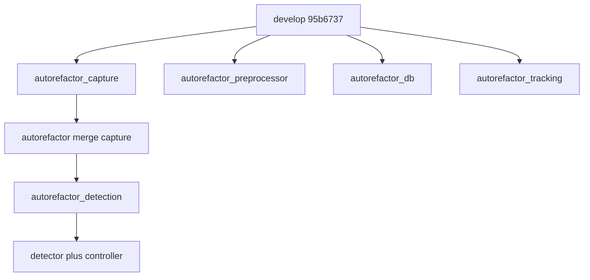
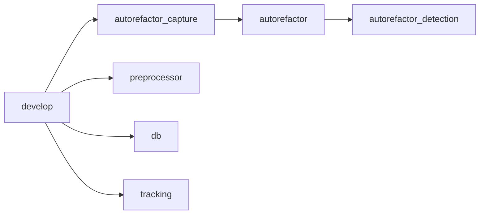
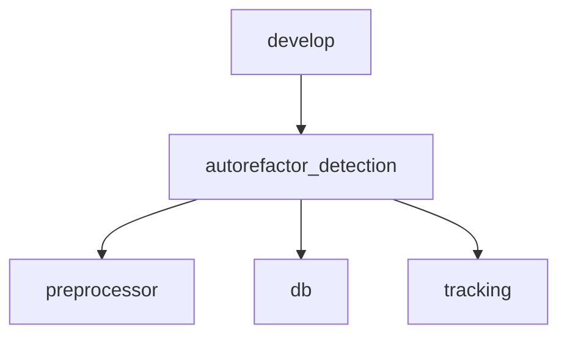

# Итоговый отчёт: ветки autorefactor_* vs develop

**Дата подготовки:** март 2026  
**База сравнения:** `develop` (merge-base со всеми перечисленными ветками — `95b6737`).

Все ветки — **линейное продолжение** `develop` (на develop нет уникальных коммитов, отсутствующих в этих ветках). Ни одна ветка не вмержена в develop → **готовность к продакшену неполная** до merge и приёмки.

---

## Оглавление отчётов по веткам

| Ветка | Отчёт | Коммитов | Объём diff |
|-------|--------|----------|------------|
| **autorefactor_capture** | [branch_develop_autorefactor_capture.md](branch_develop_autorefactor_capture.md) | 15 | 95 files, +10k/−1.6k |
| **autorefactor_preprocessor** | [branch_develop_autorefactor_preprocessor.md](branch_develop_autorefactor_preprocessor.md) | 4 | 71 files, +4.3k/−0.5k |
| **autorefactor_db** | [branch_develop_autorefactor_db.md](branch_develop_autorefactor_db.md) | 4 | 65 files, +4.3k/−0.7k |
| **autorefactor_tracking** | [branch_develop_autorefactor_tracking.md](branch_develop_autorefactor_tracking.md) | 4 | 67 files, +4.2k/−0.5k |
| **autorefactor_detection** | [branch_develop_autorefactor_detection.md](branch_develop_autorefactor_detection.md) | 22 | 108 files, +11.6k/−2k |

---

## Диаграмма происхождения веток

Установите расширение **Markdown Preview Mermaid Support** (`bierner.markdown-mermaid`) — см. [.vscode/extensions.json](.vscode/extensions.json). Предпросмотр: **Ctrl+Shift+V**.

Диаграммы используют синтаксис **`graph TB` / `graph LR`** (а не `flowchart`), потому что в расширении часто встроена старая Mermaid, которая иначе выдаёт «No diagram type detected».

Линейная схема слияний:

**Смысл:** `autorefactor_detection` уже включает **всю** работу по capture. Ветки preprocessor, db и tracking расходятся **параллельно** от одного develop и **пересекаются** в одних и тех же файлах (`objects_handler`, `pipeline_surveillance`, `visualizer`, …).

---

## Стратегия merge в develop

**Варианты:**

1. **Один крупный merge** из `autorefactor_detection` (уже содержит capture + detector + controller), затем **по очереди** preprocessor → db → tracking с ручным разрешением конфликтов.
2. **Пошагово:** сначала только `autorefactor_capture` в develop, затем поверх — коммиты detection (object_detector + controller), затем остальные три ветки.
3. **Интеграционная ветка:** вручную слить preprocessor + db + tracking в одну ветку от `autorefactor_detection`, прогнать тесты, затем один merge в develop.

Без выбранного порядка или без объединения трёх «хвостов» конфликты в общих файлах **неизбежны**.

---

## Приоритеты дальнейшей работы (общие)

По каждой ветке детали — в соответствующем отчёте. Сводно:

1. **Стабильность** — тесты, `scripts/run_diagnostics.py`, сценарии capture/recording, journal/БД.
2. **Архитектура и поддержка** — [REFACTORING_REPORT.md](../REFACTORING_REPORT.md), [REFACTORING_PROGRESS.md](../REFACTORING_PROGRESS.md), [docs/DEPENDENCY_INJECTION_GUIDE.md](../docs/DEPENDENCY_INJECTION_GUIDE.md); уменьшение дублирования между ветками.
3. **Быстродействие** — профилирование детектора ([OBJECT_DETECTOR_PERFORMANCE_ANALYSIS.md](OBJECT_DETECTOR_PERFORMANCE_ANALYSIS.md)), память (скрипты на ветке capture/detection).
4. **Отсутствие регрессий** — чек-листы deploy/run, GUI, double-click/journal (история в [reports/README.md](README.md)).
5. **Совместимость рефакторинга** — единая очередь merge; при необходимости — одна интеграционная ветка от `autorefactor_detection`.

---

## Ссылки на документацию проекта

- [docs/ARCHITECTURE.md](../docs/ARCHITECTURE.md)
- [docs/PIPELINE_ARCHITECTURE.md](../docs/PIPELINE_ARCHITECTURE.md)
- [docs/GUI_REFACTORING_GUIDE.md](../docs/GUI_REFACTORING_GUIDE.md)
- [docs/VIDEO_CAPTURE_OPENCV_ISSUES.md](../docs/VIDEO_CAPTURE_OPENCV_ISSUES.md)
- [reports/README.md](README.md) — исторические отчёты по темам

---

*Все пути в ссылках — относительно корня репозитория или относительно папки `reports/` для отчётов по веткам.*
