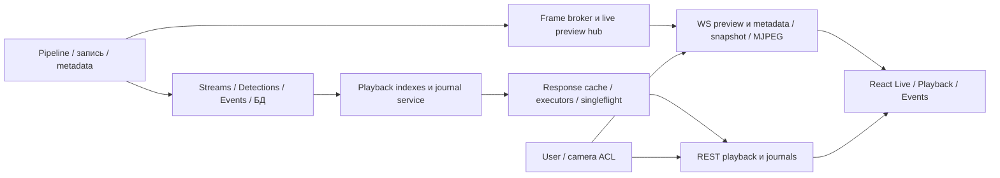

# Повторный аудит EvilEye и план исправлений

Дата: 23.09.2026. Проверенная ревизия: **`32acaa52ab8cdfa4e3f08d9d5adb746369345069`**.

Предыдущий аудит и оценка его реализации: [`AUDIT_REVIEW_f458f393_to_32acaa52.md`](AUDIT_REVIEW_f458f393_to_32acaa52.md).

## 1. Резюме

Главные текущие риски — **изоляция данных камер, актуальность архивных индексов, корректность резервных ответов и управление незавершённой работой**. Они непосредственно влияют на доверие к изображению/событиям и на воспринимаемые зависания UI. Уменьшение React updates и bundle полезно, но не компенсирует ошибки данных и очередей.

Приоритеты:

- **P0:** воспроизводимая выдача данных за пределами camera ACL; блокирует приёмку многопользовательского контура.
- **P1:** потеря/устаревание данных, зависание, отсутствие надёжного контроля регрессий; ближайший цикл исправлений.
- **P2:** нагрузка и UX, конкретные неполные lifecycle-сценарии; после устранения P0 и функциональных P1.
- **P3:** структурный рефакторинг после фиксации контрактов и измерений.

Уровни доказательств: **HTTP**, **эксперимент функции**, **статический вывод**, **гипотеза производительности**. В каждом пункте ниже указан уровень; статический вывод не выдаётся за браузерный замер.

## 2. Проверенный контур системы



Основные границы, где найдены дефекты: raw path → canonical file; общий index → ответ конкретного пользователя; исходные записи → freshness индекса; backend task → срок ожидания HTTP; lifecycle React → WebSocket/fetch/cache.

Изучены README, архитектура, web UI/deployment/WAN-документация, изменённые модули и смежные механизмы авторизации, journals, metadata, caches, тестов и диагностики. Для capture/recording/GPU/Qt/БД проверялись связи с web-контуром, но не выполнялся самостоятельный нагрузочный аудит всех алгоритмов. Производительность реальных видеопотоков и Linux deployment требует отдельного стенда; выводы здесь не подменяют эти проверки.

## 3. Реестр текущих проблем

| ID | Приоритет | Суть | Доказательство | Происхождение |
|---|---|---|---|---|
| R01 | P0 | Playback ACL проверяет иной путь, чем отдаваемый файл | HTTP | A03 закрыт неполностью |
| R02 | P0 | Journal media не применяет camera ACL и типовой allowlist | HTTP для video/JSON; код preview/frame | Пропущено первым аудитом, существовало ранее |
| R03 | P0 | Singleflight events разделяет уже отфильтрованный результат между камерами | Эксперимент + путь endpoint | Существовало ранее, A04/A10 не закрывают |
| R04 | P1 | Detection ticks перестают обновляться для известных камер | Эксперимент | Регрессия `9e1fb234` |
| R05 | P1 | «Полный день» events обрезан до 2000; пустая камера вызывает rebuild | Эксперимент | Исправление A10 неполно, общий cap усугубляет охват |
| R06 | P1 | Fresh lookup уничтожает stale fallback | Эксперимент | Регрессия политики cache eviction |
| R07 | P1 | Очередь state вне timeout; часть executor queues не ограничена | Эксперимент + код | Старый пробел сохраняется после B06 |
| R08 | P1 | Отзыв ACL не завершает открытый WS; pending кадры переживают unsubscribe | Статический вывод | Старый lifecycle-пробел A01 |
| R09 | P1 | UI-кэши не имеют общей границы пользователя/версии ACL | Статический вывод | A08 исправлен локально |
| R10 | P1 | Multi-run cleanup рвёт все сокеты; notify fetch не защищён от гонок | Статический вывод | Часть — регрессия multi-run lifecycle |
| R11 | P2 | Нулевая видимость Live трактуется как подписка на все камеры | Статический вывод | B01 неполон |
| R12 | P2 | Последовательный REST fallback может постоянно обходить хвост камер | Статический вывод | Новая fairness-проблема B03 |
| R13 | P2 | Viewport-first effects всё ещё запускают/отменяют day fetch; scan остаётся дневным | Статический вывод | B02 неполон |
| R14 | P2 | Journal stale catch меняет UI; внешний signal отключает deadline | Статический вывод | B04 неполон |
| R15 | P1 | Предел RAM не обеспечен всеми слоями; сериализация блокирует event loop/lock | Код; величина эффекта не измерена | A12 неполон |
| R16 | P1 | API gate и regression tests не защищают реализованные контракты | Запуск 348 tests + код CI/tests | Частично новая регрессия |
| R17 | P2 | Perf probe и отчёты не позволяют принять цель «UI стал быстрее» | Код + сверка артефактов | Недостаточная верификация этапа 2 |

### R01. Авторизация playback media выполняется до нормализации пути

**Места:** `evileye/api/routes/playback.py:999`, `evileye/api/core/media_access.py:15,49`, `evileye/api/core/playback_service.py:1440`.

Endpoint передаёт исходную строку в parser камеры и только потом разрешает файл через `Path.resolve()`/проверку data root. Для пользователя с единственной разрешённой Cam2:

```text
path=Streams/2026-01-01/Cam9/seg.mp4             → 403
path=Streams/2026-01-01/Cam2/../Cam9/seg.mp4     → 200, содержимое Cam9
path=Streams/2026-01-01/Cam2/../../../Events/2026-01-01/Metadata/private.json
                                                 → 200, JSON Cam9
```

Это проверено через настоящий login и FastAPI TestClient. Ограничение «файл внутри data_dir» соблюдается, но оно не равно праву на конкретную камеру. Allowlist корневых `Streams`/`Events` также не ограничивает тип выдаваемого файла. Возможные symlink-варианты отдельно не воспроизводились.

**Исправление:** один resolver возвращает canonical file, media type и полный набор владельцев из проверенного архива/manifest; после разрешения пути выполняются root/type/ACL-проверки. Передавать в FileResponse тот же проверенный объект/путь. Не извлекать разрешение из произвольного раннего фрагмента исходной строки. Для composite требовать все участвующие камеры. Имена с `-` нельзя надёжно отличать от составного имени без явного контракта.

**Приёмка:** разрешённое видео 200/206, чужое 403; `..`, абсолютные пути, альтернативные разделители, пути с повторным `Streams`, symlink и JSON рядом с видео не расширяют права; легитимные Events/Videos и камеры с дефисами работают.

### R02. Journal media обходит общий контроль доступа

**Места:** `evileye/api/routes/journals.py:286,318,365`; `evileye/api/core/journal_service.py:905,916`.

`/journals/video` проверяет существование и нахождение файла внутри image root. Камера и тип содержимого не проверяются. `preview` и `frame` также не вызывают camera ACL; чтение current_user в frame используется для логирования. Общий middleware разрешает маршрут по роли/`journal:view`, что не заменяет camera ACL.

**HTTP-воспроизведение:** пользователь с Cam2 получает 200 для `Events/.../Videos/Cam9/clip.mp4` и даже `Events/.../Metadata/private.json` через `/api/v1/journals/video`. Data root journal service направлен на синтетическую папку; реальная authentication/route/path confinement сохранена. Для preview/frame подтверждён кодовый путь, отдельный JPEG-запрос в данном эксперименте не выполнялся.

**Исправление:** распространить R01 resolver/ACL на все способы доставки одного ресурса. Для старых images без камеры в имени использовать связь с записью журнала/manifest; неизвестное владение не должно означать разрешение. Установить подходящую политику браузерного кэша для защищённых media; текущий `public, max-age=3600` не связан с auth scope.

**Приёмка:** единая матрица пользователей и камер для preview, frame, video, playback media, включая отсутствие роли, пустой ACL, legacy media, чужой ресурс и неверный тип. Существующая легитимная journal-навигация сохраняется.

### R03. Singleflight нарушает изоляцию результата events

**Места:** `playback_timeline_index.py:658–700`; `evileye/api/core/singleflight.py:20–39`; `routes/playback.py:463–565`.

Ключ `ensure_event_intervals:<date>` одинаков для всех камер. Функция лидера возвращает список, уже отфильтрованный его `cameras`. Ожидающий получает копию этого списка, а не результат с собственным фильтром. Endpoint дополнительно camera ACL к `items` после shared build не применяет.

**Эксперимент:** лидер запрашивает Cam1, ожидающий Cam2; оба получают Cam1. Синхронизация контролирует, что второй поток действительно ждёт внутри настоящего SingleFlight. HTTP-путь до выдачи этого списка прослежен по коду; пара одновременных HTTP-запросов разных пользователей отдельно не запускалась.

У `ensure_detection_ticks` аналогичный ключ без списка камер; эффект там может проявляться пустыми маркерами, поскольку внешний код дополнительно выбирает ключи запрошенных камер. Не следует механически переносить утверждение об утечке events на каждый endpoint.

**Исправление:** коалесцировать только построение общего, независимого от пользователя индекса. После ожидания каждый caller читает/фильтрует свою проекцию. Ключ общей работы включает storage root, дату, run/версию источника там, где они влияют на данные. Camera ACL повторно применяется перед возвратом конечного ответа. Одно добавление cameras в ключ без синхронизации записи общего файла может создать lost-update race.

**Приёмка:** параллельные Cam1/Cam2/admin/empty ACL не обмениваются элементами; обе камеры сохраняются на диске; исключения лидера не блокируют повтор; источник/дата не смешиваются. Политика строк `System` и строк без камеры задаётся явно.

### R04. Пересборка детекций закрепляет старые данные

**Место:** `playback_timeline_index.py:435–489`, особенно вычисление `missing` и запись нового `source_mtime`.

Builder переносит все прежние `by_camera`, загружает исходники только для отсутствующих камер и без проверки версии старого payload записывает новый mtime/built_at. Изменение объектов уже известной камеры не приводит к загрузке данных. Даже полный вызов `_rebuild_detection_ticks` не исправляет индекс.

**Эксперимент:** первый source содержит один tick; после добавления второго и изменения mtime rebuild возвращает один tick, source loader вызван всего один раз, старое содержимое помечено текущей сигнатурой. В `f458f393` эта функция действительно пересчитывала запрошенные камеры при rebuild; это новая регрессия, а не только сохранённая A09.

**Исправление:** разделить «расширить coverage при той же source version» и «обновить source version». При смене версии инвалидировать старое покрытие и пересчитать его либо вести версию по каждой камере. Учитывать INDEX_VERSION. Для существующих повреждённых generated ticks нужен управляемый rebuild/новая версия формата; перезапуск процесса сам по себе не поможет.

**Приёмка:** cold Cam1 → Cam2 → append/change/delete Cam1 → повтор обеих; для today и исторической даты, после restart и смены формата. Нельзя объявить свежими данные от предыдущей версии исходников.

### R05. Полнота events-index не определена корректно

**Места:** `playback_timeline_index.py:608–695`; `playback_service.py:1353–1437`.

Новый builder вызывает `load_event_intervals` для всех камер. Сервис принудительно ограничивает результат 2000 первыми по времени интервалами даже при большем `limit`. Такой файл не является индексом полного дня. Последующая фильтрация позднего окна не восстановит потерянные записи. Камера, события которой оказались после глобального cap, может исчезнуть целиком.

Coverage вычисляется по камерам реально возвращённых событий. Камера без событий никогда не считается покрытой, поэтому каждый запрос инициирует новую сборку. Добавляемый к restricted query `System` может давать тот же эффект, если в этот день системных событий нет.

**Эксперимент:** 2001 исходная запись → 2000 в индексе; два запроса пустой камеры → две загрузки источника.

**Исправление:** снять presentation cap с внутреннего построения; при больших данных строить индекс потоково/порциями с явным `complete`. Покрытие отражает проверенную область данных, включая пустые камеры. HTTP-limit/окно применяется только к пользовательской проекции. Переиндексировать старые неполные generated files после смены схемы.

**Приёмка:** день с >10000 событий, несколько камер с неравномерной нагрузкой, позднее окно, пустая камера и отсутствие System; результат корректен, повтор не вызывает rebuild при неизменных источниках.

### R06. Кэш удаляет данные, предназначенные для timeout fallback

**Места:** `playback_cache.py:33–91`; `routes/playback.py:252–280` и остальные fresh/stale lookup.

`recall(require_fresh=True)` удаляет entry при `expires_at is None` или истёкшем TTL. Для `/playback/cameras` `_remember` вызывается без TTL: это намеренный sticky fallback. Следующий fresh lookup удаляет его ещё до загрузки. Если загрузка зависает, fallback уже отсутствует. Аналогично теряются expired ответы; `remember()` очищает expired entries других ключей.

**Эксперимент:** `remember(sticky)` → обычное чтение возвращает данные → fresh lookup возвращает None → обычное чтение тоже None. В старой реализации fresh miss не удалял entry.

**Исправление:** независимые `fresh_until` и `stale_until`, явная политика stale по endpoint, LRU/bytes eviction поверх retention. Состояние cache miss/stale/hit должно соответствовать фактическому источнику ответа. Не хранить резервный ответ бессрочно без бюджета.

**Приёмка:** истёкшая freshness + timeout даёт разрешённый stale; после `stale_until` — контролируемый 503; чтение fresh не уничтожает резервный ответ; смена ACL не делает stale доступным чужому пользователю.

### R07. Timeout не охватывает очередь и не ограничивает всю незавершённую работу

**Места:** `routes/state.py:47–87`; `routes/playback.py:45–54,110–177,430–456`; `playback_timeline_index.py:172–188`.

State helper сначала ждёт `slot_sem.acquire()`, затем включает timeout выполнения. При занятых трёх слотах запрос может ждать без ограничения и не добраться до cached fallback. Этот пробел был и в старом `async with semaphore`; удержание слота до завершения worker исправляет runaway concurrency, но делает отсутствие queue deadline особенно заметным при зависшем worker.

**Эксперимент:** helper с timeout 10 мс и занятым семафором не возвращает stale/503; через ~104 мс его отменяет только внешний timeout теста.

Light/metadata executors имеют по четыре worker, но количество submitted/ожидающих futures этими числами не ограничивается. Дубликаты metadata выполняют singleflight уже внутри worker, занимая рабочие потоки ожиданием. Refresh сначала создаёт thread, а внутри пытается взять один из двух слотов; это ограничивает тяжёлую работу, но не сам поток вызовов Thread/start. `thread_inflight` — счётчик futures, не точное число одновременно работающих ОС-потоков.

**Исправление:** единый deadline admission + execution; ограниченные working/queued budgets по классу работ; coalescing до submission; stale/503 с Retry-After при насыщении. Удерживать слот до реального завершения worker. Для неотменяемой синхронной операции нужен её собственный timeout/кооперативная остановка либо изоляция процесса, если библиотека позволяет бессрочное зависание. Отмена HTTP не должна запускать дополнительную работу.

**Приёмка:** медленный источник/зависание, очередь 0/лимит/переполнение, отмена клиента, поздний exception; все запросы отвечают в пределах общего бюджета, число futures и потоков ограничено, слоты возвращаются после завершения worker. Задержки проверяются отдельным интеграционным тестом, а не хрупким unit assert в миллисекундах.

### R08. Авторизация долгоживущих соединений не обновляется

**Места:** `routes/realtime.py:307–355`; `live_preview_hub.py:167–189,269–271`; сопоставление с `routes/users.py`.

`allowed_ids` вычисляется при открытии WS и затем остаётся прежним. В update/disable пользователя не найдено завершения его preview-соединений; ping и повторный subscribe пересекаются со старым набором. Поэтому отзыв camera ACL не гарантирует прекращения уже открытого потока. Аналогичную политику необходимо проверить для metadata WS и MJPEG.

`set_client_sources([])` меняет source set и last_etag, но не удаляет `pending`; sender уже скопированной пачки также не проверяет актуальную подписку. Следовательно, после unsubscribe могут уйти ранее накопленные кадры. Это самостоятельное нарушение обещанного контракта `[] = none`, даже без изменения ACL.

**Исправление:** версия auth/ACL и registry соединений пользователя; закрытие либо revalidation при изменении разрешений/disable, определённая политика logout. Очистка pending и проверка актуальной подписки перед отправкой. Для кадра, отправка которого уже началась, явно определить границу протокола и подтверждение unsubscribe.

**Приёмка:** открыть binary/notify/metadata/MJPEG, затем убрать камеру/disable; доступ прекращается за установленный бюджет. Pending запрещённой камеры после подтверждения unsubscribe не выдаётся. Нужны интеграционные соединения, а не только tests функций пересечения множеств.

### R09. Auth scope не является границей всех frontend caches

**Места:** `auth/AuthContext.tsx:50,128`; `api/dataCache.ts`; `features/journals/useJournalFeed.ts:17–37`; `features/live/LivePage.tsx:37–62`; `features/playback/usePlaybackMetadata.ts:16–29`; все frontend paths здесь относительно `evileye/api/frontend/src/`.

Общий `cacheClear()` нигде не вызывается. Journal cache key не содержит пользователя, начальное состояние берётся из него до нового запроса. Logout меняет AuthContext, но не очищает эти данные. При входе другого пользователя в той же SPA недавние строки предыдущего пользователя могут отобразиться из памяти. В metadata cache нет TTL/лимита и auth scope.

Live исправляет только свой camera key и делает это в effect после инициализации состояния из cache/lastGood. Username не отражает изменение прав того же пользователя. Это клиентское сохранение ранее законно полученных данных; сетевую утечку нового защищённого ответа здесь отдельно не воспроизводили.

**Исправление:** центральный `authEpoch`/scope в cache key и guards всех fetch, отмена запросов/transport и очистка чувствительных stores при logout, смене пользователя и ACL revision. Не ждать эффекта конкретной страницы. UI visibility prefs отделить от hard camera permissions.

**Приёмка:** admin → logout → restricted user в одной вкладке, тот же username после revoke, delayed ответ предыдущего scope, remount Live/Events/Playback/mobile. Ни одного кадра/строки старого scope, старые запросы не наполняют новый cache.

### R10. Жизненный цикл Live transport создаёт reconnect и гонки JPEG

**Места:** `features/live/useLiveGridPreviewWs.ts:126–284`, особенно notify `:205–207` и cleanup `:270–284`.

Effect зависит от `runIdsKey`, но cleanup закрывает **все** sockets и очищает **все** blobs. При смене набора видимых run неизменившиеся run тоже переподключаются; diff внутри setup не спасает, поскольку cleanup выполняется первым. Вероятные пользовательские симптомы — мерцание/переход на fallback и лишние handshakes; браузерный trace не снимался.

Notify запускает async fetch без AbortSignal, лимита на источник и generation/sequence guard. Старый ответ способен перезаписать более новый и примениться после cleanup. `etagsRef` при очистке blobs не очищается: следующий GET может получить 304, хотя соответствующего blob уже нет.

**Исправление:** независимый store/lifecycle каждого run; отдельный unmount cleanup и diff подписок. На source — максимум один JPEG fetch плюс coalesced последний notify, проверка request generation/monotonic frame identity, отмена при teardown. Blob и ETag — одна атомарная запись кэша; если blob отсутствует, conditional GET запрещён.

**Приёмка:** два run с source 0, убрать/добавить один run без reconnect другого; out-of-order GET, медленный ответ после unmount, 304 после cleanup, StrictMode mount/cleanup, auth change. Проверять кадры и количество WS/fetch, а также revokeObjectURL.

### R11. Видимость Live не ограничивает подписку в нулевом случае

**Место:** `features/live/LivePage.tsx:137–157`, demand timer `:159`.

`activeSources.length > 0 ? activeSources : cameras` использует все камеры и до инициализации observer, и после подтверждённого отсутствия видимых плиток. WS lifecycle не привязан к `document.hidden`; visibility-aware polling списка камер не приостанавливает сам транспорт.

**Исправление:** отдельный признак готовности observer; готовое пустое множество → пустая подписка. Определить grace для скрытой вкладки и expanded stream, согласовать с preview demand. Не приводить отсутствие наблюдения к бесконечной подписке на все камеры.

**Приёмка:** 0/1/4/16 видимых, scroll, скрытие вкладки, expand/collapse; измерить subscribe contents, WS bytes, snapshot requests, время восстановления и серверный demand.

### R12. REST fallback metadata несправедлив к последним камерам

**Место:** `features/live/useRunMetadataWs.ts:247–280`.

Один цикл последовательного `await request` имеет общий timeout 8 с и каждый раз начинает с того же списка sourceKeys. Если первые камеры расходуют весь бюджет, последние не достигаются ни в одном цикле. Single-flight и abort снизили overlap, но создали риск постоянного отсутствия metadata у хвоста при WAN/медленном сервере.

**Исправление:** batch metadata, либо ограниченный параллелизм с timeout на запрос и round-robin cursor. Сохранять не более одного поколения цикла и корректно завершать его при восстановлении WS. Не сбрасывать in-flight-флаг так, чтобы callback старого цикла разрешил overlap нового.

**Приёмка:** 1/4/16 источников, задержки 0,5/2/8 с, один навсегда зависший source; каждая доступная камера обслуживается в ограниченное время, одновременных запросов не больше установленного лимита.

### R13. Загрузка детекций ещё не обеспечивает приоритет viewport

**Места:** `features/playback/useDetectionIndex.ts:100,126–255,257`; `playback_metadata_service.py:532–590`.

В первом render `loading=false`. Primary effect вызывает `setLoading(true)`, но следующий effect того же render ещё видит false и запускает day fetch. Следующий render его отменяет; после primary completion он запускается снова. При изменении viewport возможно повторение. `seedTicks` объединяет state, но не задаёт покрытие уже полученных данных для исключения сетевого запроса.

На сервере compact/day index загружается перед `_filter_index_window`, поэтому узкое окно уменьшает ответ, но не гарантирует уменьшение cold scan. Отмена HTTP не обязательно отменяет уже начатую синхронную работу.

**Исправление:** явная state machine с generation и coverage; primary completion конкретного queryKey разрешает background stage. Seed/viewport/day объединяются по известной области/версии данных. Full-day enrichment запускается единожды на версию, а не при каждом изменении loading. Оптимизацию backend scan проектировать по замеру отдельно.

**Приёмка:** при mount и смене viewport day request не стартует до primary; abort не оставляет worker storm; после timeline seed не дублируется покрытая область; cold/warm time-to-first-marker и bytes фиксируются отдельно.

### R14. Journal guards не охватывают error/loading и deadline

**Место:** `features/journals/useJournalFeed.ts:72–80,117–154,159–179`.

В catch при `gen !== current`/abort всё ещё возможен `setMessage(loadError)`: старый запрос может заменить сообщение уже нового фильтра. `reload(signal)` ставит timer, который вызывает abort только если **внешнего signal нет**; auto-load всегда передаёт внешний signal из effect, поэтому заявленные 30 с для него не действуют. После собственного timeout `finally` не снимает loading, если `effective.aborted`. Poll не имеет собственного abort/deadline и ограничения одновременно выполняемых poll.

**Исправление:** единый request generation/scope guard перед любым изменением state/cache; объединение внешней отмены с локальным deadline; текущий завершённый/отменённый запрос снимает loading; poll single-flight и cleanup. Различать user cancellation, superseded request и timeout error.

**Приёмка:** delayed success **и error**, A→B→A фильтры, две кнопки More до render, timeout initial load, unmount, reload+poll; проверять настоящий hook/DOM, а не только equality helper.

### R15. Cache budget и стоимость копирования не закрывают проблему памяти/лагов

**Места:** `playback_cache.py:17–92`; `playback_metadata_service.py:25–27,227–244,423–471`; frontend `api/dataCache.ts`, `usePlaybackMetadata.ts:16`.

Положительный результат: response cache ограничен 256 ключами, deepcopy вынесен из lock. Ограничения:

- `bytes_est` — длина JSON, не резидентный объём Python-графа; один oversized entry явно разрешён сверх soft budget 64 MiB;
- при удалении/перезаписи/eviction размер старого объекта вычисляется повторным `json.dumps` под lock;
- копирование и сериализация `remember/recall` вызываются из async routes и done callbacks, то есть могут занимать event loop;
- `copy_ms` учитывает запись/deepcopy, но не read copy, JSON estimate и response serialization;
- `DETECTION_INDEX_CACHE`, `DAY_CAMERA_INDEX_CACHE`, `JSON_OBJECTS_CACHE` не имеют общего лимита; camera-set в новом day key увеличивает количество вариантов;
- browser metadata map не имеет TTL/лимита, общий dataCache удаляет expired ключи только при обращении к ним.

Это подтверждённые механизмы удержания данных/работы; величина RSS и long tasks на реальном архиве здесь не измерялась.

**Исправление:** хранить размер entry при вставке, определять отдельный stale retention, явную oversized policy и бюджеты всех слоёв. По профилю рассмотреть immutable payload/предварительно сериализованные ответы, вынесение тяжёлой подготовки из event loop. Не заменять структурную утечку частым глобальным cacheClear.

**Приёмка:** 30 минут смены дат/окон/камер/пользователя, несколько больших дней; стабилизация entries/RSS после прогрева и eviction, корректные hit/stale/eviction/oversize counters; latency event loop и стоимость копирования измерены.

### R16. Проверки не являются достаточным regression gate

**Места:** `.github/workflows/web-journals.yml`, `scripts/verify_web_journals.sh`, `tests/unit/api/test_playback_memory_cache.py`, `test_playback_route_timeouts.py`, `test_playback_metadata_ts_cache.py`, `tests/unit/meta/test_pytest_exit_status.py`.

Результат текущего API-набора: **335 passed / 13 failed / exit 1**. Семь failures вызваны обращением к удалённому route `_memory_cache`. Метатест A11 строит ключи самостоятельно: он пройдёт даже при возвращении `int(ts)` в production endpoint. Subprocess A05 запускает probe вне дерева tests и не гарантирует загрузку именно `tests/conftest.py`; отдельный статический guard полезен, но не заменяет проверку процесса с настоящим hook. Frontend tests работают в node environment, тесты ETag/frameKey/generation не монтируют транспортные hooks.

CI запускает ограниченный journal-набор, не новые ACL/index/cache/state проверки. Изменения только `tests/unit/api/test_playback_*`, `tests/conftest.py` или `pyproject.toml` не включены отдельными path filters. В текущем запуске старые auth-тесты из CI-списка тоже падают; это отдельная проблема fixture/контрактов.

**Исправление:** восстановить тесты через публичный cache API/инъекцию policy; endpoint tests для ACL/metadata и hooks tests для транспорта. Включить релевантный полный API-набор и meta guards в обязательный CI, browser smoke основных маршрутов. Платформенные AF_UNIX тесты отделить явным условием с объяснением; сравнить Python/Node среды с deployment. Не скрывать продуктовые ошибки массовым skip/xfail.

**Приёмка:** намеренный failure в тесте внутри дерева с реальным conftest даёт ненулевой exit и завершает процесс; все обязательные tests проходят; изменённые security/test/dependency файлы запускают gate; статическая SPA соответствует исходникам.

### R17. Методика измерений пока не подтверждает устранение UI тормозов

**Места:** `scripts/audit_perf_probe.py:220,240–273`; `reports/audit_perf_*2026-09-23.md`.

Probe неверно читает `timeline.by_camera[Cam]` как массив, не ставит Range для media, передаёт неподдерживаемый `limit` в detections, опрашивает отсутствующие diagnostic URLs и не делает ошибки измерений обязательным failure. Raw samples/фиксированный архив/точные ревизии до и после не приложены. Ни прежний, ни текущий аудит не содержит browser traces для реального deployment. Поэтому нельзя количественно ранжировать вклад React, декодирования JPEG/видео, сети, server scans и сериализации.

**Исправление и приёмка:** см. отдельную программу измерений ниже. Bundle split уже подтверждён: entry 243477 байт, 34 JS суммарно 552795 байт; все 34 JS-файла и CSS совпадают с Git blobs, HTML отличается только пустой строкой. Дальнейшее дробление bundle имеет смысл после измерения загрузки маршрутов.

## 4. Подробный план доработок

Работы ниже — план, а не уже внесённые исправления. Размер S/M/L означает относительный объём и сложность проверки, не обещание календарного срока.

### Этап 0. Сделать критические дефекты воспроизводимыми и восстановить gate

| Задача | Объём | Результат | Критерий завершения |
|---|---|---|---|
| T01. Починить 7 тестов после cache extraction, согласовать остальные failures | M | Tests используют актуальные интерфейсы; Linux/Windows ограничения разделены | Обязательный API-набор зелёный, каждый прежний failure имеет объяснение и корректную проверку |
| T02. Превратить audit probes в тесты ожидаемого безопасного поведения | M | HTTP ACL, concurrent events, changing-source ticks, stale и queue deadline | До исправления воспроизводят дефекты, после — проходят; без внешних камер |
| T03. Расширить CI и guard pytest exit | S–M | API+meta+frontend+build gates, корректные triggers, smoke | Намеренная регрессия в каждом проверяемом контракте валит gate |

T01–T03 должны сопровождать срочные исправления ниже; не откладывать P0 до косметического выравнивания всех старых тестов.

### Этап 1. Закрыть изоляцию данных

| Задача | Связь | Объём | Конкретные работы / приёмка |
|---|---|---|---|
| T04. Canonical media authorization | R01/R02 | L | Resolver с owner/type/root; подключить playback и journal media; all-of composite, legacy mapping, запрет не-медиа; полная HTTP path/ACL матрица |
| T05. Разделить общий build и пользовательскую проекцию | R03 | M–L | Per-index single writer; одинаковый shared result для всех callers; фильтр после ожидания и на выходе endpoint; concurrent users/storage roots тесты |
| T06. Отзыв доступа в открытых transport | R08 | M–L | Auth revision, закрытие/revalidation WS/MJPEG; очистка pending, определённое unsubscribe acknowledgement; проверка уже открытого stream |
| T07. Auth scope frontend | R09 | M | Общая смена epoch, cancel/clear всех чувствительных stores, guards delayed responses; admin→restricted и revoke same-user сценарии |

**Выход этапа:** ни один endpoint, shared result, активное соединение или SPA-cache не выдаёт данные за пределами действующих прав. Сначала определяется и документируется политика System/безымянных записей и legacy media; неоднозначное владение не разрешается молча.

### Этап 2. Исправить архивные данные и деградацию при нагрузке

| Задача | Связь | Объём | Конкретные работы / приёмка |
|---|---|---|---|
| T08. Версионируемые detection indexes | R04 | M–L | Source version и coverage; append/change/delete; миграция generated ticks; правильный результат после restart и concurrent coverage expansion |
| T09. Полный event index | R05 | M–L | Отделить builder от endpoint limit; complete/coverage для пустых камер; >10000 событий/позднее окно; отсутствие повторного rebuild |
| T10. Freshness и stale retention | R06 | M | Два срока и отдельный eviction; truthful cache status; cached ответ при timeout, конечный срок stale, ACL на выходе |
| T11. Admission/deadline/worker accounting | R07 | L | Deadline от входа, bounded queued+running, coalescing до executor; таймаут низкоуровневых операций; насыщение и отмена без роста очереди |
| T12. Общие бюджеты caches | R15 | M–L | Размер entry без повторной сериализации под lock, oversized policy, лимиты metadata/JSON/browser stores, метрики по каждому слою |

Зависимости: T05 определяет общий single-writer контракт для T08/T09; T10 и T11 проектируются совместно, чтобы overload не уничтожил stale; T12 не должен менять семантику T10. Изменения формата индексов требуют контролируемого обновления generated files, а не удаления исходных `objects_*.json`/event JSON.

**Выход этапа:** новые записи становятся видимы, старый архив полностью доступен, empty results не запускают бесконечные rebuild, timeout возвращает ответ в ограниченный срок, размер незавершённой работы ограничен.

### Этап 3. Стабилизировать transport и UI

| Задача | Связь | Объём | Конкретные работы / приёмка |
|---|---|---|---|
| T13. Независимые Live connections и notify pipeline | R10/R11 | L | Per-run lifecycle, per-source single-flight latest notify, blob+ETag atomic, cancellation, visible-ready/hidden state; hooks tests и browser reconnect trace |
| T14. Справедливый metadata fallback | R12 | M | Batch или ограниченный параллелизм+round-robin; все 16 камер получают metadata при медленной одной; overlap bounded |
| T15. Detection load state machine | R13 | M | generation/coverage, primary→background, seed reuse, dedup; проверка количества запросов и первого маркера |
| T16. Journal request state machine | R14 | M | Guard всех transitions, составной AbortSignal/deadline, single-flight poll; настоящий hook/DOM тест для success/error/timeout/unmount |
| T17. Изоляция playback render по профилю | B05 | M, после измерения | Изолировать playhead/time label, memoize coverage/markers по стабильным данным, проверить seek/EOF/gap; изменения подтверждены Profiler |

Не объединять все транспортные изменения в один большой коммит: единица изменения — конкретный контракт с тестом и понятным эффектом. Throttle 10 Hz и DOM playhead сохранить до проверки альтернативы; дальнейшее уменьшение частоты без анализа может ухудшить seek/overlay UX.

### Этап 4. Повторные измерения и окончательная приёмка

T18 (M): исправить probe, сохранить raw artifacts, выполнить матрицу из раздела 5 до и после соответствующей оптимизации. Ускорение принимается по сопоставимым сценариям; ухудшение tail latency объясняется или исправляется, а не скрывается средним значением.

### Этап 5. Снижение связности и читаемость

T19 (M–L, P3, после функциональных исправлений):

1. `ArchiveMediaResolver`/`CameraPolicy` с явным результатом canonical path + ownership; adapters HTTP/WS не дублируют parser пути.
2. `IndexRepository` отделяет discovery/source version, build, persist, coverage и projection; `SingleFlight` работает с полным результатом, без пользовательского контекста внутри build.
3. `CachePolicy` и `WorkScheduler` получают явные зависимости/clock/budgets; routes больше не владеют разрозненными глобальными locks/pools/словари.
4. Frontend transport stores отдельно от hooks и компонентов: auth scope, connection state, request generation, frame cache, cancellation. UI подписывается на минимальный нужный source.
5. Удалить дублирующие guards и комментарии «Axx/Bxx» после переноса мотивации в контракт/тест; названия описывают поведение, а не номер аудита.
6. Обновить архитектурную документацию фактическими flow, индексными форматами, stale semantics, empty subscription, ACL revoke и diagnostics. Принимать docs вместе с кодом соответствующей подсистемы.

Критерий: тесты контрактов сохраняются, transport/index/cache можно тестировать без полного app/pipeline, в production нет дополнительных кругов копирования/сериализации из-за абстракций. Переписывание всего проекта не требуется.

## 5. Программа измерений производительности

### 5.1. Воспроизводимая среда

- Зафиксировать Git SHA, Python/Node/library versions, ОС, CPU/RAM/GPU, workers, storage backend и диск, archive manifest/checksum, режим preview binary/notify и конфигурацию камер.
- Отдельно считать cold in-process cache, cold generated indexes и OS filesystem cache; не называть рестарт «полностью холодным диском».
- Использовать неизменный replay/archive набор. Для live-теста фиксировать длительность, FPS/resolution/качество JPEG и число клиентов.
- Сохранять исходные timing samples, коды, response bytes, `/ready` counters, server metrics и browser traces в артефакты CI/benchmark; исключить cookie/token/пароли.
- Повторять сравнение на одинаковых данных несколько раз. Небольшие 11 samples оставить smoke, p95/p99 оценивать на длительном сценарии с сотнями/тысячами запросов и показывать число наблюдений.

### 5.2. Обязательные сценарии

| Сценарий | Варианты | Измерения |
|---|---|---|
| Открытие Live | 1/4/16 камер, 1/несколько run, binary/notify, cold/warm | Время первого/всех видимых кадров, возраст кадров, WS bytes, fallback share, decode/long tasks |
| Видимость и lifecycle | 0/1/4/16 tiles, hidden tab, scroll, remount, auth change | Подписки, reconnects, requests, blobs, heap, время восстановления |
| WAN metadata fallback | 0,5/2/8 с REST delay, WS loss, одна зависшая камера | Max concurrent, freshness каждой камеры, fairness, recovery |
| Открытие Playback | Небольшой и большой день, >10000 events, пустая камера, cold/warm | p50/p95/p99 timeline/ticks/events; first video/marker; scan/build/serialize/copy time |
| Seek/play/gaps/EOF | 1/4/16 камер, быстрые seeks и масштаб timeline | Seek latency, range requests/206, video stalls, React commits, long tasks, корректность overlay |
| Journal | Filter A→B→A, More, reload+poll, delayed error | Корректность строк/сообщений/loading, число запросов, время первого списка |
| Насыщение сервера | Очередь выше лимита, отмена клиентов, worker timeout | Running/queued/abandoned, queue wait, execution time, stale/503/Retry-After, event-loop lag |
| Продолжительная сессия | Минимум 30 минут, смена дат/камер/окон | RSS/heap/cache entries+bytes, rebuild count, blob URLs, futures после прогрева |

### 5.3. Начальные критерии приёмки

Сначала снять baseline на целевом оборудовании. Следующие критерии — **предлагаемые gates**, а не уже достигнутые измерения:

1. Ноль ошибок изоляции/актуальности данных во всех функциональных сценариях.
2. Каждый HTTP-запрос ограничен общим configured deadline с оговорённой небольшой транспортной погрешностью; очередь входит в deadline.
3. Running + queued не превышает объявленных лимитов; после прекращения нагрузки очередь освобождается. RSS/heap не растёт монотонно при повторении того же фиксированного набора данных.
4. В steady state одинаковый index generation строится один раз; empty camera и исторический день не запускают повторных scans без изменения источника.
5. Hidden/0-visible режим не получает постоянный поток JPEG после допустимого grace; для notify не более одного активного fetch на source.
6. p95 по тому же сценарию не ухудшается более чем на предварительно установленный допуск (начальный ориентир 10%, подтвердить повторными прогонами). Цель оптимизации — измеряемое снижение server/Network/main-thread work без функциональной регрессии.
7. Для интерактивных действий начальный UI-ориентир — p95 реакции до 200 мс на целевом клиенте; отдельно фиксировать время загрузки архива/первого кадра, которое зависит от сети и не следует смешивать с реакцией интерфейса. Long tasks >50 мс и React commits разбираются по стеку, а не только считаются.

Абсолютные бюджеты first frame/seek/index следует согласовать с возможностями целевого сервера и сети после baseline; обещать их по текущим локальным данным нельзя.

## 6. Research по найденным механизмам

Использованы первичные источники для проверки семантики; их положения применены к конкретному коду, а не заменяют воспроизведения.

- **Canonicalization:** `Path.resolve()` разрешает симлинки и устраняет `..`; следовательно, ACL по исходным `Path.parts` не описывает обязательно тот же файл. Это объясняет R01 и порядок resolver → ACL. [Python 3.13 pathlib](https://docs.python.org/3.13/library/pathlib.html#pathlib.Path.resolve).
- **Потоки и отмена:** запущенный `Future` нельзя остановить простым `cancel()`. Поэтому timeout HTTP не является timeout синхронной операции; нужны admission limits и timeout самого I/O. [Python 3.13 concurrent.futures](https://docs.python.org/3.13/library/concurrent.futures.html#concurrent.futures.Future.cancel).
- **React lifecycle:** при изменении dependencies React выполняет cleanup старого effect перед setup нового. Это делает teardown всех run при изменении `runIdsKey` ожидаемым результатом текущего кода, а не случайностью scheduler. [React useEffect](https://react.dev/reference/react/useEffect).
- **Pytest conftest scope:** доступность conftest определяется расположением теста в дереве директорий. Probe за пределами `tests/` не гарантирует проверку именно `tests/conftest.py`; guard должен запускать тест внутри этого дерева или явно подключать проверяемый plugin. [Pytest fixture/conftest scope](https://docs.pytest.org/en/stable/reference/fixtures.html#conftest-py-sharing-fixtures-across-multiple-files).

Версии библиотек не обновлялись и vulnerability-advisory scan зависимостей не выполнялся: обнаруженные ошибки относятся к логике приложения и воспроизводятся с используемыми версиями.

## 7. Артефакты и воспроизведение

- [`audit_32acaa52/probes.py`](audit_32acaa52/probes.py) — независимые сценарии на синтетических данных.
- [`audit_32acaa52/probe_results.json`](audit_32acaa52/probe_results.json) — HTTP-коды, количество ticks/events, cross-camera result и deadline/cache наблюдения.
- [`audit_32acaa52/validation_summary.json`](audit_32acaa52/validation_summary.json) — среда, 13 failures, frontend/typecheck/build results, SHA-256 assets.
- [`audit_32acaa52/revision_range.json`](audit_32acaa52/revision_range.json) — все 29 коммитов и 83 файла диапазона.

Из корня репозитория с установленными API/test dependencies:

```powershell
python reports/audit_32acaa52/probes.py --out probe_results.json
python -m pytest tests/unit/api tests/unit/meta/test_pytest_exit_status.py -q --tb=short
```

`probes.py` намеренно утверждает наблюдаемое **ошибочное** поведение ревизии `32acaa52`. Его exit 0 означает успешное воспроизведение дефектов. После исправлений он должен перестать подтверждать дефекты; для постоянного CI нужны отдельные regression tests с ожиданием корректного поведения. В ограниченной среде можно задать `--scratch` в разрешённой временной папке. Не запускать raw audit probes как release gate без изменения их ожиданий.

Итоговая рекомендуемая последовательность: **T01–T07 → T08–T12 → T13–T18 → T19**. Срочная работа — закрыть P0 и регрессии индексов/кэша; затем измеренно устранять очереди и браузерные задержки, сохраняя доказуемую корректность данных.
