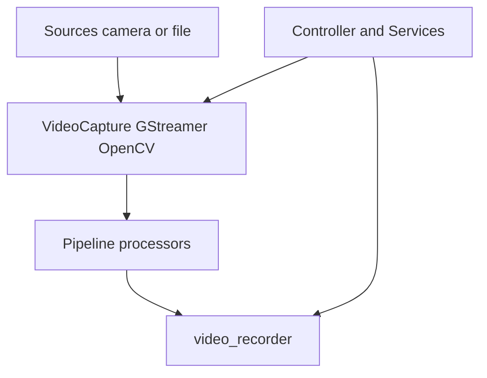

# Ветка `autorefactor_capture` vs `develop`

## Мета

| Параметр | Значение |
|----------|----------|
| **Merge-base с develop** | `95b6737` — *Merge branch 'main' into develop* |
| **Коммитов поверх develop** | 15 |
| **Объём diff** | 95 файлов, +10622 / −1620 строк |

### Список коммитов (`develop..autorefactor_capture`)

```
9fbdd22 fix gstreamer reconnections
dda4d9d Update opencv capture reconnect logic
1b824d8 Remove hasattr from controller.py
ab30130 Add tests and test scripts
8e55cb7 Add missing files
8dd3565 fix real-time playing for videos
7d94e52 Implement new gstreamer inmprovements
ec8415f Improve gstreamer capture fps #2
f65488c Improve gstreamer real capture fps
8e1af12 fix gstreamer video loop playback
f9ba87d Code purification
f5b40da continue refactoring and diagnostics
090d158 Autorefactoring capture and recording
14dd295 core minor refactoring
7484595 Docs update
0d2a496 Incapsulation refactoring
```

---

## Обоснование изменений

Ветка нацелена на **стабильный захват и запись**: GStreamer/OpenCV reconnect, реальное время воспроизведения видео, цикл воспроизведения, FPS, рефакторинг `video_recorder/*` и `capture/*` (базовые классы, исключения, очереди). Параллельно внесена **инкапсуляция и выделение сервисов контроллера** (общая основа для остальных autorefactor-веток).

Связанная документация:

- [docs/PIPELINE_ARCHITECTURE.md](../docs/PIPELINE_ARCHITECTURE.md) — уровень pipeline и захвата
- [docs/ARCHITECTURE.md](../docs/ARCHITECTURE.md) — уровень 4 (видеозахват и запись)
- [docs/VIDEO_CAPTURE_OPENCV_ISSUES.md](../docs/VIDEO_CAPTURE_OPENCV_ISSUES.md) — известные проблемы OpenCV-захвата

---

## Затронутые подсистемы (сводка)

- **`evileye/capture/`** — `video_capture_gstreamer.py`, `video_capture_opencv.py`, `video_capture_base.py`, константы, исключения, `queue_utils`
- **`evileye/video_recorder/`** — `event_recorder`, `recorder_base`, `recorder_gstreamer`/`opencv`, `retention`, `writer_factory`, валидаторы путей
- **`evileye/controller/`** — крупный рефакторинг `controller.py`, появление `controller/services/*` (pipeline, database, events, visualization, config, objects_handler, service_locator)
- **`evileye/core/`** — интерфейсы, контракты, DI, `config_validator`, `object_pool`, `memory_monitor`, `system_diagnostics`
- **Скрипты** — `scripts/analyze_gstreamer_logs.py`, `diagnose_gstreamer_issues.py`, `memory_profiler.py`, `run_diagnostics.py`, `test_capture_memory.py`, `test_recording_memory.py`
- **Тесты** — `tests/test_capture_recorder_utils.py`
- **Конфиги** — `poly-videos-capture-only.json`, `test_capture_memory.json` и правки gst-конфигов

---

## Готовность

Ветка **не вмержена в develop** → формально готовность **неполная** до merge и приёмки.

**Критерии «готово к merge»:**

- Прогон тестов и скриптов памяти/диагностики на целевых конфигах (камеры/файлы, GStreamer и OpenCV)
- Ручная проверка: reconnect при обрыве, loop playback, real-time для видео
- Согласование с веткой `autorefactor_detection` (detection уже включает эту цепочку через merge)

---

## Риски регрессий

| Зона | Риск |
|------|------|
| GStreamer pipeline | Переподключение, FPS, совместимость версий |
| OpenCV capture | Реконнект, платформы (см. VIDEO_CAPTURE_OPENCV_ISSUES) |
| Запись/ретеншн | Пути, ротация, совместимость с существующими деплоями |
| Controller | Удаление `hasattr` — возможные краевые случаи инициализации |

---

## Диаграмма потока (что меняется)

Для отображения диаграмм установите расширение **Markdown Preview Mermaid Support** (`bierner.markdown-mermaid`) — оно указано в [.vscode/extensions.json](../.vscode/extensions.json). Затем откройте предпросмотр Markdown (Ctrl+Shift+V).



---

## Дальнейшее развитие (по приоритету)

1. **Стабильность**  
   - Регулярный прогон `scripts/run_diagnostics.py`, `test_capture_memory.py`, `test_recording_memory.py`  
   - Чек-лист сценариев reconnect и длительного захвата  

2. **Архитектура и поддержка**  
   - Довести Controller до целей из [REFACTORING_REPORT.md](../REFACTORING_REPORT.md) (уменьшение монолита, делегирование `run()`)  
   - Единый стиль обработки ошибок в capture/recorder (exceptions уже заведены — расширить покрытие)  

3. **Быстродействие**  
   - Профилирование через `memory_profiler.py`; сравнение FPS до/после на одних и тех же конфигах  

4. **Отсутствие регрессий в бизнес-логике**  
   - Сценарии deploy/run, запись по событиям, совместимость journal/БД с новыми путями и ретеншном  

5. **Совместимость для merge в develop**  
   - Либо merge **только capture** первым, либо merge через **autorefactor_detection** (уже содержит capture)  
   - При последующем merge preprocessor/db/tracking — готовность к конфликтам в `controller`, `visualizer`, `objects_handler` (общая база из этой ветки)

---

*Отчёт сгенерирован для возврата к проекту после простоя; актуальность уточнять по `git log develop..autorefactor_capture`.*
