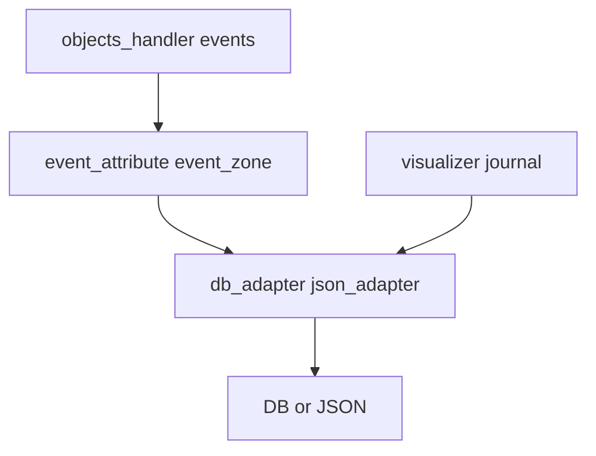

# Ветка `autorefactor_db` vs `develop`

## Мета

| Параметр | Значение |
|----------|----------|
| **Merge-base с develop** | `95b6737` |
| **Коммитов поверх develop** | 4 |
| **Объём diff** | 65 файлов, +4330 / −665 строк |

### Список коммитов

```
d6db912 Autorefactoring database access
14dd295 core minor refactoring
7484595 Docs update
0d2a496 Incapsulation refactoring
```

---

## Обоснование изменений

Цель ветки — **рефакторинг доступа к БД**: адаптеры `db_adapter_*`, JSON-адаптеры `json_adapter_*`, событийные модули (`event_attribute`, `event_zone`). Согласуется с уровнем 7 в [docs/ARCHITECTURE.md](../docs/ARCHITECTURE.md) и рекомендациями [REFACTORING_REPORT.md](../REFACTORING_REPORT.md) (оптимизация копирований, будущий батчинг).

Общий хвост с preprocessor/tracking снова трогает `objects_handler`, `pipeline_surveillance`, `visualizer` — те же файлы, что и в соседних ветках.

---

## Затронутые подсистемы (сводка)

- **`evileye/database_controller/`** — `db_adapter_objects`, `db_adapter_system_events`, `db_adapter_zone_events`; `json_adapter_*` (attribute, cam, fov, system, zone)
- **`evileye/events_detectors/`** — `event_attribute.py`, `event_zone.py`, `events_detector.py`
- **`evileye/objects_handler/`**, **`pipeline_surveillance`**, **`visualization_modules/`** — как в preprocessor/tracking

---

## Готовность

Не вмержено → **готовность неполная**.

**Критерии:**

- Прогон сценариев записи в БД и чтения journal  
- Проверка совместимости с PostgreSQL/JSON-режимами из [docs/DATABASE_SETUP_GUIDE.md](../docs/DATABASE_SETUP_GUIDE.md)

---

## Риски регрессий

- Изменение сигнатур/поведения адаптеров → пропуск или дублирование событий  
- JSON-адаптеры — формат файлов и миграции  

---

## Диаграмма потока



---

## Дальнейшее развитие (по приоритету)

1. **Стабильность** — интеграционные тесты адаптеров; проверка под нагрузкой  
2. **Архитектура** — доведение батчинга из [REFACTORING_PROGRESS.md](../REFACTORING_PROGRESS.md); единый слой ошибок (см. также незакоммиченные модули в git status: `database_error_handler`, `database_validator` при появлении в ветке)  
3. **Быстродействие** — `executemany` / батч-вставки в hot-path  
4. **Регрессии** — сравнение количества/содержимого событий до/после  
5. **Совместимость merge** — порядок: после capture/detection; конфликты с preprocessor/tracking разрешать в пользу согласованного API адаптеров  

---

*См. также: [BRANCH_DEVELOP_INDEX.md](BRANCH_DEVELOP_INDEX.md).*
