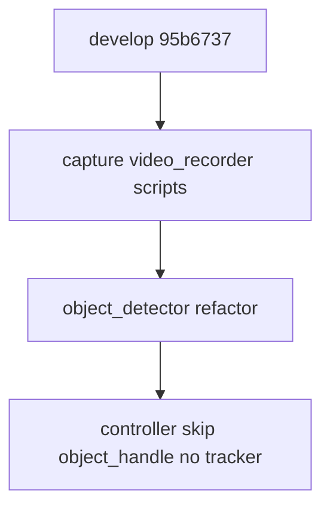
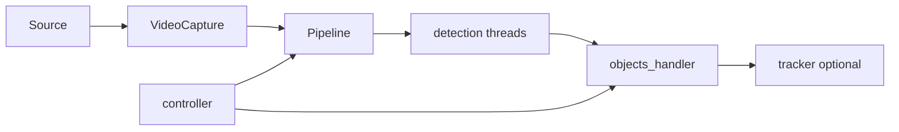

# Ветка `autorefactor_detection` vs `develop`

## Мета

| Параметр | Значение |
|----------|----------|
| **Merge-base с develop** | `95b6737` |
| **Коммитов поверх develop** | 22 (включая merge-коммиты) |
| **Объём diff** | 108 файлов, +11662 / −2082 строк |

### Происхождение ветки

`autorefactor_detection` — **интеграционная** ветка:

1. Содержит **всю цепочку `autorefactor_capture`** (merge `autorefactor_capture` → `autorefactor` → merge в detection).
2. Дополнительно: рефакторинг **`object_detector/*`** (detection_thread_*, object_detection_*), правки **controller** (skipping object_handle, работа без tracker, недостающие компоненты).

### Список коммитов (`develop..autorefactor_detection`)

```
62bbd12 implement skipping object_handle
2f2de1c add missing components
2de0eca fix working without tracker
ed8dcb2 Merge branch 'autorefactor' into autorefactor_detection
55862d0 Merge branch 'autorefactor_capture' into autorefactor
9fbdd22 fix gstreamer reconnections
... (цепочка capture — см. branch_develop_autorefactor_capture.md)
2eddf07 Autorefactor object_detector
14dd295 core minor refactoring
7484595 Docs update
0d2a496 Incapsulation refactoring
```

Ключевой коммит по детектору `2eddf07` затрагивает 12 файлов в `evileye/object_detector/` (в т.ч. `detection_thread_base`, yolo/rtdetr/rfdetr потоки, `object_detection_base` и реализации).

---

## Обоснование изменений

- **Захват и запись** — как в [branch_develop_autorefactor_capture.md](branch_develop_autorefactor_capture.md) (GStreamer/OpenCV, recorder, диагностика).
- **Детекция** — упрощение/унификация потоков детекции и базового класса; см. [docs/ATTRIBUTES_DETECTION_README.md](../docs/ATTRIBUTES_DETECTION_README.md), [reports/OBJECT_DETECTOR_PERFORMANCE_ANALYSIS.md](OBJECT_DETECTOR_PERFORMANCE_ANALYSIS.md).
- **Controller** — возможность пропуска/обхода object_handle и сценарии без tracker — снижение связности и падений при отключённых компонентах.

---

## Затронутые подсистемы

- Всё из **capture**-ветки (capture, video_recorder, scripts, tests) — см. отчёт по capture.
- **`evileye/object_detector/`** — полный рефакторинг потоков и базового слоя.
- **`evileye/controller/controller.py`** — существенные дополнения (+122 строк в коммите skipping object_handle и др.).
- Плюс общие модули (core, services, visualization) как в остальных autorefactor-ветках.

---

## Готовность

Не вмержено в develop → **готовность неполная**, при этом это **наиболее полный** снимок рефакторинга относительно develop.

**Критерии:**

- Полный прогон: capture + detector + controller без tracker  
- Регрессии детекции — сравнение с develop на одних весах/конфигах  
- После merge detection в develop — остальные ветки (preprocessor, db, tracking) вливать поверх с разрешением конфликтов

---

## Риски регрессий

| Зона | Риск |
|------|------|
| object_detector | Потоки YOLO/RT-DETR/RF-DETR — регресс точности/латентности |
| Controller | Новая ветвление без tracker / skipping object_handle |
| Capture | Те же, что в capture-отчёте |

---

## Диаграмма: detection как супермножество



Поток данных:



---

## Дальнейшее развитие (по приоритету)

1. **Стабильность** — объединить чек-листы capture + detector; прогон `run_diagnostics` и тестов памяти  
2. **Архитектура** — не раздувать controller дальше; вынести «skipping»/режимы в сервис или флаги конфига; выровнять с [REFACTORING_REPORT.md](../REFACTORING_REPORT.md)  
3. **Быстродействие** — замеры по [OBJECT_DETECTOR_PERFORMANCE_ANALYSIS.md](OBJECT_DETECTOR_PERFORMANCE_ANALYSIS.md) после стабилизации  
4. **Регрессии** — автоматизированный прогон на фиксированном наборе видео/кадров  
5. **Совместимость merge** — **рекомендуемая база для первого большого merge в develop**; затем последовательно preprocessor → db → tracking (или одна интеграционная ветка после ручного слияния трёх)

---

*Связанные отчёты: [branch_develop_autorefactor_capture.md](branch_develop_autorefactor_capture.md) (содержимое capture уже внутри detection).*
