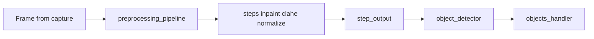

# Ветка `autorefactor_preprocessor` vs `develop`

## Мета

| Параметр | Значение |
|----------|----------|
| **Merge-base с develop** | `95b6737` |
| **Коммитов поверх develop** | 4 |
| **Объём diff** | 71 файл, +4316 / −527 строк |

### Список коммитов

```
4ccb512 Autorefactoring preprocessing
14dd295 core minor refactoring
7484595 Docs update
0d2a496 Incapsulation refactoring
```

---

## Обоснование изменений

Ветка фокусируется на **цепочке препроцессинга**: `preprocessing_base`, `preprocessing_factory`, `preprocessing_pipeline`, шаги (`step_abstract`, clahe, inpaint, normalize, input/output). Это соответствует модульной обработке кадров до детектора в [docs/PIPELINE_ARCHITECTURE.md](../docs/PIPELINE_ARCHITECTURE.md) и уровню pipeline в [docs/ARCHITECTURE.md](../docs/ARCHITECTURE.md).

Помимо preprocessing, затронуты **общие** модули (как и в `autorefactor_db` / `autorefactor_tracking`): `objects_handler`, `pipeline_surveillance`, `events_detector`, `visualizer`, `run_config_helper` — из-за общего «хвоста» после инкапсуляции и core minor refactoring.

---

## Затронутые подсистемы (сводка)

- **`evileye/preprocessing/`** — base, factory, pipeline, `steps/*` (abstract, clahe, inpaint, input, normalize, output)
- **`evileye/objects_handler/`** — `objects_handler`, `object_result`, `labeling_manager`
- **`evileye/pipelines/pipeline_surveillance.py`**
- **`evileye/events_detectors/events_detector.py`**, `object_detection_base.py`
- **`evileye/visualization_modules/`** — main_window, visualizer, db_journal, journal_init_thread, configurer_window, unified_journal_components

---

## Готовность

Не вмержено в develop → **готовность неполная**.

**Критерии готовности:**

- Регрессионные прогоны pipeline с включёнными шагами препроцессинга (CLAHE, inpaint и т.д.)
- Согласование с ветками **db** и **tracking** перед merge в develop (ожидаются конфликты в общих файлах)

---

## Риски регрессий

- Изменение контрактов шагов pipeline → влияние на детектор и трекер
- Побочный эффект правок в `objects_handler` / `pipeline_surveillance` на журнал и события

---

## Диаграмма потока



---

## Дальнейшее развитие (по приоритету)

1. **Стабильность** — интеграционные тесты pipeline с полным набором шагов; проверка на реальных конфигах  
2. **Архитектура** — явные интерфейсы для шагов (если ещё не выровнено с `evileye/core/interfaces.py`); уменьшение дублирования с соседними ветками в общих файлах  
3. **Быстродействие** — профилирование цепочки шагов (дорогие операции — inpaint/clahe)  
4. **Регрессии** — сравнение результатов детекции до/после на фиксированном наборе кадров  
5. **Совместимость merge** — merge **после** capture/detection; затем последовательно с db/tracking с ручным разрешением конфликтов в `objects_handler` и visualizer  

---

*См. также: [BRANCH_DEVELOP_INDEX.md](BRANCH_DEVELOP_INDEX.md), [branch_develop_autorefactor_detection.md](branch_develop_autorefactor_detection.md).*
