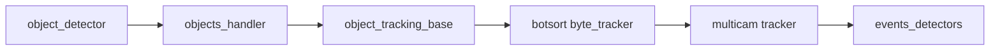

# Ветка `autorefactor_tracking` vs `develop`

## Мета

| Параметр | Значение |
|----------|----------|
| **Merge-base с develop** | `95b6737` |
| **Коммитов поверх develop** | 4 |
| **Объём diff** | 67 файлов, +4198 / −492 строк |

### Список коммитов

```
406081d Autorefactoring obeject_tracker
14dd295 core minor refactoring
7484595 Docs update
0d2a496 Incapsulation refactoring
```

*Примечание: в сообщении коммита опечатка — obeject_tracker → object_tracker.*

---

## Обоснование изменений

Ветка посвящена **трекингу объектов**: `object_tracking_base`, `object_tracking_botsort`, `byte_tracker`, `custom_object_tracking`, `object_multicam_tracking_base`, `mctrack`. Это узел после детекции в pipeline; см. [docs/PIPELINE_ARCHITECTURE.md](../docs/PIPELINE_ARCHITECTURE.md) и уровень обработки объектов в [docs/ARCHITECTURE.md](../docs/ARCHITECTURE.md).

Также затронуты те же **общие** файлы, что и preprocessor/db (objects_handler, pipeline_surveillance, visualizer).

---

## Затронутые подсистемы (сводка)

- **`evileye/object_tracker/`** — base, botsort, `trackers/byte_tracker`
- **`evileye/object_multi_camera_tracker/`** — `custom_object_tracking`, `mctrack`, base
- **`evileye/events_detectors/`** — event_attribute, event_zone (как в db-ветке)
- **`evileye/objects_handler/`**, **pipeline_surveillance**, **visualization_modules**

---

## Готовность

Не вмержено → **готовность неполная**.

**Критерии:**

- Сценарии с tracker включённым и выключенным (согласуется с коммитами на detection: «fix working without tracker»)  
- Мультикам-трекинг на тестовых конфигах  

---

## Риски регрессий

- Изменение API базового трекера → поломка botsort/byte  
- Поведение без tracker — не должно ломать pipeline (проверить совместимость с autorefactor_detection)  

---

## Диаграмма потока



---

## Дальнейшее развитие (по приоритету)

1. **Стабильность** — тесты трекера на видео с известными траекториями; сценарий без tracker  
2. **Архитектура** — выравнивание имён и документации (исправить опечатку в истории коммитов при следующем rebase при необходимости); единый интерфейс трекера  
3. **Быстродействие** — профилирование byte_tracker/botsort на длинных последовательностях  
4. **Регрессии** — сравнение track id и событий зон до/после  
5. **Совместимость merge** — merge после detection; конфликты с preprocessor/db в общих файлах — объединять с сохранением опциональности tracker  

---

*См. также: [BRANCH_DEVELOP_INDEX.md](BRANCH_DEVELOP_INDEX.md), [branch_develop_autorefactor_detection.md](branch_develop_autorefactor_detection.md).*
